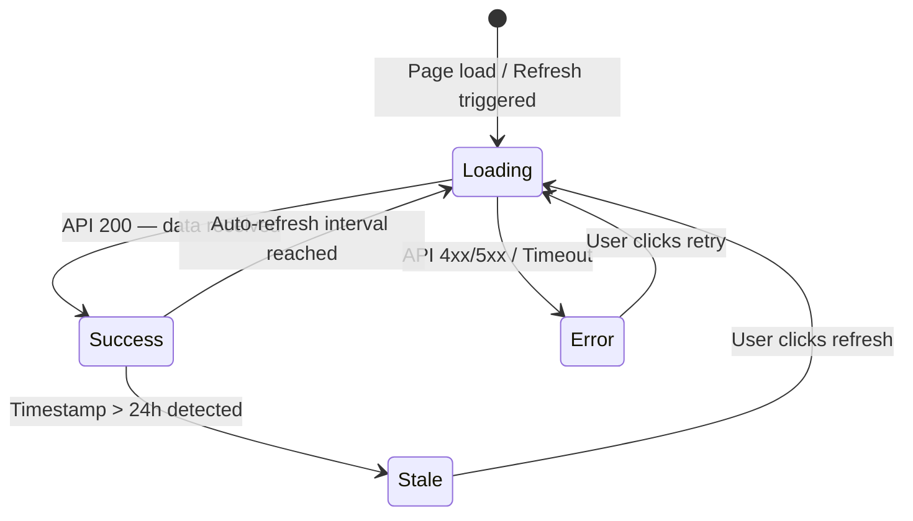

# FinTech BA — Reference Guide

## Standard Jira Ticket Template

Use this exact structure for every ticket output:

---

**Ticket Title:** `[Feature/Module Name] - [Brief Actionable Description]`

**Epic:** `[Name of the parent Epic]`

**User Story:**
> As a **[Target User]**, I want to **[Action/Feature]** so that **[Business Value/Outcome]**.

**Overview:**
[2–3 sentences. State what this ticket accomplishes and why it matters to the fund investment platform. Include the affected module and business impact.]

**Detailed Requirements:**
- [Functional requirement — describe behavior precisely]
- [Non-functional requirement — e.g., performance, security, data precision]
- [Financial logic — formulas, rounding mode (HALF_UP / HALF_EVEN), decimal precision, currency handling]
- [Validation rules — required fields, allowed formats, boundary values]
- [Edge case — zero values, null handling, concurrent access, timezone behaviour]

**UI/UX & Front-End Considerations:**
- **Layout:** [Describe page structure — grid, panels, table, form]
- **Interactive Elements:** [Dropdowns, date pickers, modals, inline edits]
- **State Changes:**
  - `Default` — [what the user sees on load]
  - `Loading` — [skeleton screen / spinner behaviour]
  - `Success` — [confirmation message / data update]
  - `Error` — [inline or toast error message with specific error copy]
  - `Empty State` — [placeholder text or CTA when no data]
- **Accessibility:** [ARIA labels, keyboard navigation, colour contrast requirement]
- **Mermaid.js diagram** *(if the flow has 3+ states or conditional branches)*:

```mermaid
stateDiagram-v2
    [*] --> Default
    Default --> Loading : User submits
    Loading --> Success : API returns 200
    Loading --> Error : API returns 4xx/5xx
    Success --> [*]
    Error --> Default : User retries
```

**Acceptance Criteria (BDD Format):**

*Scenario 1 — Happy Path*
- **Given** [initial context — user is logged in, data is available]
- **When** [action — user clicks, submits, navigates]
- **Then** [expected outcome — specific data shown, state changed, API called]

*Scenario 2 — Error Path*
- **Given** [context where an error can occur]
- **When** [action that triggers the error]
- **Then** [error message displayed, no data mutation, system stays stable]

*Scenario 3 — Edge Case*
- **Given** [boundary condition — zero balance, max value, missing optional field]
- **When** [action]
- **Then** [system handles gracefully — fallback value, validation message, or no-op]

**Definition of Done (DoD):**
- [ ] Code compiles and builds without errors.
- [ ] Unit tests written and passing (minimum 80% coverage).
- [ ] Feature tested in staging environment.
- [ ] Code reviewed and approved by at least one peer.
- [ ] UI/UX matches approved structural mockups across supported browsers.

---

## Field-by-Field Guide

| Field | Common Mistakes | Correct Approach |
|---|---|---|
| **Ticket Title** | "Fix fund display" | "Fund Dashboard - Display NAV per Unit with Currency Filter" |
| **User Story** | Missing business value | Always complete the "so that" clause with measurable outcome |
| **Overview** | Generic summary | Name the module + state the financial impact |
| **Detailed Requirements** | "Show balance correctly" | "Display balance as decimal(18,4), rounded HALF_UP, with ISO 4217 currency code" |
| **UI/UX** | Skipping error states | Always include Loading, Success, Error, and Empty states |
| **AC Scenarios** | Only happy path | Min 3: happy path + error + edge case |
| **DoD** | Modified or skipped | Always verbatim — never change or remove items |

---

## Clarifying Questions Bank

### User & Permissions
- Who is the primary user of this feature? (Fund Manager / Back-Office Admin / Compliance Officer / Investor / Super Admin)
- Are there role-based visibility or edit restrictions?
- Are there multi-tenancy concerns (per-fund, per-client isolation)?

### Financial Logic
- What currency or currencies does this feature support? Is multi-currency display required?
- What decimal precision is required? (e.g., NAV = 4 decimal places, percentage = 2)
- What rounding mode applies? (HALF_UP, HALF_EVEN / Banker's Rounding)
- Is this feature affected by market cut-off times or settlement T+n rules?
- Are there minimum/maximum value constraints?

### Data & Integrations
- Where does the data originate? (Core banking system, fund administrator, third-party data vendor)
- Is this a real-time feed or a batch/end-of-day update?
- What is the expected data latency SLA?
- Are there upstream dependencies that must be resolved first?

### Regulatory & Compliance
- Does this feature fall under UCITS, AIFMD, MiFID II, FATCA, or CRS reporting obligations?
- Are there audit trail or data retention requirements?
- Are there jurisdictional restrictions (e.g., US persons exclusion, KYC gate)?

### UI & UX
- Is there an approved wireframe or design mockup?
- What browsers/devices must be supported?
- Are there white-labelling or branding constraints?

---

## Epic Breakdown Decision Guide

| Indicator | Single Ticket | Epic + Stories |
|---|---|---|
| Involves 1 user role | ✅ | — |
| Involves 1 data entity | ✅ | — |
| Completable in 1 sprint | ✅ | — |
| Involves multiple user roles | — | ✅ |
| Requires both FE and BE work across multiple components | — | ✅ |
| Touches regulatory reporting + UI + API | — | ✅ |
| Estimated effort > 8 story points | — | ✅ (split first) |

---

## Complete Example Ticket

---

**Ticket Title:** Fund Dashboard - Display Real-Time NAV per Unit with Currency Filter

**Epic:** Fund Performance Dashboard

**User Story:**
> As a **Fund Manager**, I want to view the real-time Net Asset Value (NAV) per unit for each fund I manage, filtered by currency, so that I can monitor fund performance without switching between multiple reports.

**Overview:**
This ticket implements the NAV per unit display widget on the Fund Manager Dashboard. It consumes the real-time pricing feed from the fund administrator API and renders per-unit values in the selected display currency, enabling faster intraday performance monitoring.

**Detailed Requirements:**
- Display NAV per unit for each active fund in the manager's portfolio.
- Values must be retrieved from the `GET /api/v2/funds/{fundId}/nav` endpoint.
- NAV values are expressed as `decimal(18, 4)`, rounded using HALF_EVEN (Banker's Rounding).
- Support multi-currency display: USD, EUR, GBP, HKD. Default to fund base currency.
- Currency conversion must use the ECB daily FX rate snapshot, updated at 09:00 UTC daily.
- Exclude funds with `status = SUSPENDED` or `status = CLOSED` from the display.
- Refresh interval: 60 seconds (configurable via feature flag `NAV_REFRESH_INTERVAL_SECS`).
- Data must be no older than T+0 close. Display a stale data warning if timestamp > 24h.

**UI/UX & Front-End Considerations:**
- **Layout:** Card grid (3 columns on desktop, 1 column on mobile). Each card shows: Fund Name, ISIN, NAV per Unit, Currency, Last Updated timestamp.
- **Interactive Elements:** Currency filter dropdown (multi-select), manual refresh button.
- **State Changes:**
  - `Default` — cards populate with last known NAV on load
  - `Loading` — skeleton cards shown during fetch; refresh button disabled
  - `Success` — cards update in place; "Last updated: HH:MM UTC" refreshes
  - `Error` — inline banner: "Unable to fetch NAV data. Please try again." Stale values remain visible.
  - `Stale` — amber badge "Data may be outdated" on cards where timestamp > 24h
- **Accessibility:** Each card has `aria-label="[Fund Name] NAV per unit [value] [currency]"`. Keyboard-navigable filter.



**Acceptance Criteria (BDD Format):**

*Scenario 1 — Happy Path: NAV displayed in selected currency*
- **Given** a Fund Manager is logged in with 3 active funds
- **When** they select EUR from the currency filter
- **Then** all 3 fund cards display NAV per unit converted to EUR, rounded to 4 decimal places, with the ECB FX rate timestamp shown

*Scenario 2 — Error Path: API unavailable*
- **Given** a Fund Manager is on the dashboard
- **When** the NAV API returns a 503 error during the scheduled refresh
- **Then** the existing card values remain visible, and an error banner displays "Unable to fetch NAV data. Please try again." — no values are cleared or set to zero

*Scenario 3 — Edge Case: Fund with stale data*
- **Given** a fund's last NAV update timestamp is 26 hours ago
- **When** the Fund Manager views the dashboard
- **Then** that fund's card displays an amber "Data may be outdated" badge alongside the last known NAV value

**Definition of Done (DoD):**
- [ ] Code compiles and builds without errors.
- [ ] Unit tests written and passing (minimum 80% coverage).
- [ ] Feature tested in staging environment.
- [ ] Code reviewed and approved by at least one peer.
- [ ] UI/UX matches approved structural mockups across supported browsers.

---

## FinTech Domain Notes

| Term | Definition |
|---|---|
| NAV | Net Asset Value — total fund assets minus liabilities, per unit |
| ISIN | International Securities Identification Number (12-char alphanumeric) |
| T+n | Settlement cycle: trade date plus n business days |
| Base Currency | The reporting currency the fund is denominated in |
| HALF_EVEN | Banker's rounding — rounds to nearest even digit at .5 boundary |
| UCITS | EU fund regulatory framework — imposes strict NAV calculation and disclosure rules |
| MiFID II | EU directive — governs transaction reporting, best execution, and cost disclosure |
| FATCA | US legislation — requires reporting of US persons' foreign financial accounts |
