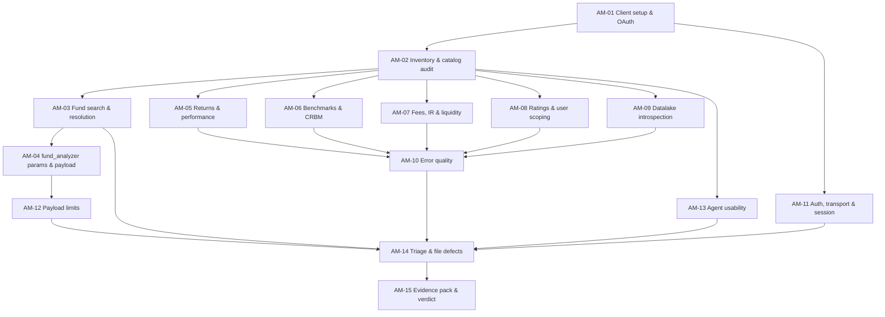

# Aloha MCP — QA Verification Plan

> **Status:** DRAFT — ready to create in Jira. Nothing has been raised yet.
> **Version:** 2.0 · **Prepared:** 2026-08-05
> **Endpoint under test:** `https://mcp.conceptia.com/aloha/mcp` (Streamable HTTP)
> **Server build observed:** `0.9.5` — *FAD - Investment Front Office Application*
> **Structure:** one new Epic + 15 child stories, dependency-ordered
> **Audience:** QA engineers executing the cycle. Every story is written to be picked up and run without further briefing.

---

## 1. Purpose

Establish whether the Aloha MCP server is fit for the team to rely on, and produce a defensible QA verdict backed by evidence.

This is a **fresh cycle**. It does not inherit or continue any earlier ticket, and it does not carry forward previously reported defects. Where earlier observations exist they are treated as *unverified rumour* and must be re-established by this cycle's own evidence.

**The question this cycle answers:** *Can the team depend on the Aloha MCP server for day-to-day fund analysis, and what must be fixed before that is true?*

---

## 2. What is under test

| Dimension | Detail |
|---|---|
| Service | Conceptia **Aloha** MCP — fund / endowment platform |
| Modules covered | Total Endowment, Public, Private, Pipeline, Risk, Scenario Test, Cash Forecast |
| Transport | **Streamable HTTP** at `/aloha/mcp` |
| Auth | Microsoft OAuth, Azure AD tenant `0afd37d3-78e8-4fe4-accc-89937c47655c`, browser flow — **no token paste at any point** |
| Tool surface | **34 tools** (counted 2026-08-05) |
| Write capability | **None found** — all 34 tools are read or compute |
| Distinct from | `conceptia-dynamo` (`/dynamo/sse`). A different server. Never mix findings between them |

### 2.1 In scope

Functional correctness of the tool surface, parameter handling, payload behaviour, error quality, authentication and transport sanity, and agent usability.

### 2.2 Out of scope

Deferred unless this cycle surfaces evidence that justifies them:

- Injection payload libraries (SQL / command / path / prompt injection)
- Performance, load and soak testing
- Deliberate cross-account or cross-tenant access attempts
- Penetration testing of the Azure AD tenant

**If any out-of-scope issue surfaces accidentally, stop and escalate (§8) — do not explore it further.**

---

## 3. Evidence already captured

A probe session was run on **2026-08-05, 10:50–10:51 UTC** from Claude Code v2.1.222 using native HTTP transport. Eight read-only calls were made. **QA should confirm and extend these, not re-derive them from scratch.**

### 3.1 Confirmed facts

| # | Fact | How established |
|---|---|---|
| E1 | Endpoint is live; build `0.9.5`; uptime ≈ 12.1 days at probe time | `health_check` |
| E2 | Unauthenticated `POST /aloha/mcp` → **401** with spec-compliant `WWW-Authenticate` | curl |
| E3 | OAuth browser flow completes; no token paste required | Claude Code CLI `/mcp` |
| E4 | Catalog contains **34 tools**; full inventory captured | `baseline/aloha-tool-inventory-2026-08-05.md` |
| E5 | **No write-capable tool exists.** All 34 read or compute | Schema audit of all 34 |
| E6 | Fund 500 resolves cleanly from its full name, source `solovis` | `Search_Funds` |

### 3.2 Observations requiring verification

These are the **highest-value starting points**. Each is already assigned to a story.

| # | Observation | Story |
|---|---|---|
| O1 | `fund_analyzer` silently resolves an ambiguous `search_term` to the **top Elasticsearch hit** with no disambiguation, then fails if that fund lacks Solovis data | AM-03, AM-04 |
| O2 | `fund_analyzer` **ignores `start_date`** when scoping returned time series — returned data from 1995 for a 2025-08-01 request. `end_date` *is* honoured. `start_date` is its only required parameter | AM-04 |
| O3 | `fund_analyzer` returns **613,731 characters** for one fund with **all seven optional slices disabled**. Defaults are all-on, so normal calls are larger. No server-side cap observed | AM-04, AM-12 |
| O4 | `get_user_info` returns *"No user email found in request headers"* **despite completed OAuth**. Identity is not forwarded to the service. The three user-scoped rating tools document a fallback to `MCP_DEFAULT_USER_EMAIL` — potentially a single shared identity for all callers | AM-08, AM-11 |
| O5 | Catalog contains **three self-declared duplicate aliases** — `search_funds`≡`Search_Funds` (differ only by capitalisation), `rating_detail`≡`get_rating_details`, `rating_summary`≡`get_rating_summary` — plus four overlapping fund-search entry points | AM-02, AM-13 |
| O6 | `fund_id` type is inconsistent: `Search_Funds` returns `"4874"` (string), `search_all_funds` returns `4874` (number) | AM-03 |
| O7 | Failure detail is returned as a **Python `dict` repr embedded in a string**, not JSON — right content, unparseable format | AM-10 |
| O8 | Legacy `/aloha/sse` still answers **401 rather than 404** — the retired route is still live in routing | AM-11 |
| O9 | Authorization-server metadata advertises PKCE **`plain`** alongside `S256`, and `/register` is open with `token_endpoint_auth_methods_supported: ["none"]` | AM-11 |
| O10 | `smpublic_main_v3` exposes **zero parameters** yet its description says it requires a Flask JSON body via HTTP proxy — likely non-functional over MCP | AM-09 |

**O4 is the most serious observation in this list.** Treat it as the cycle's priority-one item.

---

## 4. Verified test fixtures

Reusable across the whole cycle. All confirmed live on 2026-08-05.

| Fixture | Value | Purpose |
|---|---|---|
| Valid Solovis fund | `fund_id = 500` — *Citadel Kensington Global Strategies Fund Ltd.* | Happy-path anchor; has Solovis data |
| Exact-name query | `"Citadel Kensington Global Strategies"` | Resolves to exactly 1 result → 500 |
| Ambiguous query | `"Citadel Investment"` | Returns **4** ALB candidates, none of them 500 |
| ALB fund, no Solovis data | `fund_id = 4874` — *Citadel Jackson Investment Fund Ltd* | The fund the ambiguous query silently resolves to |
| Second ALB decoy | `fund_id = 986` — *ANTAEUS INTERNATIONAL INVESTMENTS, LTD.* | Matches on manager, not name — ranked #2 |
| Non-existent id | `99999999` | Negative / error-quality input |
| Benchmark resolution | via `search_crbm_index` | Benchmark tools need `bbg_id`, not names |

**Ambiguity note for testers:** `"Citadel Investment"` matches 986 through its *manager* (`Citadel Advisors LLC`), not its name. That is defensible search behaviour. The defect is not the match — it is `fund_analyzer` choosing one candidate silently.

---

## 5. Epic and story structure

### 5.1 Epic

**`Aloha MCP — QA Verification Cycle`**

> Verify that the Aloha MCP server is fit for team use: confirm the tool surface, validate functional correctness and parameter handling across all 34 tools, assess payload behaviour, error quality, authentication and agent usability, then issue an evidence-backed QA verdict with defects filed.

### 5.2 Stories

Draft IDs `AM-01`…`AM-15`. Replace with real Jira keys on creation. Full ticket text is in **`aloha_mcp_uat_tickets.md`**.

| ID | Story | Depends on | Suggested owner | Est. |
|---|---|---|---|---|
| **AM-01** | Set up MCP clients and complete OAuth | — | QA Lead | 0.5 d |
| **AM-02** | Capture tool inventory and audit catalog quality | AM-01 | QA Lead | 1 d |
| **AM-03** | Verify fund search and resolution correctness | AM-02 | QA-B | 1 d |
| **AM-04** | Verify `fund_analyzer` parameter handling and payload scoping | AM-03 | QA-B | 1.5 d |
| **AM-05** | Smoke-test returns and performance tools | AM-02 | QA-C | 1 d |
| **AM-06** | Smoke-test benchmark and CRBM tools | AM-02 | QA-C | 0.5 d |
| **AM-07** | Smoke-test fee, IR and liquidity model tools | AM-02 | QA-C | 1 d |
| **AM-08** | Verify ratings tools and user-scoping behaviour | AM-02 | QA-B | 1 d |
| **AM-09** | Verify datalake introspection tools | AM-02 | QA-B | 1 d |
| **AM-10** | Verify error quality and LLM-oriented failure handling | AM-05, AM-06, AM-07, AM-08, AM-09 | QA-C | 1 d |
| **AM-11** | Verify authentication, transport and session behaviour | AM-01 | QA-C | 1 d |
| **AM-12** | Verify payload limits and client compatibility | AM-04 | QA-B | 1 d |
| **AM-13** | Assess agent usability and tool selection | AM-02 | QA Lead | 1 d |
| **AM-14** | Triage findings and file defects | AM-03 … AM-13 | QA Lead | 1 d |
| **AM-15** | Assemble evidence pack and issue QA verdict | AM-14 | QA Lead | 1 d |

**Total ≈ 14.5 person-days → roughly 5–6 working days for 3 QA.**

### 5.3 Dependency graph



### 5.4 Critical path

`AM-01 → AM-02 → AM-03 → AM-04 → AM-12 → AM-14 → AM-15`

**AM-02 is the true bottleneck** — six stories unblock from it. Prioritise it on day 1 and get it reviewed the same day.

### 5.5 Suggested sprint sequencing

| Day | QA Lead | QA-B | QA-C |
|---|---|---|---|
| 1 | AM-01, AM-02 | *assist AM-02* | AM-01 (2nd client) |
| 2 | AM-13 | AM-03 | AM-11 |
| 3 | AM-13 | AM-04 | AM-05 |
| 4 | *review* | AM-04, AM-08 | AM-06, AM-07 |
| 5 | AM-14 | AM-09, AM-12 | AM-10 |
| 6 | AM-15 | *support* | *support* |

---

## 6. Environment setup

These steps were executed and verified on 2026-08-05. Use them verbatim.

### 6.1 Client 1 — Claude Code

Add to `.mcp.json` in the repo root:

```json
{
  "mcpServers": {
    "conceptia-aloha": {
      "type": "http",
      "url": "https://mcp.conceptia.com/aloha/mcp"
    }
  }
}
```

**Use native `type: http`, not `npx mcp-remote`.** The native transport cannot silently fall back to SSE, which guarantees you are testing the Streamable HTTP surface and not a legacy path.

Authenticate from an interactive terminal — the desktop app cannot run the OAuth flow itself:

```bash
npm install -g @anthropic-ai/claude-code
```

```bash
claude
```

Then at the prompt: `/mcp` → select `conceptia-aloha` → **Authenticate** → complete the Microsoft login in the browser. Scopes requested are `openid`, `profile`, `user.read`.

> **Gotcha, confirmed 2026-08-05:** a client session started *before* authentication will not pick up the new token. **Restart the client after authenticating.**

### 6.2 Client 2 — required

A second client is mandatory (AM-01). **Antigravity** is the intended second client. Configure it against the same endpoint and authenticate with a *different* QA's Azure AD account where possible — that also gives AM-08 the two identities it needs.

### 6.3 Security rules for testers

- Every QA authenticates with **their own** Azure AD account
- **Never** paste, share, screenshot or commit a token. The flow is browser-only; if any screen asks you to paste a token, stop and report it
- Treat the endpoint as **Production** until §9 Q1 is answered

---

## 7. Test standards

### 7.1 Folder layout

```
Aloha Server/
  Test Guide/
    aloha_mcp_uat_plan.md          ← this file
    aloha_mcp_uat_tickets.md       ← ticket drafts
  baseline/
    aloha-tool-inventory-2026-08-05.md
  Test Result/
    AM-01 Result.md … AM-15 Result.md
    logs/2026-08-05/
```

**Log naming:** `{story-id}_{test-id}_{fixture}_{UTC-timestamp}_{type}.txt`
e.g. `AM-04_T03_FUND500_2026-08-05T105118Z_response.json`

### 7.2 Every test log records

Test ID · UTC timestamp · tester · client name + version · **exact input, copy-pasted not paraphrased** · raw tool JSON or transcript path · expected vs actual · Pass / Fail / Blocked · defect key if failed.

### 7.3 Redaction

Strip before attaching anything to Jira: **JWTs and bearer tokens, account numbers, investor names, individual email addresses, free-text note bodies.** Fund names and fund IDs are fine.

### 7.4 Severity rubric

Use this consistently — it drives what blocks the verdict.

| Severity | Definition | Example from pre-cycle probe |
|---|---|---|
| **S1 Critical** | Data exposed to the wrong user, auth bypassable, or data mutated unexpectedly | O4 if confirmed |
| **S2 High** | A primary tool returns wrong data, or is unusable in normal conditions | O2, O3 |
| **S3 Medium** | Tool works but behaviour is wrong, misleading, or forces workarounds | O1, O5, O7 |
| **S4 Low** | Cosmetic, documentation, or naming inconsistency | O6, O10 |

### 7.5 Result cell values

`P` Pass · `F` Fail (defect key in Notes) · `B` Blocked (state blocker) · `S` Skipped (state reason) · `n/a` Not applicable

---

## 8. Stop-and-escalate triggers

**Halt the cycle, notify the service owners immediately, and file an S1:**

- Any fund or record appears that the authenticated user should not be able to see
- Any tool call succeeds **without** authentication
- Any tool mutates data — this cycle authorises **read-only** use only
- A tool returns another user's identity, ratings, or personal data
- Credentials, tokens, connection strings or internal infrastructure detail appear in any response

**Do not investigate further after triggering.** Capture the evidence, redact it, escalate.

---

## 9. Open questions for the service owners

Send before day 1. Q1 and Q2 gate the cycle.

> **Q1 — Which environment should QA test against?** 🔴 *blocking*
> Only one URL is known: `https://mcp.conceptia.com/aloha/mcp`. Is there a separate Dev or staging endpoint? If Production is the only option, please confirm in writing that QA may run read-only tests against it.
>
> **Q2 — Confirm the tool surface is read-only.** 🔴 *blocking*
> Our schema audit of all 34 tools found no write capability. Please confirm no tool can mutate fund, rating or reference data — including indirectly via `get_data` or the model tools.
>
> **Q3 — Is user identity meant to reach the service?**
> `get_user_info` reports no user email in request headers despite a completed OAuth session, and the user-scoped rating tools document a fallback to `MCP_DEFAULT_USER_EMAIL`. Is per-user scoping intended to work today? If so, this is a defect. If not, what is the intended authorisation model? *(See O4 — highest-priority question in this list.)*
>
> **Q4 — Is `fund_analyzer.start_date` meant to scope returned data?**
> It is the tool's only required parameter, yet returned series span back to 1995 regardless. Is it intended to filter the payload, or only the computed metrics?
>
> **Q5 — Is there an intended cap on `fund_analyzer` response size?**
> One fund with all optional slices disabled returned ~614 KB.
>
> **Q6 — Are the duplicate tool aliases intentional?**
> `search_funds`/`Search_Funds`, `rating_detail`/`get_rating_details`, `rating_summary`/`get_rating_summary`. If they exist for backward compatibility, can the duplicates be hidden from the tool list?
>
> **Q7 — Is the legacy `/aloha/sse` route decommissioned?**
> It answers 401, not 404, so it is still routed.
>
> **Q8 — What is the expected tool count for build `0.9.5`?**
> Confirming the intended number turns our inventory into a real drift baseline.
>
> **Q9 — Which MCP clients must be supported?**
> This plan assumes Claude Code plus Antigravity. Confirm or extend.

---

## 10. Entry criteria

The cycle may start when:

| # | Criterion |
|---|---|
| 1 | Q1 and Q2 answered in writing |
| 2 | At least two QA have Azure AD accounts with Aloha access |
| 3 | Epic and all 15 stories created in Jira with dependencies linked |
| 4 | Test fixtures (§4) confirmed still valid |

---

## 11. Exit criteria

The cycle may close, and a verdict be issued, when **all** hold:

| # | Criterion |
|---|---|
| 1 | ≥2 MCP clients connected via OAuth, no token paste (AM-01) |
| 2 | All 34 tools inventoried, classified, and stored as the drift baseline (AM-02) |
| 3 | Every tool in the catalog either smoke-tested or explicitly deferred with a reason (AM-05…AM-09) |
| 4 | All ten pre-cycle observations O1–O10 dispositioned: confirmed defect, by-design, or not reproducible |
| 5 | Smoke pass rate ≥ 80% of non-`n/a` cells (AM-05…AM-09) |
| 6 | Auth, transport and session behaviour verified (AM-11) |
| 7 | Every failure has a filed, linked defect with a severity (AM-14) |
| 8 | Evidence pack assembled and redacted (AM-15) |
| 9 | Verdict issued: **Pass** / **Pass with findings** / **Fail** |

### 11.1 Verdict guidance

- **Pass** — no S1 or S2 open; smoke pass rate ≥ 80%; auth clean
- **Pass with findings** — usable, but named S2/S3 defects remain open with tickets filed
- **Fail** — any **S1** confirmed, or any stop-and-escalate trigger fired, or smoke pass rate < 80%

**An S1 on O4 (user scoping) is an automatic Fail** regardless of every other result.

---

## 12. Risks

| Risk | Impact | Mitigation |
|---|---|---|
| Testing runs against Production | Medium | Read-only only; no write tool exists; escalate on any mutation |
| Large payloads exhaust client context mid-test | High | Disable optional slices by default; save raw responses to file and analyse structurally rather than reading in full |
| Single tester, single client masks client-specific defects | Medium | Two clients mandatory in AM-01; AM-12 compares them |
| Fixtures drift as fund data changes | Low | Re-confirm §4 at cycle start |
| Q1/Q2 unanswered, cycle starts anyway | High | Hard entry gate — do not start AM-01 without them |
