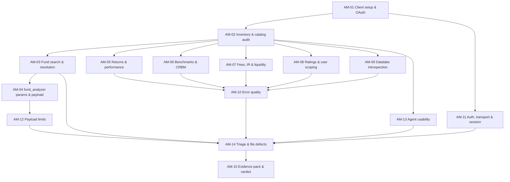

# Aloha MCP — QA Verification Plan

> **Status:** **EXECUTED AND CLOSED.** Epic + 15 stories created in Jira 2026-08-07 as [KS-1066](https://gendvn.atlassian.net/browse/KS-1066) / KS-1070–KS-1084; cycle run and closed 2026-08-11 with verdict **FAIL**. 12 bugs filed (KS-1085–KS-1096). Epic status: Development Complete — remediation owned by engineering.
> **Version:** 2.0 · **Prepared:** 2026-08-05 · **Status annotations added:** 2026-08-14
> **Endpoint under test:** `https://mcp.conceptia.com/aloha/mcp` (Streamable HTTP)
> **Server build observed:** `0.9.5` — *FAD - Investment Front Office Application*. Still `0.9.5` at the last live check (2026-08-12, uptime 18.8 d, no restart) — **no remediation had shipped**, so this plan's design is still current for the re-test.
> **Structure:** one new Epic + 15 child stories, dependency-ordered
> **Audience:** QA engineers executing the cycle. Every story is written to be picked up and run without further briefing.

> **What this document is, now that the cycle has run.** It remains a **pre-cycle design document**. Execution findings (`NEW-nn`) are deliberately **not** retrofitted into it — they live in `Findings Register.md` (canonical index) and `Test Result/KS-1066 All Findings and Bugs Report.md` (cycle compilation). What has been added below is **status only**: which questions got answered, which exit criteria were met, whether the fixtures still hold. Where an execution result changes how a section should be *used*, that is flagged inline and points at the register.
>
> **Re-testing from this plan?** Read `Test Result/KS-1066 …Report.md` **§7** first — it revises the story set for the next cycle (mandatory date-window matrix column, a cross-tool numeric-consistency story, optional-parameter coverage, a completeness-signal audit, and scripting the 34-tool smoke pass).

---

## 1. Purpose

Establish whether the Aloha MCP server is fit for the team to rely on, and produce a defensible QA verdict backed by evidence.

This is a **fresh cycle**. It does not inherit or continue any earlier ticket, and it does not carry forward previously reported defects. Where earlier observations exist they are treated as *unverified rumour* and must be re-established by this cycle's own evidence.

**The question this cycle answers:** *Can the team depend on the Aloha MCP server for day-to-day fund analysis, and what must be fixed before that is true?*

---

## 2. What is under test

| Dimension | Detail |
|---|---|
| Service | Conceptia **Aloha** MCP — fund / endowment platform |
| Modules covered | Total Endowment, Public, Private, Pipeline, Risk, Scenario Test, Cash Forecast |
| Transport | **Streamable HTTP** at `/aloha/mcp` |
| Auth | Microsoft OAuth, Azure AD tenant `0afd37d3-78e8-4fe4-accc-89937c47655c`, browser flow — **no token paste at any point** |
| Tool surface | **34 tools** (counted 2026-08-05, re-confirmed 2026-08-06) — full list in **§2.3** |
| Write capability | **None found** — all 34 tools are read or compute |
| Distinct from | `conceptia-dynamo` (`/dynamo/sse`). A different server. Never mix findings between them |

### 2.1 In scope

Functional correctness of the tool surface, parameter handling, payload behaviour, error quality, authentication and transport sanity, and agent usability.

### 2.2 Out of scope

Deferred unless this cycle surfaces evidence that justifies them:

- Injection payload libraries (SQL / command / path / prompt injection)
- Performance, load and soak testing
- Deliberate cross-account or cross-tenant access attempts
- Penetration testing of the Azure AD tenant

**If any out-of-scope issue surfaces accidentally, stop and escalate (§8) — do not explore it further.**

### 2.3 The 34 tools — full list by group

Source: `baseline/aloha-tool-inventory-2026-08-06.md` (live schema capture, build `0.9.5`). Identical to the 2026-08-05 capture — **delta 0**.

> ✅ **Still valid.** Re-checked live on 2026-08-11: **34/34 tool names, exact match** to the 08-06 baseline, delta 0. This section and the baseline remain the drift reference for the re-test.

> **See also:** `baseline/aloha-tool-inventory-2026-08-11.md` — same 34 tools, but with **full untruncated tool descriptions and every parameter description**. Its §4 lists eleven documented behavioural rules that are invisible in the earlier baselines and have no test case in any story.

`R` = read · `C` = compute/derive · `W` = write (**none found**)

**Fund search & resolution — 5 tools** → AM-03 (KS-1072)

| # | Tool | R/C/W | Required |
|---|---|:--:|---|
| 1 | `Search_Funds` | R | `search_term` |
| 2 | `search_funds` | R | `search_term` — alias of `Search_Funds` |
| 3 | `search_all_funds` | R | `search_term` |
| 4 | `search_albourne_funds` | R | `search_term` |
| 5 | `search_crbm_index` | R | `names` |

**Bundled analysis — 2 tools** → AM-04 (KS-1073) for `fund_analyzer`; AM-09 (KS-1078) for `smpublic_main_v3`

| # | Tool | R/C/W | Required |
|---|---|:--:|---|
| 6 | `fund_analyzer` | C | `start_date` — plus 18 optional params |
| 7 | `smpublic_main_v3` | C | *(none — see O10)* |

**Returns & performance — 7 tools** → AM-05 (KS-1074)

| # | Tool | R/C/W | Required |
|---|---|:--:|---|
| 8 | `get_fund_returns` | R | `fund_ids`, `start_date`, `end_date` |
| 9 | `get_top_funds_by_returns` | R | *(none)* |
| 10 | `get_bottom_funds_by_returns` | R | *(none)* |
| 11 | `calculate_annualized_returns` | C | `fund_ids` |
| 12 | `intraday_fund_returns` | R | *(none)* — formerly `fund_returns` |
| 13 | `calculate_drawdown` | C | `fund_id` |
| 14 | `equity_beta` | C | *(none)* |

**Benchmarks & CRBM — 3 tools** → AM-06 (KS-1075)

| # | Tool | R/C/W | Required |
|---|---|:--:|---|
| 15 | `get_benchmark_history` | R | `benchmark_ids`, `start_date`, `end_date` |
| 16 | `get_fund_crbm` | R | *(none — omitting `fund_id` returns all funds)* |
| 17 | `calculate_crbm_returns` | C | `fund_id`, `start_date`, `end_date` |

**Fees, IR & liquidity — 6 tools** → AM-07 (KS-1076)

| # | Tool | R/C/W | Required |
|---|---|:--:|---|
| 18 | `fee_model` | C | **15 params**: `fund_id`, `benchmark`, `translation`, `mgt_fee`, `mgt_fee_freq`, `perf_fee`, `hwm_status`, `hurdle_status`, `ramp_type`, `hurdle_fixed`, `hurdle_type`, `perf_return`, `catch_up`, `catch_up_perc_soft`, `crystialized_paid` |
| 19 | `get_fee_model_defaults` | R | *(none — omitting `fund_id` returns all funds)* |
| 20 | `ir_model` | C | *(none — omitting `fund_ids` returns all public-sleeve funds)* |
| 21 | `calculate_liquidity_cost` | C | `fund_id` — plus 9 optional params |
| 22 | `get_liquidity_parameters` | R | *(none — omitting `fund_id` returns all funds)* |
| 23 | `query_fund_manager` | R | `fields` |

**Ratings — 5 tools** → AM-08 (KS-1077)

| # | Tool | R/C/W | Required |
|---|---|:--:|---|
| 24 | `get_rating_details` | R | `id` |
| 25 | `rating_detail` | R | `id` — alias of `get_rating_details` |
| 26 | `get_rating_summary` | R | `id` |
| 27 | `rating_summary` | R | `id` — alias of `get_rating_summary` |
| 28 | `list_rating_details_by_user` | R | *(none — user-scoped, see O4)* |

**Datalake / schema introspection — 6 tools** → AM-09 (KS-1078)

| # | Tool | R/C/W | Required |
|---|---|:--:|---|
| 29 | `show_schemas` | R | *(none)* |
| 30 | `list_tables` | R | `db_name` |
| 31 | `describe_table` | R | `db_name`, `table_name` |
| 32 | `get_data` | R | `db_name`, `table_name` |
| 33 | `health_check` | R | *(none)* |
| 34 | `get_user_info` | R | *(none)* |

**Totals:** 5 + 2 + 7 + 3 + 6 + 5 + 6 = **34** · read `R` 25 · compute `C` 9 · write `W` **0**

**Two cross-cutting properties of this list, both feeding later stories:**

- **13 tools take no required parameter at all** — `equity_beta`, `get_bottom_funds_by_returns`, `get_fee_model_defaults`, `get_fund_crbm`, `get_liquidity_parameters`, `get_top_funds_by_returns`, `get_user_info`, `health_check`, `intraday_fund_returns`, `ir_model`, `list_rating_details_by_user`, `show_schemas`, `smpublic_main_v3`. Several of these return **every fund** when their optional filter is omitted → feeds AM-12 (KS-1081).
- **Three self-declared alias pairs** (O5): `search_funds`≡`Search_Funds`, `rating_detail`≡`get_rating_details`, `rating_summary`≡`get_rating_summary`. Six catalog entries, three distinct behaviours → feeds AM-13 (KS-1082).

---

## 3. Evidence already captured

A probe session was run on **2026-08-05, 10:50–10:51 UTC** from Claude Code v2.1.222 using native HTTP transport. Eight read-only calls were made. **QA should confirm and extend these, not re-derive them from scratch.**

### 3.1 Confirmed facts

| # | Fact | How established |
|---|---|---|
| E1 | Endpoint is live; build `0.9.5`; uptime ≈ 12.1 days at probe time | `health_check` |
| E2 | Unauthenticated `POST /aloha/mcp` → **401** with spec-compliant `WWW-Authenticate` | curl |
| E3 | OAuth browser flow completes; no token paste required | Claude Code CLI `/mcp` |
| E4 | Catalog contains **34 tools**; full inventory captured | `baseline/aloha-tool-inventory-2026-08-05.md` |
| E5 | **No write-capable tool exists.** All 34 read or compute | Schema audit of all 34 |
| E6 | Fund 500 resolves cleanly from its full name, source `solovis` | `Search_Funds` |

### 3.2 Observations requiring verification

These are the **highest-value starting points**. Each is already assigned to a story.

| # | Observation | Story |
|---|---|---|
| O1 | `fund_analyzer` silently resolves an ambiguous `search_term` to the **top Elasticsearch hit** with no disambiguation, then fails if that fund lacks Solovis data | AM-03, AM-04 |
| O2 | `fund_analyzer` **ignores `start_date`** when scoping returned time series — returned data from 1995 for a 2025-08-01 request. `end_date` *is* honoured. `start_date` is its only required parameter | AM-04 |
| O3 | `fund_analyzer` returns **613,731 characters** for one fund with **all seven optional slices disabled**. Defaults are all-on, so normal calls are larger. No server-side cap observed | AM-04, AM-12 |
| O4 | `get_user_info` returns *"No user email found in request headers"* **despite completed OAuth**. Identity is not forwarded to the service. The three user-scoped rating tools document a fallback to `MCP_DEFAULT_USER_EMAIL` — potentially a single shared identity for all callers | AM-08, AM-11 |
| O5 | Catalog contains **three self-declared duplicate aliases** — `search_funds`≡`Search_Funds` (differ only by capitalisation), `rating_detail`≡`get_rating_details`, `rating_summary`≡`get_rating_summary` — plus four overlapping fund-search entry points | AM-02, AM-13 |
| O6 | `fund_id` type is inconsistent: `Search_Funds` returns `"4874"` (string), `search_all_funds` returns `4874` (number) | AM-03 |
| O7 | Failure detail is returned as a **Python `dict` repr embedded in a string**, not JSON — right content, unparseable format | AM-10 |
| O8 | Legacy `/aloha/sse` still answers **401 rather than 404** — the retired route is still live in routing | AM-11 |
| O9 | Authorization-server metadata advertises PKCE **`plain`** alongside `S256`, and `/register` is open with `token_endpoint_auth_methods_supported: ["none"]` | AM-11 |
| O10 | `smpublic_main_v3` exposes **zero parameters** yet its description says it requires a Flask JSON body via HTTP proxy — likely non-functional over MCP | AM-09 |

**O4 is the most serious observation in this list.** Treat it as the cycle's priority-one item.

> ✅ **All ten dispositioned — every one CONFIRMED.** None came back by-design or not-reproducible. Exit criterion §11.4 met. Canonical severities and ticket links: `Findings Register.md` §5.
>
> **Two results change how this section reads:**
> - **O4 was confirmed but rated S2, not S1.** It fails **closed** — empty result plus an explicit "no identity" message — rather than serving one user another user's data, so the automatic-Fail clause in §11.1 never fired. Filed as [KS-1094](https://gendvn.atlassian.net/browse/KS-1094), P0. Still reproduced live on 2026-08-12.
> - **O1's decoy is not stable.** This table and §4 name `4874` as the fund the ambiguous query silently resolves to. On 2026-08-12 the same query resolved to `986` instead — the top Elasticsearch hit **changes between days**. Assert *"resolved silently to one candidate without disambiguating"*, never *"resolved to 4874"*, or the test will flap.
>
> **Severity caution:** §7.4 below cites O1/O5/O7 as S3 and O6/O10 as S4. Those were **pre-cycle illustrations of the rubric**, written before any of the ten was executed. Execution moved O1 to **S2** and O10 to **S3**. Use the register, not §7.4, for real severities.

---

## 4. Verified test fixtures

Reusable across the whole cycle. All confirmed live on 2026-08-05.

| Fixture | Value | Purpose |
|---|---|---|
| Valid Solovis fund | `fund_id = 500` — *Citadel Kensington Global Strategies Fund Ltd.* | Happy-path anchor; has Solovis data |
| Exact-name query | `"Citadel Kensington Global Strategies"` | Resolves to exactly 1 result → 500 |
| Ambiguous query | `"Citadel Investment"` | Returns **4** ALB candidates, none of them 500 |
| ALB fund, no Solovis data | `fund_id = 4874` — *Citadel Jackson Investment Fund Ltd* | The fund the ambiguous query silently resolves to |
| Second ALB decoy | `fund_id = 986` — *ANTAEUS INTERNATIONAL INVESTMENTS, LTD.* | Matches on manager, not name — ranked #2 |
| Non-existent id | `99999999` | Negative / error-quality input |
| Benchmark resolution | via `search_crbm_index` | Benchmark tools need `bbg_id`, not names |

**Ambiguity note for testers:** `"Citadel Investment"` matches 986 through its *manager* (`Citadel Advisors LLC`), not its name. That is defensible search behaviour. The defect is not the match — it is `fund_analyzer` choosing one candidate silently.

> ✅ **Fixtures re-confirmed live 2026-08-11/12** — with two caveats that will break a test written literally against this table.
>
> | Fixture | Status |
> |---|---|
> | `fund_id = 500` + exact-name query | ✅ Valid. `Search_Funds` returns exactly 1 result, source `solovis` |
> | Ambiguous `"Citadel Investment"` | ⚠️ Still ambiguous, but **which candidate wins changes between days** — `4874` on 2026-08-05, `986` on 2026-08-12. Assert the *absence of disambiguation*, not the specific id |
> | `4874` / `986` as named decoys | ⚠️ Both still exist; their **ranking is not stable**. Treat the "top hit" and "ranked #2" labels in the table above as illustrative only |
> | `99999999` | ✅ Valid as a negative input — and note the finding: `get_fund_returns` answers it with a silent empty success ([KS-1087](https://gendvn.atlassian.net/browse/KS-1087)) |
>
> **New fixture caution, from the post-cycle probe.** A *numeric* search term is not a name-only search: `Search_Funds("500")` returned **161 rows**, three of which match on `fund_id` rather than on any part of the name. `Search_Funds` also exposes no `limit` and emits no truncation flag. Do not use a bare numeric string as a "should return one fund" fixture. Tracked as NEW-25 in `Findings Register.md`.

---

## 5. Epic and story structure

### 5.1 Epic

**`Aloha MCP — QA Verification Cycle`**

> Verify that the Aloha MCP server is fit for team use: confirm the tool surface, validate functional correctness and parameter handling across all 34 tools, assess payload behaviour, error quality, authentication and agent usability, then issue an evidence-backed QA verdict with defects filed.

### 5.2 Stories

Draft IDs `AM-01`…`AM-15`. ~~Replace with real Jira keys on creation.~~ **Created in Jira 2026-08-07** — real keys below. Full ticket text is in **`aloha_mcp_uat_tickets.md`**.

| ID | Jira key | Story | Depends on | Owner | Est. | Cycle verdict |
|---|---|---|---|---|---|---|
| **AM-01** | [KS-1070](https://gendvn.atlassian.net/browse/KS-1070) | Set up MCP clients and complete OAuth | — | QA Lead | 0.5 d | Pass with findings |
| **AM-02** | [KS-1071](https://gendvn.atlassian.net/browse/KS-1071) | Capture tool inventory and audit catalog quality | AM-01 | QA Lead | 1 d | Pass with findings |
| **AM-03** | [KS-1072](https://gendvn.atlassian.net/browse/KS-1072) | Verify fund search and resolution correctness | AM-02 | QA-B | 1 d | Pass with findings |
| **AM-04** | [KS-1073](https://gendvn.atlassian.net/browse/KS-1073) | Verify `fund_analyzer` parameter handling and payload scoping | AM-03 | QA-B | 1.5 d | **FAIL** |
| **AM-05** | [KS-1074](https://gendvn.atlassian.net/browse/KS-1074) | Smoke-test returns and performance tools | AM-02 | QA-C | 1 d | **FAIL** |
| **AM-06** | [KS-1075](https://gendvn.atlassian.net/browse/KS-1075) | Smoke-test benchmark and CRBM tools | AM-02 | QA-C | 0.5 d | Pass with findings |
| **AM-07** | [KS-1076](https://gendvn.atlassian.net/browse/KS-1076) | Smoke-test fee, IR and liquidity model tools | AM-02 | QA-C | 1 d | Pass with findings |
| **AM-08** | [KS-1077](https://gendvn.atlassian.net/browse/KS-1077) | Verify ratings tools and user-scoping behaviour | AM-02 | QA-B | 1 d | **FAIL (O4)** |
| **AM-09** | [KS-1078](https://gendvn.atlassian.net/browse/KS-1078) | Verify datalake introspection tools | AM-02 | QA-B | 1 d | **FAIL** |
| **AM-10** | [KS-1079](https://gendvn.atlassian.net/browse/KS-1079) | Verify error quality and LLM-oriented failure handling | AM-05, AM-06, AM-07, AM-08, AM-09 | QA-C | 1 d | **FAIL** |
| **AM-11** | [KS-1080](https://gendvn.atlassian.net/browse/KS-1080) | Verify authentication, **TLS**, transport and session behaviour | AM-01 | QA-C | 1 d | Pass with findings |
| **AM-12** | [KS-1081](https://gendvn.atlassian.net/browse/KS-1081) | Verify payload limits and client compatibility | AM-04 | QA-B | 1 d | Pass with findings |
| **AM-13** | [KS-1082](https://gendvn.atlassian.net/browse/KS-1082) | Assess agent usability and tool selection | AM-02 | QA Lead | 1 d | Pass with findings |
| **AM-14** | [KS-1083](https://gendvn.atlassian.net/browse/KS-1083) | Triage findings and file defects | AM-03 … AM-13 | QA Lead | 1 d | Pass |
| **AM-15** | [KS-1084](https://gendvn.atlassian.net/browse/KS-1084) | Assemble evidence pack and issue QA verdict | AM-14 | QA Lead | 1 d | Pass (deliverable) |

**Total ≈ 14.5 person-days → roughly 5–6 working days for 3 QA.** *(Actual: ≈14.5 person-days, all manual transcript capture — no reusable test asset was produced. Report §7.5 recommends scripting the smoke pass before the re-test.)*

**Cycle verdict: FAIL** — five stories failed, and the smoke pass rate landed at ≈73% against an 80% bar (§11.5). The story titles above are the drafted wording; the live Jira summaries all carry the `Aloha MCP QA - …` prefix per `aloha_mcp_uat_tickets.md`.

### 5.3 Dependency graph



### 5.4 Critical path

`AM-01 → AM-02 → AM-03 → AM-04 → AM-12 → AM-14 → AM-15`

**AM-02 is the true bottleneck** — six stories unblock from it. Prioritise it on day 1 and get it reviewed the same day.

### 5.5 Suggested sprint sequencing

| Day | QA Lead | QA-B | QA-C |
|---|---|---|---|
| 1 | AM-01, AM-02 | *assist AM-02* | AM-01 (2nd client) |
| 2 | AM-13 | AM-03 | AM-11 |
| 3 | AM-13 | AM-04 | AM-05 |
| 4 | *review* | AM-04, AM-08 | AM-06, AM-07 |
| 5 | AM-14 | AM-09, AM-12 | AM-10 |
| 6 | AM-15 | *support* | *support* |

---

## 6. Environment setup

These steps were executed and verified on 2026-08-05. Use them verbatim.

### 6.1 Client 1 — Claude Code

Add to `.mcp.json` in the repo root:

```json
{
  "mcpServers": {
    "conceptia-aloha": {
      "type": "http",
      "url": "https://mcp.conceptia.com/aloha/mcp"
    }
  }
}
```

**Use native `type: http`, not `npx mcp-remote`.** The native transport cannot silently fall back to SSE, which guarantees you are testing the Streamable HTTP surface and not a legacy path.

Authenticate from an interactive terminal — the desktop app cannot run the OAuth flow itself:

```bash
npm install -g @anthropic-ai/claude-code
```

```bash
claude
```

Then at the prompt: `/mcp` → select `conceptia-aloha` → **Authenticate** → complete the Microsoft login in the browser. Scopes requested are `openid`, `profile`, `user.read`.

> **Gotcha, confirmed 2026-08-05:** a client session started *before* authentication will not pick up the new token. **Restart the client after authenticating.**

### 6.2 Client 2 — required

A second client is mandatory (AM-01). ~~**Antigravity** is the intended second client.~~ Configure it against the same endpoint and authenticate with a *different* QA's Azure AD account where possible — that also gives AM-08 the two identities it needs.

> ⚠️ **What actually happened: the two clients were Cursor IDE and Claude Code CLI 2.1.223, both native HTTP.**
>
> **Antigravity was excluded from the acceptance criteria.** It self-reported an `mcp-remote` transport, which violates AC1's native-HTTP requirement and carries a risk of silent SSE fallback — meaning its results could not be attributed to the Streamable HTTP surface under test. Its inventory report was also not counted as a third schema-diff peer, so the 34-tool / 0-write / 3-duplicate conclusion rests on **Cursor ↔ Claude Code alone**. Both points are recorded as NEW-1 and NEW-2 in `Findings Register.md`.
>
> **For the re-test:** either configure Antigravity with a genuine native-HTTP transport and re-qualify it, or drop it from the plan and name Cursor as client 2. Settle it via §9 Q9 before day 1 rather than mid-cycle.
>
> **The two-client requirement earned its keep.** It caught a real divergence: Cursor returns `MCP error -32001` on an omit-filter `get_liquidity_parameters` call where Claude Code succeeds (NEW-19). A single-client cycle would have recorded that tool as either broken or working, depending on which client ran it.

### 6.3 Security rules for testers

- Every QA authenticates with **their own** Azure AD account
- **Never** paste, share, screenshot or commit a token. The flow is browser-only; if any screen asks you to paste a token, stop and report it
- Treat the endpoint as **Production** until §9 Q1 is answered

---

## 7. Test standards

### 7.1 Folder layout

Verified against the working tree on **2026-08-14**:

```
Aloha Server/
  Test Guide/
    Findings Register.md           ← canonical index of every finding ID
    aloha_mcp_uat_plan.md          ← this file
    aloha_mcp_uat_tickets.md       ← ticket drafts
  baseline/
    aloha-tool-inventory-2026-08-05.md
    aloha-tool-inventory-2026-08-06.md
    aloha-tool-inventory-2026-08-11.md   ← full descriptions + all parameter text; §4 = rules R1–R11
  Test Result/
    KS-1070…KS-1084 {Claude,Cursor,Consolidated} Result.md
    KS-1066 All Findings and Bugs Report.md
    Claude Session Handoff.md
    logs/                          ← 10 raw capture files
```

> ⚠️ **`Findings Register.md` lives under `Test Guide/`, not at the `Aloha Server/` root.** An earlier revision of this section placed it at the root, and `Test Result/KS-1066 …Report.md` still cites the root path in three places. There is no copy at the root — the `Test Guide/` one is the only file.

**Log naming:** `{story-id}_{test-id}_{fixture}_{UTC-timestamp}_{type}.txt`
e.g. `AM-04_T03_FUND500_2026-08-05T105118Z_response.json`

> **Actual practice, 2026-08:** the cycle stored its primary evidence as one markdown file per story per client rather than as separate log files. **A `Test Result/logs/` directory does exist** — 10 raw capture files, used selectively for the bulky or hard-to-quote cases (`KS-1072_special_chars.txt`, `KS-1073_baseline_slices_off.txt`, `KS-1073_malformed_date.txt`, `KS-1074_intraday_direct.txt`, `KS-1075_get_fund_crbm_omit.txt`, and five others). They do **not** follow the naming convention above; they use `{KS-key}_{case}.txt`. Either convention is fine — pick one at the start of the re-test and apply it consistently, and keep saving large responses to file rather than rendering them (§12, and the `fund_analyzer` testing tip in AM-04).

### 7.1.1 Finding IDs — where they live

This plan defines `O1`–`O10` (§3.2) and `AM-01`–`AM-15` (§5.2). **Neither is a Jira key** — real keys are `KS-nnnn`.

Findings discovered *during* execution are numbered `NEW-nn`. They do not appear in this file or in `aloha_mcp_uat_tickets.md`, and should not be retrofitted into them — both are pre-cycle design documents. The canonical index of every finding ID, its severity, its ticket and its status is **`Aloha Server/Test Guide/Findings Register.md`**. Update that file when raising or dispositioning a finding.

**As of the 2026-08-11 cycle close the series runs NEW-1…NEW-25** — 24 issued (NEW-3 was never used), 10 filed as bugs, 9 deferred at triage, 5 raised post-cycle and still draft. **Next free ID: NEW-26.** The series has four known numbering defects (a skipped slot, two double-assignments, and one finding carrying two IDs) — all traced and explained in register §6, so do not re-derive them.

> ⚠️ Never write `https://gendvn.atlassian.net/browse/NEW-nn` or `/browse/AM-nn`. No `NEW` or `AM` project exists in this Jira instance — those links 404. A link-ify pass had produced 52 such dead links across 20 locations in live Jira; they were swept on **2026-08-12**. About 7 remain, all inside comments authored by another QA, deliberately left. See register §6 item 6 and §4.1.

### 7.2 Every test log records

Test ID · UTC timestamp · tester · client name + version · **exact input, copy-pasted not paraphrased** · raw tool JSON or transcript path · expected vs actual · Pass / Fail / Blocked · defect key if failed.

### 7.3 Redaction

Strip before attaching anything to Jira: **JWTs and bearer tokens, account numbers, investor names, individual email addresses, free-text note bodies.** Fund names and fund IDs are fine.

### 7.4 Severity rubric

Use this consistently — it drives what blocks the verdict.

| Severity | Definition | Example from pre-cycle probe |
|---|---|---|
| **S1 Critical** | Data exposed to the wrong user, auth bypassable, or data mutated unexpectedly | O4 if confirmed |
| **S2 High** | A primary tool returns wrong data, or is unusable in normal conditions | O2, O3 |
| **S3 Medium** | Tool works but behaviour is wrong, misleading, or forces workarounds | O1, O5, O7 |
| **S4 Low** | Cosmetic, documentation, or naming inconsistency | O6, O10 |

> **The definitions are canonical; the examples are not.** The right-hand column was written 2026-08-05 as an illustration, before any observation had been executed. Execution moved **O1 → S2** and **O10 → S3**, and **O4 landed at S2 rather than the S1 hypothesised here**, because it fails closed. For the severity actually assigned to any finding, use `Findings Register.md` §5 (O1–O10) and §2 (NEW-nn). Do not cite this table's examples as if they were triage outcomes.
>
> **Severity is not a native Jira field in this project.** It is carried on the bug tickets as labels (`S2` and so on) — which means **a Jira label filter is not a reliable way to count the cycle's S2 bugs.** [KS-1085](https://gendvn.atlassian.net/browse/KS-1085) has no labels at all and shows priority Medium where its eleven siblings show High. It was filed by a different QA (Ha Khoa Dinh) before the labelling convention existed, and the decision on 2026-08-14 was to **leave it as filed and treat it as an independent ticket** — so the gap is permanent by choice, not an oversight to correct. The authority on which findings are S2 is the [KS-1083](https://gendvn.atlassian.net/browse/KS-1083) triage comment and `Findings Register.md`, never a label query. Recorded in register §4.1.

### 7.5 Result cell values

`P` Pass · `F` Fail (defect key in Notes) · `B` Blocked (state blocker) · `S` Skipped (state reason) · `n/a` Not applicable

---

## 8. Stop-and-escalate triggers

**Halt the cycle, notify the service owners immediately, and file an S1:**

- Any fund or record appears that the authenticated user should not be able to see
- Any tool call succeeds **without** authentication
- Any tool mutates data — this cycle authorises **read-only** use only
- A tool returns another user's identity, ratings, or personal data
- Credentials, tokens, connection strings or internal infrastructure detail appear in any response

**Do not investigate further after triggering.** Capture the evidence, redact it, escalate.

---

## 9. Open questions for the service owners

Send before day 1. Q1 and Q2 gate the cycle.

> **Status after the 2026-08-11 cycle.** Four are effectively settled by evidence, three remain genuinely open and are carried into the re-test, and one — Q3 — is now a filed P0 bug rather than a question.
>
> | Q | Topic | Status after the cycle |
> |---|---|---|
> | **Q1** | Which environment | ⚪ **No written answer recorded.** The cycle proceeded read-only against Production. If the re-test also runs against Production, get the confirmation in writing this time — §10 criterion 1 makes it an entry gate |
> | **Q2** | Confirm read-only | ⚪ **No written answer recorded.** Independently re-established by evidence: the schema audit found 0 write-capable tools among 34, and no tool mutated data during the cycle |
> | **Q3** | Is identity meant to reach the service | 🔴 **Open — and now a filed defect.** [KS-1094](https://gendvn.atlassian.net/browse/KS-1094), P0. Confirmed on both clients, 5+ times, and still reproducing 2026-08-12. The *question* still needs an owner answer: is per-user scoping intended to work at all, and if not, what is the authorisation model? |
> | **Q4** | Does `fund_analyzer.start_date` scope data | ✅ **Answered by evidence — it does not.** Confirmed as O2 and filed inside [KS-1085](https://gendvn.atlassian.net/browse/KS-1085). Inverted ranges are also accepted silently. What remains for the owners is intent, not fact |
> | **Q5** | Intended cap on `fund_analyzer` size | ✅ **Answered by evidence — no cap exists**, at the tool or catalog level. Filed as [KS-1085](https://gendvn.atlassian.net/browse/KS-1085) (single-tool) and [KS-1093](https://gendvn.atlassian.net/browse/KS-1093) (catalog-wide byte cap) |
> | **Q6** | Are the duplicate aliases intentional | 🟡 **Open.** O5 confirmed: three alias pairs, six catalog entries, three behaviours. QA's recommendation from KS-1082/KS-1083 is to hide the aliases from the tool list. Awaiting an owner ruling |
> | **Q7** | Is `/aloha/sse` decommissioned | 🟡 **Open.** O8 reproduced — the route still answers 401, not 404 |
> | **Q8** | Expected tool count for `0.9.5` | ⚪ **Unanswered.** The 34-tool baseline held exactly across 08-05, 08-06 and 08-11, so it is a *de facto* drift baseline; an owner confirmation would make it a real one |
> | **Q9** | Which clients must be supported | ⚠️ **Overtaken by events.** The cycle ran on **Cursor + Claude Code**, not Claude Code + Antigravity as assumed here. Antigravity was excluded from the acceptance criteria because it self-reported an `mcp-remote` transport, violating AC1's native-HTTP requirement. Confirm the supported client list before the re-test |
> | **Q10** | PKCE `plain` / open registration | 🟡 **Open — question added 2026-08-14.** See below |
>
> ⚠️ **Q10 did not exist, and two documents assumed it did.** Both `aloha_mcp_uat_tickets.md` (AM-11) and `Test Result/KS-1066 …Report.md` §3 cite *"plan §9 Q6"* as the owner question covering **O9** (PKCE `plain`, open `/register`). Q6 is the alias question — this plan had no question covering O9 at all. Q10 below fills the gap. Existing numbers are unchanged so other documents' citations of Q1–Q9 stay valid; only the O9 → "Q6" citations should be re-pointed at **Q10**.

> **Q1 — Which environment should QA test against?** 🔴 *blocking*
> Only one URL is known: `https://mcp.conceptia.com/aloha/mcp`. Is there a separate Dev or staging endpoint? If Production is the only option, please confirm in writing that QA may run read-only tests against it.
>
> **Q2 — Confirm the tool surface is read-only.** 🔴 *blocking*
> Our schema audit of all 34 tools found no write capability. Please confirm no tool can mutate fund, rating or reference data — including indirectly via `get_data` or the model tools.
>
> **Q3 — Is user identity meant to reach the service?**
> `get_user_info` reports no user email in request headers despite a completed OAuth session, and the user-scoped rating tools document a fallback to `MCP_DEFAULT_USER_EMAIL`. Is per-user scoping intended to work today? If so, this is a defect. If not, what is the intended authorisation model? *(See O4 — highest-priority question in this list.)*
>
> **Q4 — Is `fund_analyzer.start_date` meant to scope returned data?**
> It is the tool's only required parameter, yet returned series span back to 1995 regardless. Is it intended to filter the payload, or only the computed metrics?
>
> **Q5 — Is there an intended cap on `fund_analyzer` response size?**
> One fund with all optional slices disabled returned ~614 KB.
>
> **Q6 — Are the duplicate tool aliases intentional?**
> `search_funds`/`Search_Funds`, `rating_detail`/`get_rating_details`, `rating_summary`/`get_rating_summary`. If they exist for backward compatibility, can the duplicates be hidden from the tool list?
>
> **Q7 — Is the legacy `/aloha/sse` route decommissioned?**
> It answers 401, not 404, so it is still routed.
>
> **Q8 — What is the expected tool count for build `0.9.5`?**
> Confirming the intended number turns our inventory into a real drift baseline.
>
> **Q9 — Which MCP clients must be supported?**
> This plan assumes Claude Code plus Antigravity. Confirm or extend.
>
> **Q10 — Is PKCE `plain` still advertised deliberately, and is open dynamic registration intentional?** *(added 2026-08-14 — covers O9, which no earlier question addressed)*
> Authorization-server metadata advertises PKCE **`plain`** alongside `S256`, and `/register` is open with `token_endpoint_auth_methods_supported: ["none"]`. QA reproduced both but did **not** POST to `/register`. Can `plain` be dropped? Is open registration intentional, and is it rate-limited? This is the O9 question that AM-11 (KS-1080) and the findings report both mis-cite as "§9 Q6".

---

## 10. Entry criteria

The cycle may start when:

| # | Criterion |
|---|---|
| 1 | Q1 and Q2 answered in writing |
| 2 | At least two QA have Azure AD accounts with Aloha access |
| 3 | Epic and all 15 stories created in Jira with dependencies linked |
| 4 | Test fixtures (§4) confirmed still valid |

---

## 11. Exit criteria

The cycle may close, and a verdict be issued, when **all** hold:

| # | Criterion | 2026-08-11 result |
|---|---|---|
| 1 | ≥2 MCP clients connected via OAuth, no token paste (AM-01) | ✅ Met — Cursor + Claude Code |
| 2 | All 34 tools inventoried, classified, and stored as the drift baseline (AM-02) | ✅ Met |
| 3 | Every tool in the catalog either smoke-tested or explicitly deferred with a reason (AM-05…AM-09) | ✅ Met |
| 4 | All ten pre-cycle observations O1–O10 dispositioned: confirmed defect, by-design, or not reproducible | ✅ Met — all ten **confirmed**, none by-design or not-reproducible |
| 5 | Smoke pass rate ≥ 80% of non-`n/a` cells (AM-05…AM-09) | ❌ **Not met — ≈73%.** This is the single criterion that forces the Fail |
| 6 | Auth, transport and session behaviour verified (AM-11) | ✅ Met |
| 7 | Every failure has a filed, linked defect with a severity (AM-14) | ✅ Met — 12 bugs, KS-1085…KS-1096 |
| 8 | Evidence pack assembled and redacted (AM-15) | ✅ Met |
| 9 | Verdict issued: **Pass** / **Pass with findings** / **Fail** | ✅ Met — **FAIL** |

### 11.1 Verdict guidance

- **Pass** — no S1 or S2 open; smoke pass rate ≥ 80%; auth clean
- **Pass with findings** — usable, but named S2/S3 defects remain open with tickets filed
- **Fail** — any **S1** confirmed, or any stop-and-escalate trigger fired, or smoke pass rate < 80%

**An S1 on O4 (user scoping) is an automatic Fail** regardless of every other result.

> **How this resolved, 2026-08-11: FAIL on the pass rate — no S1 was confirmed.**
>
> **No stop-and-escalate trigger fired.** O4 was confirmed but rated **S2**: identity never reaches the service, and user-scoped ratings therefore fail **closed** — an empty result plus an explicit "no identity" message — rather than serving one caller another caller's data. The automatic-Fail clause above is written for a *confirmed shared-identity leak*; that is not what was found. Had ratings returned a different real user's data, this would have been S1 and the verdict would carry that label. It does not.
>
> **The verdict rests on criterion 5 alone.** Everything else passed. Note what that means for the re-test: the bar is a *rate*, and 12 S2 bugs were filed while eight of nine criteria were met.
>
> **Adoption recommendation issued with the verdict:** no wider team adoption; **limited pilot yes**, but only under the KS-1081 safe-usage guardrails (always pass `fund_id`/`fund_ids`; do not expect the `include_*` slice flags to shrink a `fund_analyzer` response; budget 90–120 s timeouts on all-funds CRBM calls); and a **follow-up security cycle: yes** — identity forwarding, a ratings re-test once O4 is fixed, O8/O9 auth hardening, and stack-trace sanitisation re-verification.
>
> **Remediation priority as filed:** **P0** KS-1094, KS-1095 · **P1** KS-1085, KS-1086, KS-1087, KS-1089, KS-1090, KS-1096 · **P2** KS-1088, KS-1091, KS-1092, KS-1093 · **P3** the deferred S3/S4 set in the KS-1083 triage sheet.
>
> Full detail: `Test Result/KS-1066 All Findings and Bugs Report.md` §1.

---

## 12. Risks

| Risk | Impact | Mitigation | Outcome 2026-08 |
|---|---|---|---|
| Testing runs against Production | Medium | Read-only only; no write tool exists; escalate on any mutation | **Materialised, no harm.** Ran read-only against Production throughout; nothing mutated, no escalation trigger fired |
| Large payloads exhaust client context mid-test | High | Disable optional slices by default; save raw responses to file and analyse structurally rather than reading in full | **Materialised.** The mitigation held, but only because testers applied it — and note it is *not sufficient*: disabling all seven `fund_analyzer` slices still returns ~585–638 KB (O3). Post-cycle probes deliberately avoided the known payload bombs |
| Single tester, single client masks client-specific defects | Medium | Two clients mandatory in AM-01; AM-12 compares them | **Mitigation paid off** — caught NEW-19, a Cursor-only timeout on a call Claude Code completes |
| Fixtures drift as fund data changes | Low | Re-confirm §4 at cycle start | **Under-rated — raise to Medium.** Fund 500 held, but the ambiguous-query decoy ranking changed between days (4874 → 986). Re-confirm at cycle start *and* do not assert on a specific decoy id |
| Q1/Q2 unanswered, cycle starts anyway | High | Hard entry gate — do not start AM-01 without them | **Gate did not hold.** The cycle ran with no written answer recorded for either. No harm resulted, but the gate was nominal — enforce it or drop it |
| *(new)* No repeatable test asset exists | High | — | **Materialised.** The whole cycle was manual transcript capture at ≈14.5 person-days, so the re-test costs the same again. Report §7.5 recommends scripting the 34-tool smoke pass; a script carrying the window-scoping and oracle assertions would have caught the post-cycle findings automatically. Note ~20 minutes of manual probing after cycle close produced **five** new findings (NEW-21…NEW-25) plus two amendments to filed bugs — the cycle's coverage was thinner than 14.5 days suggests |
