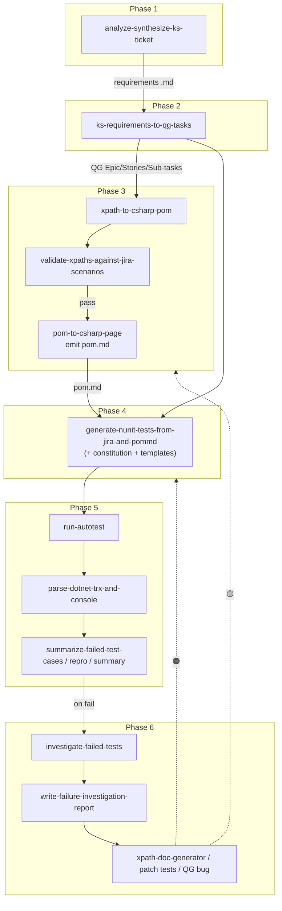

# Skill Classification — ATL Version 2

## Purpose

This document applies the **Skill Candidate Classification** pattern from `workflow/workflow_diagram 1.md` to **ATL Version 2** (`Automation Workflow/atl version 2.md`). It identifies which workflow units are strong candidates for **standalone Cursor agent skills**, which should stay **inline or orchestrator-only**, and how larger phases can be **split into smaller, testable skills** where it adds value.

## BA criteria for a good skill candidate

A step (or coherent sub-step) is a good skill candidate when it has:

| Criterion | Question |
|---|---|
| **(a) Bounded I/O** | Are inputs and outputs explicit enough to document in YAML and test? |
| **(b) Reusability** | Can another workflow or team reuse it without rewriting domain glue? |
| **(c) Non-trivial scope** | Is it more than a one-liner or trivial file check? |
| **(d) Independent testability** | Can you validate it with fixtures (sample `.trx`, `pom.md`, Jira JSON) without running the whole ATL? |

**Legend:** ✅ Yes · ⚠️ Partial (orchestrator fragment / thin wrapper) · ❌ No (gate, human approval, or belongs inside another skill)

---

## Skill Candidate Classification (ATL v2)

Granularity follows the markdown structure of ATL v2 (phases and numbered sub-steps). Names in **backticks** are *proposed* skill identifiers; several already exist in your repo or docs under the same or similar names.

| Step ID | Step name | Skill candidate? | Proposed skill name(s) | Reusability |
|---|---|---|---|---|
| **P1** | Phase 1 — Requirement Analysis | ✅ **Yes** | `analyze-synthesize-ks-ticket` *(as documented)* | **High** — any KS/Business/Dev ticket → structured requirements `.md` |
| P1a | Ingest ticket + comments + synthesis | ⚠️ Partial | Could split into `fetch-jira-ticket` + `synthesize-requirements-doc` if you want thinner skills | Medium — split only if you need independent iteration on fetch vs synthesis |
| P1b | Filename: Ticket Summary + `YYYYMMDD_HHMMSS` | ✅ **Yes** | `save-timestamped-markdown` *(utility)* | **High** — generic naming + write for any audit trail |
| **P2** | Phase 2 — Test Design (full phase) | ✅ **Yes** | `ks-requirements-to-qg-tasks` *(as documented)* | **Medium–High** — QG-centric but reusable across features |
| P2a | Parse Phase 1 requirements into Epic/Story/Sub-task model | ✅ **Yes** | `parse-atl-requirements-markdown` | **Medium** — reusable wherever requirements live in that markdown shape |
| P2b | Apply `[PHASE 2] 
` naming | ✅ **Yes** | `apply-qg-issue-naming-convention` | **Medium** — any Jira project with naming rules |
| P2c | Create/update Jira hierarchy in QG | ✅ **Yes** | `create-jira-epic` / `create-jira-stories` / `create-jira-subtasks` *(generic building blocks)* | **High** — not ATL-specific if parameterized by project/key |
| **P3** | Phase 3 — Automation Architecture (umbrella) | ⚠️ Partial | Orchestrator pattern `atl-phase-3-pom-pipeline` *(optional meta-skill)* | Low as one blob — prefer sub-skills below |
| P3.1 | UI scanning → unique XPaths | ✅ **Yes** | `xpath-to-csharp-pom` *(as documented)* | **High** — any web page → XPath inventory |
| P3.2 | Validate XPaths vs Phase 2 tasks | ✅ **Yes** | `validate-xpaths-against-jira-scenarios` *(or keep inside `pom-to-csharp-page`)* | **Medium** — couples Jira structure + DOM model |
| P3.3 | HALT on mismatch — log + notify | ⚠️ Partial | `log-xpath-mismatch-discrepancies` | **Medium** — small but testable report artifact |
| P3.4 | Generate `pom.md` + path under `docs/aloha/user-steps/<module>/` | ✅ **Yes** | `pom-to-csharp-page` *(as documented)* or split: `emit-pom-markdown` + `resolve-module-folder-from-ticket` | **Medium** — path/naming rules are repo-specific |
| **P4** | Phase 4 — Automation Scripting (full) | ✅ **Yes** | `generate-nunit-tests-from-jira-and-pommd` *(umbrella name)* | **Medium** — Selenium + your templates |
| P4a | Load `constitution.md` + template files | ✅ **Yes** | `load-project-test-constitution` | **High** — any codegen in this repo |
| P4b | Map Jira scenarios → test methods + data | ✅ **Yes** | `map-jira-stories-to-nunit-scenarios` | **Medium** — depends on Jira field layout |
| P4c | Merge locators from `pom.md` into Page/interaction layer | ✅ **Yes** | `merge-pom-markdown-into-test-code` | **Medium** — couples `pom.md` schema + C# |
| P4d | Enforce DRY, data-driven patterns, logging | ⚠️ Partial | Usually **rules inside** P4 umbrella, not a separate skill | Low if only lint/style |
| **P5** | Phase 5 — Test Execution & Branching | ⚠️ Partial | Meta-orchestrator `atl-phase-5-execute-and-branch` | Low — sequencing is workflow glue |
| P5.1 | Compose `dotnet test` + filters + `-p:Platform=x64` | ✅ **Yes** | `run-autotest` *(as documented)* | **High** — any .NET test run with your conventions |
| P5.2a | Parse console / `.trx` for pass/fail | ✅ **Yes** | `parse-dotnet-trx-and-console` | **High** — any dotnet test pipeline |
| P5.2b | List failed TCs, messages, stacks | ✅ **Yes** | `summarize-failed-test-cases` | **High** |
| P5.2c | Emit `Isolated_Bug_Repro_<ID>.cs` | ✅ **Yes** | `generate-isolated-bug-repro` | **Medium** — depends on test/project layout |
| P5.2d | “No Jira yet” handoff to Phase 6 | ❌ No | Policy line inside orchestrator + Phase 6 skill | Trivial rule |
| P5-pass | Final Test Execution Summary (all green) | ✅ **Yes** | `generate-test-execution-summary` | **Medium** — reporting template |
| **P6** | Phase 6 — Failure Investigation | ✅ **Yes** | `investigate-failed-tests` *(as documented)* | **High** — RCA pattern reusable |
| P6.1 | Ingest Phase 5 console + `TestResults/*.trx` | ✅ **Yes** | `ingest-failed-test-artifacts` | **High** |
| P6.1b | Cross-reference XPath with Phase 3 `pom.md` | ✅ **Yes** | `crossref-failure-to-pom-markdown` | **Medium** |
| P6.2 | Live browser decision tree (🔴/🟡/🟠) | ✅ **Yes** | `classify-failure-via-live-ui-check` | **Medium** — needs browser MCP / manual hybrid |
| P6.3 | Write `TestResults/FailureReport_<YYYYMMDD_HHMMSS>.md` | ✅ **Yes** | `write-failure-investigation-report` | **High** — schema-driven markdown |
| P6.4 | Remediation routing table | ⚠️ Partial | `route-atl-remediation` *(or inside investigate skill)* | Medium — thin if only routing text |
| P6.4b | 🟡 path: re-run `xpath-doc-generator` | ✅ **Yes** | `xpath-doc-generator` *(named in ATL v2 §6.4)* | **Medium** — must align with Phase 3 tool naming |
| P6.4c | 🔴 path: create QG bug + link Epic | ✅ **Yes** | `create-qg-bug-with-evidence` | **High** — Jira API + attachment pattern |
| **—** | Human approval / “Continue” gates | ❌ No | *(human-in-the-loop pattern)* | Not automatable as standalone skill |
| **—** | HALT / STOP branches | ❌ No | *(inline guard + messaging)* | Policy, not a skill |

### Documentation note (BA)

ATL v2 §6.1 references “**Phase 5 Step 4** console log”; the workflow body defines execution as **§5.1**. Treat **5.1** as the intended reference when implementing or skilling **P6.1** inputs.

---

## Recommended skill breakdown (priority order)

### Tier 1 — Build first *(high reuse, clear I/O)*

| Priority | Skill name | Covers (ATL v2) | Justification |
|---|---|---|---|
| 🥇 1 | `run-autotest` | P5.1 | Stable CLI composition; reusable across any ATL run |
| 🥇 2 | `parse-dotnet-trx-and-console` | P5.2a | Pure parsing; easy fixtures from real `.trx` |
| 🥇 3 | `analyze-synthesize-ks-ticket` | P1 | Already the Phase 1 entry; high value |
| 🥇 4 | `xpath-to-csharp-pom` | P3.1 | Page → locators; reusable outside ATL |
| 🥇 5 | `investigate-failed-tests` | P6 *(umbrella)* | End-to-end RCA story; can internally call Tier-2 atoms |

### Tier 2 — Domain ATL / QG *(build second)*

| Priority | Skill name | Covers | Justification |
|---|---|---|---|
| 🥈 6 | `ks-requirements-to-qg-tasks` | P2 | Jira hierarchy from requirements; couples QG rules |
| 🥈 7 | `pom-to-csharp-page` | P3.2–P3.4 | Validation + `pom.md` emission; bounded if `pom.md` schema is fixed |
| 🥈 8 | `validate-xpaths-against-jira-scenarios` | P3.2 | Isolates “compare DOM plan to Jira” for separate testing |
| 🥈 9 | `generate-nunit-tests-from-jira-and-pommd` | P4 | Large codegen skill; benefits from constitution + templates as **inputs**, not separate skills at first |
| 🥈 10 | `write-failure-investigation-report` | P6.3 | Markdown report with fixed sections — easy to snapshot-test |

### Tier 3 — Supporting atoms *(split out when Tier 1–2 stabilize)*

| Priority | Skill name | Covers | Justification |
|---|---|---|---|
| 🥉 11 | `save-timestamped-markdown` | P1b | Thin but reusable file naming |
| 🥉 12 | `summarize-failed-test-cases` | P5.2b | Could live inside `parse-dotnet-trx-and-console` until you need reuse |
| 🥉 13 | `generate-isolated-bug-repro` | P5.2c | Useful when repro templates stabilize |
| 🥉 14 | `generate-test-execution-summary` | P5-pass | Reporting-only |
| 🥉 15 | `xpath-doc-generator` | P6.4b | Remediation entry; align naming with Phase 3 stack |
| 🥉 16 | `create-qg-bug-with-evidence` | P6.4c | Jira create + attachments + Epic link |
| 🥉 17 | `crossref-failure-to-pom-markdown` | P6.1b | Keeps investigation skill thinner |

---

## Skill dependency map (ATL v2)

High-level data flow between **proposed** and **documented** skills:

---

## Consolidation guidance (BA)

1. **Do not fragment prematurely:** `P4a–P4c` can remain **sections inside one Phase 4 skill** until codegen errors cluster around one concern (template vs Jira mapping vs `pom.md` parsing).
2. **Keep investigation cohesive:** `investigate-failed-tests` should own **P6.1–P6.3** in one skill first; extract `ingest-failed-test-artifacts` and `write-failure-investigation-report` only when you want separate unit tests or reuse in non-ATL runs.
3. **Align tool names:** ATL v2 mentions **`xpath-doc-generator`** in remediation while Phase 3 references **`xpath-to-csharp-pom`** / **`pom-to-csharp-page`**. In skills (and Jira), **standardize on one canonical name** or document **alias triggers** in YAML `description` to avoid agents missing the skill.
4. **Orchestrator skill (optional):** A thin `atl-v2-orchestrator` skill that only lists phase order and gates is **⚠️ Partial** value — prefer linking existing step skills from `qa-workflow-from-ks-ticket`-style orchestrators you already have under `.cursor/skills/`.

---

## Traceability matrix

| ATL v2 section | Primary skill (as named in doc) | Optional atomic split |
|---|---|---|
| §Phase 1 | `analyze-synthesize-ks-ticket` | fetch vs synthesize vs save |
| §Phase 2 | `ks-requirements-to-qg-tasks` | naming / parse / Jira CRUD |
| §3.1 | `xpath-to-csharp-pom` | — |
| §3.2–3.3 | `pom-to-csharp-page` | validate vs emit path |
| §Phase 4 | *(implicit composite skill)* | constitution + templates + codegen |
| §5.1 | `run-autotest` | — |
| §5.2 | composite of parse + summarize + repro | each line in Tier 3 |
| §Phase 6 | `investigate-failed-tests` | parse / classify / report / Jira |

---

*File generated for ATL Version 2 skill planning. Store alongside `atl version 2.md` and update when phases or tool names change.*
