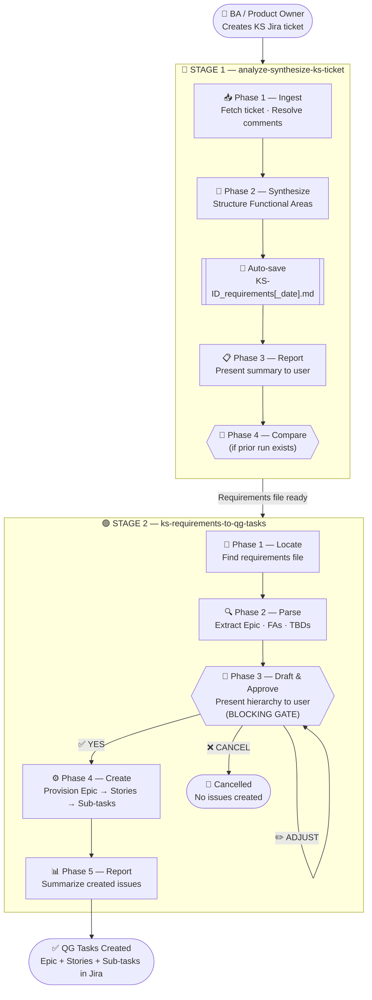
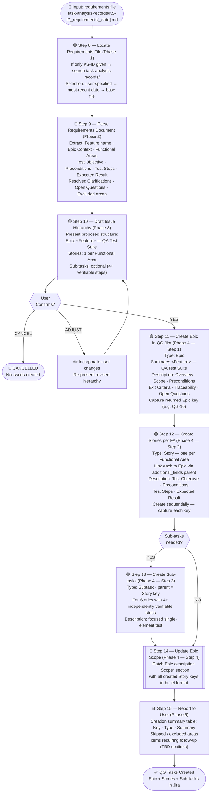
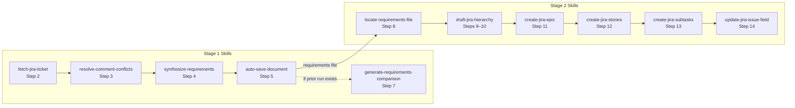
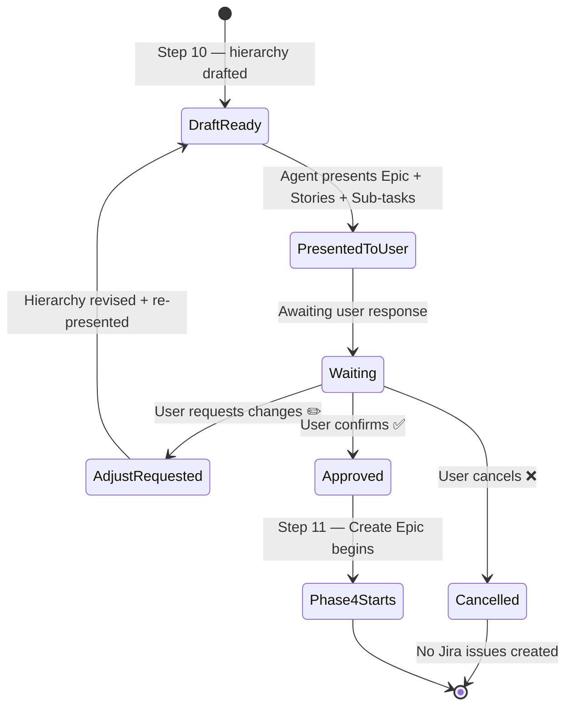

# QA Workflow — Create QG Follow-up Tickets from a KS Jira Ticket

> **KS Ticket (BA) → Requirements File → QG Jira Hierarchy (Epic → Story → Sub-task)**

Skills chained: `analyze-synthesize-ks-ticket` → `ks-requirements-to-qg-tasks`

> **Visual companion:** See [`workflow.drawio`](./workflow.drawio) for the full interactive flowchart with color-coded stages, decision gates, and legend.

*Last updated: 2026-03-31*

---

## High-Level Two-Stage Overview



---

## Stage 1 Detailed Flow — `analyze-synthesize-ks-ticket`

```mermaid
flowchart TD
    USER(["👤 User provides KS ticket ID\ne.g. KS-939"])

    STEP1["🟢 Step 1 — Trigger &amp; Intent Recognition\nConfirm ticket ID · Identify purpose\nAnnounce: no Jira writes will be made"]

    STEP2["🔵 Step 2 — Fetch KS Ticket Data\nTool: jira_get_issue\nFields: summary · description · all comments\nreporter · assignee · status · created · updated"]

    STEP3["🔵 Step 3 — Analyze &amp; Resolve Comments\n① Conflict rule: latest PO comment wins\n② Removal rule: note exclusions with author + date\n③ Merge rule: add new details per FA\n④ Flag rule: mark open/unresolved questions\n⑤ Participant rule: build role list"]

    STEP4["🔵 Step 4 — Synthesize &amp; Structure Requirements\nFor each Functional Area:\n• Test Objective\n• Preconditions\n• Test Steps (numbered)\n• Expected Result (bulleted)\n→ Use [TBD] for missing info — never omit a heading"]

    STEP5[["💾 Step 5 — Auto-Save Requirements File\ntask-analysis-records/KS-ID_requirements[_date].md\nNever overwrite — each run creates a new file"]]

    STEP6["📋 Step 6 — Present Summary to User\nFunctional Areas identified · Resolved Clarifications\nOpen Questions · Suggest next step"]

    DEC1{{"Previous run\nexists?"}}

    STEP7["🔄 Step 7 — Generate Comparison Doc (Phase 4)\nSide-by-side delta of two most recent runs\n7 sections: Metadata · FAs · Removed/Added\nScope · Clarifications · Questions · Quality score\nSaved to task-analysis-records/"]

    END1(["Stage 1 Complete\nRequirements file ready in task-analysis-records/"])

    USER --> STEP1 --> STEP2 --> STEP3 --> STEP4 --> STEP5 --> STEP6 --> DEC1
    DEC1 -->|"YES — auto-triggered"| STEP7
    DEC1 -->|"NO"| END1
    STEP7 --> END1
```



### Stage 1 — Phase Map

| Phase | Steps | Output |
|---|---|---|
| Phase 1 — Ingest | Steps 2–3 | Resolved requirements data, participant list |
| Phase 2 — Synthesize | Steps 4–5 | `KS-ID_requirements[_date].md` saved |
| Phase 3 — Report | Step 6 | Chat summary with FAs, clarifications, open questions |
| Phase 4 — Compare | Step 7 (conditional) | `KS-ID_requirements_comparison_run<N-1>_vs_runN.md` |

---

## Stage 2 Detailed Flow — `ks-requirements-to-qg-tasks`



### Stage 2 — Phase Map

| Phase | Steps | Output |
|---|---|---|
| Phase 1 — Locate | Step 8 | Requirements file path confirmed |
| Phase 2 — Parse | Step 9 | Structured data extracted from file |
| Phase 3 — Draft & Approve | Step 10 + Decision | User-confirmed task hierarchy |
| Phase 4 — Create | Steps 11–14 | Epic, Stories, Sub-tasks created in QG |
| Phase 5 — Report | Step 15 | Creation summary in chat |

---

## Data Flow Across Both Stages

```mermaid
flowchart LR
    A["KS Ticket ID\ne.g. KS-939"]
    B["Raw Ticket Data\nsummary · description\nall comments · reporter\nassignee · status"]
    C["Synthesized Requirements\nFunctional Areas\nTest Objective · Preconditions\nTest Steps · Expected Result\nClarifications · Open Questions"]
    D["Saved File\ntask-analysis-records/\nKS-ID_requirements[_date].md"]
    E["Parsed Hierarchy\nEpic spec · Story specs\nSub-task specs · TBD list\nExcluded areas"]
    F["User-Approved\nHierarchy\nwith confirmation"]
    G["Created Jira Issues\nEpic key · Story keys\nSub-task keys"]
    H["Final Record\nChat summary table\nEpic Jira link"]

    A -->|"Stage 1 — Phase 1\nFetch"| B
    B -->|"Stage 1 — Phase 2\nSynthesize"| C
    C -->|"Stage 1 — Phase 2\nAuto-save"| D
    D -->|"Stage 2 — Phase 1-2\nLocate + Parse"| E
    E -->|"Stage 2 — Phase 3\nDraft + Approve"| F
    F -->|"Stage 2 — Phase 4\nCreate"| G
    G -->|"Stage 2 — Phase 5\nReport"| H
```



---

## Skills Inventory

| # | Skill | Role | Produces |
|---|---|---|---|
| 1 | `analyze-synthesize-ks-ticket` | **Stage 1** — Ingest, resolve, synthesize KS ticket into requirements file | `KS-ID_requirements[_date].md` + optional comparison doc |
| 2 | `ks-requirements-to-qg-tasks` | **Stage 2** — Parse requirements file, draft hierarchy, create QG Jira tasks | Epic + Stories + Sub-tasks in QG project |

### Skill Boundaries

| Action | Stage 1 | Stage 2 |
|---|---|---|
| Fetch Jira ticket data | ✅ | ❌ |
| Resolve comment overrides | ✅ | ❌ |
| Produce requirements file | ✅ | ❌ |
| Create any Jira tasks | ❌ | ✅ |
| Parse requirements file | ❌ | ✅ |
| Present task hierarchy for approval | ❌ | ✅ |
| Process multiple KS tickets at once | ❌ | ❌ |

---

## Visual Color Guide

The following color system is used in [`workflow.drawio`](./workflow.drawio) and is consistent across all diagrams in this document.

### Node Colors

| Color | Fill | Stroke | Font | Meaning |
|---|---|---|---|---|
| Blue | `#DBEAFE` | `#3B82F6` | `#1E3A5F` | **Analyze / Read step** — reads data, no writes to Jira |
| Green | `#DCFCE7` | `#22C55E` | `#14532D` | **Create / Output step** — writes to Jira or produces output |
| Indigo | `#EEF2FF` | `#6366F1` | `#3730A3` | **Auto-Save / Update file** — writes to the local file system |
| Amber | `#FFFBEB` | `#F59E0B` | `#78350F` | **Decision / Human Gate** — requires human input to proceed |
| Rose | `#FFF1F2` | `#F43F5E` | `#9F1239` | **Cancelled / Error** — workflow terminated, no output created |
| Indigo light | `#EEF2FF` | `#1E3A5F` | `#1E3A5F` | **Start / End terminal** — entry and exit points of the workflow |

### Stage Background Colors

| Stage | Fill | Stroke | Meaning |
|---|---|---|---|
| Stage 1 | `#EFF6FF` (blue, 55% opacity) | `#3B82F6` | `analyze-synthesize-ks-ticket` scope |
| Stage 2 | `#F0FDF4` (green, 55% opacity) | `#22C55E` | `ks-requirements-to-qg-tasks` scope |

### Edge (Arrow) Colors

| Color | Meaning |
|---|---|
| Blue `#3B82F6` | Main flow within Stage 1 |
| Indigo `#6366F1` | Auto-save transition (Step 5 → Step 6, Step 14 → Step 15) |
| Amber `#F59E0B` | Branch from a decision gate (YES / ADJUST path) |
| Green `#22C55E` | Main flow within Stage 2 |
| Rose `#F43F5E` | CANCEL path — leads to terminated terminal |
| Green `#16A34A` | Final edge to the End terminal |

---

## Step-by-Step Descriptions

A plain-language description of every step in the workflow for business stakeholders and new team members. Each step follows the format: **Purpose → Actor → Input → Process → Output**.

---

### Stage 1 — `analyze-synthesize-ks-ticket`

---

#### Step 1 — Trigger & Intent Recognition

| Field | Detail |
|---|---|
| **Purpose** | Establish the context of the session before any data is fetched or written |
| **Actor** | Agent |
| **Input** | User message containing a KS ticket ID (e.g. `KS-939`) |
| **Process** | The agent confirms the ticket ID, identifies whether the intent is analysis-only or full synthesis, and explicitly announces that **no Jira writes will be made** in Stage 1 |
| **Output** | Confirmed session context: ticket ID, intent, and scope boundary |
| **Key Rules** | If the user provides more than one ticket ID, the agent processes only the first one and informs the user. If the intent is ambiguous, the agent asks one clarifying question before proceeding. |

---

#### Step 2 — Fetch KS Ticket Data

| Field | Detail |
|---|---|
| **Purpose** | Retrieve all raw data from the KS Jira ticket for downstream analysis |
| **Actor** | Agent (via Jira API) |
| **Input** | Confirmed KS ticket ID |
| **Process** | The agent calls `jira_get_issue` with the ticket ID. It fetches the full payload: summary, description, all comments (with author, date, and body), reporter, assignee, status, created date, and last updated date. |
| **Output** | Structured raw ticket data object held in working memory |
| **Key Rules** | If the ticket is not found or access is denied, the agent reports the exact error message and asks the user to verify the ticket ID. If the description field is empty, the agent notes this and relies entirely on the comment thread. |

---

#### Step 3 — Analyze & Resolve Comments

| Field | Detail |
|---|---|
| **Purpose** | Transform the raw, often contradictory comment thread into a single authoritative version of each requirement |
| **Actor** | Agent |
| **Input** | Raw ticket data from Step 2 |
| **Process** | The agent applies five resolution rules sequentially to every comment: **(①) Conflict rule** — when two comments contradict, the most recent comment from the PO/BA wins; **(②) Removal rule** — if a requirement is explicitly removed in a comment, the agent notes the exclusion with author and date; **(③) Merge rule** — additional details mentioned across comments are merged into the relevant Functional Area; **(④) Flag rule** — unresolved questions or ambiguous statements are marked `[OPEN QUESTION]`; **(⑤) Participant rule** — all named participants (tester, BA, PO, dev) are collected into a role list. |
| **Output** | Resolved requirements data: a clean set of Functional Areas, clarifications, open questions, and a participant list |
| **Key Rules** | The agent never silently discards a comment. Every override or exclusion is attributed to its source (author + timestamp). |

---

#### Step 4 — Synthesize & Structure Requirements

| Field | Detail |
|---|---|
| **Purpose** | Transform the resolved requirements data into a structured, standardized document that can be consumed by Stage 2 |
| **Actor** | Agent |
| **Input** | Resolved requirements data from Step 3 |
| **Process** | For each Functional Area identified, the agent produces four sections: **Test Objective** (what is being verified), **Preconditions** (what must be true before testing), **Test Steps** (numbered sequence), and **Expected Result** (bulleted outcome). Any field where data is missing is filled with `[TBD]` — no heading is ever omitted. |
| **Output** | A fully structured requirements draft in memory, ready for file-save in Step 5 |
| **Key Rules** | The `[TBD]` placeholder is mandatory for missing data — it preserves the document structure and signals gaps for later resolution. The agent never invents requirements; it only synthesizes what is present in the source ticket. |

---

#### Step 5 — Auto-Save Requirements File

| Field | Detail |
|---|---|
| **Purpose** | Persist the synthesized requirements to disk so they are available for Stage 2 and for historical comparison |
| **Actor** | Agent (file system operation) |
| **Input** | Structured requirements from Step 4, KS ticket ID, current date |
| **Process** | The agent writes the requirements to a Markdown file at the path `task-analysis-records/<KS-ID>_requirements[_date].md`. If a base file already exists, a **new dated file** is created (e.g. `KS-939_requirements_20260331.md`) — the original is never overwritten. |
| **Output** | A new `.md` file on disk in the `task-analysis-records/` directory |
| **Key Rules** | Files are append-only by policy — each run creates a new file to maintain a complete audit trail. The naming convention `<KS-ID>_requirements[_YYYYMMDD].md` is strictly followed. |

---

#### Step 6 — Present Summary to User

| Field | Detail |
|---|---|
| **Purpose** | Close Stage 1 with a human-readable summary that confirms what was captured and surfaces any open questions for the user to resolve |
| **Actor** | Agent |
| **Input** | Synthesized requirements from Step 4, saved file path from Step 5 |
| **Process** | The agent presents: **(a)** the list of Functional Areas identified, **(b)** any clarifications that were resolved from the comment thread, **(c)** all open questions flagged with `[TBD]`, and **(d)** the file path of the saved requirements document. The agent suggests the next step (run Stage 2 or resolve open questions first). |
| **Output** | A structured chat summary visible to the user |
| **Key Rules** | The summary must always include the saved file path so the user or Stage 2 can locate it. If there are zero open questions, the agent explicitly states this as confirmation of completeness. |

---

#### Decision Gate — Previous Run Exists?

| Field | Detail |
|---|---|
| **Purpose** | Determine whether this is a repeat run for the same ticket, which would make a comparison document valuable |
| **Actor** | Agent (logic check) |
| **Condition** | Does a prior `<KS-ID>_requirements*.md` file already exist in `task-analysis-records/`? |
| **YES path** | Proceed to Step 7 — auto-generate a comparison document |
| **NO path** | Stage 1 completes — the current file is the first run |

---

#### Step 7 — Generate Comparison Document *(conditional)*

| Field | Detail |
|---|---|
| **Purpose** | Highlight what changed between the two most recent runs so the BA/QA team can quickly see the evolution of requirements |
| **Actor** | Agent |
| **Input** | The two most recent `<KS-ID>_requirements*.md` files |
| **Process** | The agent produces a side-by-side comparison document with 7 sections: Metadata (run dates, ticket ID), Functional Areas delta (added/removed FAs), Removed requirements, Added requirements, Scope changes, Clarification changes, and a Quality Score (a simple count of `[TBD]` items remaining vs. resolved). The output is saved to `task-analysis-records/` with a descriptive name. |
| **Output** | `<KS-ID>_requirements_comparison_run<N-1>_vs_runN.md` in `task-analysis-records/` |
| **Key Rules** | This step is auto-triggered — the user does not need to request it explicitly. It runs whenever a prior file is detected. |

---

### Stage 2 — `ks-requirements-to-qg-tasks`

---

#### Step 8 — Locate Requirements File

| Field | Detail |
|---|---|
| **Purpose** | Identify the correct requirements file to use as the input for task creation |
| **Actor** | Agent |
| **Input** | KS ticket ID (or explicit file path provided by the user) |
| **Process** | The agent applies a three-tier selection rule: **(1)** if the user specifies an exact file path, use it; **(2)** if only a KS-ID is given, scan `task-analysis-records/` and select the file with the most recent date suffix; **(3)** if no dated file exists, fall back to the base file `<KS-ID>_requirements.md`. |
| **Output** | Confirmed file path of the requirements document to be parsed |
| **Key Rules** | If no matching file is found, the agent reports the directory searched, explains that Stage 1 must be run first, and stops. It does not attempt to create Jira tasks without a verified requirements file. |

---

#### Step 9 — Parse Requirements Document

| Field | Detail |
|---|---|
| **Purpose** | Extract all structured data from the requirements file into an in-memory representation that can drive Jira issue creation |
| **Actor** | Agent |
| **Input** | Requirements file from Step 8 |
| **Process** | The agent reads the Markdown file and extracts: Feature name, Epic context, all Functional Areas (and for each: Test Objective, Preconditions, Test Steps, Expected Result), Resolved Clarifications, Open Questions / `[TBD]` sections, and any explicitly Excluded areas. |
| **Output** | A structured data object: Epic spec, array of Story specs, list of TBDs, list of excluded areas |
| **Key Rules** | `[TBD]` fields are preserved verbatim — they are not resolved or discarded. Excluded areas are noted and will be reported in Step 15. |

---

#### Step 10 — Draft Issue Hierarchy

| Field | Detail |
|---|---|
| **Purpose** | Propose the complete Jira task structure to the user for review and approval before any issue is created |
| **Actor** | Agent |
| **Input** | Parsed data from Step 9 |
| **Process** | The agent builds a proposed hierarchy: one **Epic** (`<Feature> — QA Test Suite`), one **Story** per Functional Area, and optional **Sub-tasks** for any Story whose test steps contain 4 or more independently verifiable elements. The full proposed structure is presented in a readable table format. |
| **Output** | A draft hierarchy displayed in chat — no Jira API calls made yet |
| **Key Rules** | This is a **read-only preview**. The agent must explicitly state that no Jira writes have occurred yet and prompt the user to confirm, adjust, or cancel. |

---

#### Decision Gate — User Confirms?

| Field | Detail |
|---|---|
| **Purpose** | Enforce a mandatory human approval before any irreversible Jira API writes are made |
| **Actor** | User |
| **Condition** | Does the user approve the proposed hierarchy? |
| **YES path** | Proceed to Step 11 — begin creating Jira issues |
| **ADJUST path** | The agent incorporates the user's changes and re-presents the updated hierarchy (loops back to Step 10) |
| **CANCEL path** | The workflow terminates cleanly. No Jira issues are created. |
| **Key Rules** | The agent never creates Jira issues without explicit user confirmation. Ambiguous responses (e.g. "looks fine I guess") should be clarified before proceeding. |

---

#### Step 11 — Create Epic in QG Jira

| Field | Detail |
|---|---|
| **Purpose** | Provision the top-level Epic issue that will serve as the parent container for all QA Stories |
| **Actor** | Agent (via Jira API) |
| **Input** | Epic spec from Step 10 |
| **Process** | The agent calls the Jira `create_issue` API with `issuetype: Epic`. The Epic description is structured with five sections: Overview, Scope (initially empty — filled in Step 14), Preconditions, Exit Criteria, and Traceability (link to KS ticket). The returned Epic key (e.g. `QG-10`) is captured and stored. |
| **Output** | A live Epic issue in the QG Jira project; Epic key stored in memory |
| **Key Rules** | If Epic creation fails, the agent aborts immediately — no Stories or Sub-tasks are created. The error is reported clearly with the API response. |

---

#### Step 12 — Create Stories per Functional Area

| Field | Detail |
|---|---|
| **Purpose** | Create one Jira Story for each Functional Area identified in the requirements, all linked to the parent Epic |
| **Actor** | Agent (via Jira API) |
| **Input** | Array of Story specs + Epic key from Step 11 |
| **Process** | The agent creates Stories **sequentially** (not in parallel), one per Functional Area. Each Story is linked to the Epic via the `parent` field. The Story description contains: Test Objective, Preconditions, Test Steps, and Expected Result from the requirements. The returned key for each Story (e.g. `QG-11`, `QG-12`) is captured. |
| **Output** | N Story issues in QG Jira, each linked to the Epic; all Story keys stored in memory |
| **Key Rules** | Sequential creation is intentional — it ensures each key is captured before the next call. If one Story fails, the agent logs the error, continues creating remaining Stories, and reports all failures at the end in Step 15. |

---

#### Decision Gate — Sub-tasks Needed?

| Field | Detail |
|---|---|
| **Purpose** | Determine whether any Story is complex enough to warrant decomposition into Sub-tasks |
| **Actor** | Agent (logic check) |
| **Condition** | Does any Story contain 4 or more independently verifiable test steps? |
| **YES path** | Proceed to Step 13 — create Sub-tasks for qualifying Stories |
| **NO path** | Skip to Step 14 — update Epic Scope |

---

#### Step 13 — Create Sub-tasks *(conditional)*

| Field | Detail |
|---|---|
| **Purpose** | Break down complex Stories into focused, individually assignable Sub-tasks |
| **Actor** | Agent (via Jira API) |
| **Input** | Story keys from Step 12 for Stories with 4+ verifiable steps |
| **Process** | For each qualifying Story, the agent creates one Sub-task per verifiable test element. Each Sub-task is linked to its parent Story via the `parent` field. The Sub-task description contains a focused, single-element test scenario. |
| **Output** | Sub-task issues in QG Jira, each linked to a parent Story |
| **Key Rules** | Only Stories with 4+ independently verifiable steps get Sub-tasks. Sub-tasks are not created for FAs with simple pass/fail criteria. |

---

#### Step 14 — Update Epic Scope

| Field | Detail |
|---|---|
| **Purpose** | Patch the Epic's Scope section to list all Story keys that were created, making the Epic a self-contained index of the QA coverage |
| **Actor** | Agent (via Jira API) |
| **Input** | Epic key + all Story keys from Steps 11–12 |
| **Process** | The agent calls `update_issue` on the Epic and patches the **Scope** section of the description with a bulleted list of all Story keys and their summaries. |
| **Output** | Updated Epic description in QG Jira with a complete Scope section |
| **Key Rules** | This step always runs, even if Sub-task creation was skipped. It is the last API write of the workflow. |

---

#### Step 15 — Report to User

| Field | Detail |
|---|---|
| **Purpose** | Deliver a complete creation summary so the user has a clear record of what was built in Jira |
| **Actor** | Agent |
| **Input** | All issue keys and results from Steps 11–14 |
| **Process** | The agent presents a summary table with columns: Jira Key, Issue Type, Summary, and Status (Created / Failed). Additionally it lists: **(a)** Functional Areas that were skipped or excluded, **(b)** any `[TBD]` items that were preserved in Jira descriptions and require follow-up, and **(c)** a link to the Epic in Jira. |
| **Output** | A structured final report in chat |
| **Key Rules** | Even if one or more issues failed to create, the report must be delivered. Partial success is explicitly flagged — the user must know which issues need to be created manually. |

---

## Agent Skill Candidates

> **BA Analysis:** The 15 steps in this workflow have been evaluated for their potential to become standalone, reusable agent skills. The criteria for a good skill candidate are: **(a)** well-bounded inputs and outputs, **(b)** reusable beyond this specific workflow, **(c)** complex enough to justify a dedicated skill (vs. inline logic), and **(d)** independently testable.

---

### Skill Candidate Classification

| Step | Step Name | Skill Candidate? | Proposed Skill Name | Reusability |
|---|---|---|---|---|
| Step 1 | Trigger & Intent Recognition | ⚠️ Partial | *(part of orchestrator)* | Low — workflow-specific opening |
| Step 2 | Fetch KS Ticket Data | ✅ **Yes** | `fetch-jira-ticket` | **High** — any Jira project |
| Step 3 | Analyze & Resolve Comments | ✅ **Yes** | `resolve-comment-conflicts` | **High** — any comment-heavy ticket |
| Step 4 | Synthesize & Structure Requirements | ✅ **Yes** | `synthesize-requirements` | **Medium** — QA-specific structure |
| Step 5 | Auto-Save Requirements File | ✅ **Yes** | `auto-save-document` | **High** — any document write with naming convention |
| Step 6 | Present Summary to User | ⚠️ Partial | *(part of Stage 1 orchestrator)* | Low — output format is context-specific |
| Gate | Previous Run Exists? | ❌ No | *(inline conditional logic)* | Trivial file-check, not worth isolating |
| Step 7 | Generate Comparison Doc | ✅ **Yes** | `generate-requirements-comparison` | **Medium** — any two-version document delta |
| Step 8 | Locate Requirements File | ✅ **Yes** | `locate-requirements-file` | **Medium** — reusable within QA workflows |
| Step 9 | Parse Requirements Document | ✅ **Yes** | `parse-requirements-doc` | **Medium** — reusable for any structured Markdown |
| Step 10 | Draft Issue Hierarchy | ✅ **Yes** | `draft-jira-hierarchy` | **High** — reusable for any Jira project setup |
| Gate | User Confirms? | ❌ No | *(human-in-the-loop gate pattern)* | Pattern, not a skill |
| Adjust | Incorporate User Changes | ❌ No | *(part of draft-jira-hierarchy loop)* | Belongs inside Step 10 skill |
| Step 11 | Create Epic in QG Jira | ✅ **Yes** | `create-jira-epic` | **High** — any Jira project |
| Step 12 | Create Stories per FA | ✅ **Yes** | `create-jira-stories` | **High** — any Epic → Story hierarchy |
| Gate | Sub-tasks Needed? | ❌ No | *(inline conditional logic)* | Trivial count check, not worth isolating |
| Step 13 | Create Sub-tasks | ✅ **Yes** | `create-jira-subtasks` | **High** — any Story → Sub-task hierarchy |
| Step 14 | Update Epic Scope | ✅ **Yes** | `update-jira-issue-field` | **High** — generic Jira patch, not QA-specific |
| Step 15 | Report to User | ⚠️ Partial | *(part of Stage 2 orchestrator)* | Low — output format is workflow-specific |

---

### Recommended Skill Breakdown (Priority Order)

#### Tier 1 — High-Value, Highly Reusable *(Build First)*

These skills provide value beyond this single workflow and can be reused in any future Jira-related task.

| Priority | Skill Name | Covers | Justification |
|---|---|---|---|
| 🥇 1 | `fetch-jira-ticket` | Step 2 | Pure API wrapper — zero workflow-specific logic; reusable in any Jira workflow |
| 🥇 2 | `create-jira-epic` | Step 11 | Single well-defined Jira API call with a standard Epic template |
| 🥇 3 | `create-jira-stories` | Step 12 | Reusable loop: FA list → Story-per-FA; a universal Jira hierarchy pattern |
| 🥇 4 | `create-jira-subtasks` | Step 13 | Reusable conditional creation; pairs naturally with `create-jira-stories` |
| 🥇 5 | `update-jira-issue-field` | Step 14 | Generic PATCH wrapper; reusable for Epic, Story, or any Jira field update |

#### Tier 2 — Medium-Value, Domain-Specific *(Build Second)*

These skills are specific to QA requirements workflows but encapsulate non-trivial logic worth isolating.

| Priority | Skill Name | Covers | Justification |
|---|---|---|---|
| 🥈 6 | `resolve-comment-conflicts` | Step 3 | The 5 resolution rules form a standalone, independently testable algorithm |
| 🥈 7 | `synthesize-requirements` | Step 4 | Core intelligence step; separating it from comment-resolution enables independent iteration |
| 🥈 8 | `draft-jira-hierarchy` | Steps 9+10 | The parse → propose → user-adjust → approve loop is a complete, bounded interaction pattern |
| 🥈 9 | `generate-requirements-comparison` | Step 7 | Bounded delta-generation useful for any two-version document comparison |

#### Tier 3 — Supporting / Utility *(Build If Needed)*

Useful utilities but lower priority — thin wrappers around simple operations.

| Priority | Skill Name | Covers | Justification |
|---|---|---|---|
| 🥉 10 | `auto-save-document` | Step 5 | Naming convention + file-write logic; reusable if other workflows produce persisted files |
| 🥉 11 | `locate-requirements-file` | Step 8 | The 3-tier file-selection rule is testable and reusable within any QA flow |

---

### Skill Dependency Map



---

### Steps NOT to Make Into Skills

| Step / Gate | Reason |
|---|---|
| Step 1 — Trigger & Intent Recognition | Conversation-opening behaviour — too lightweight and too workflow-specific to justify a skill |
| Gate — Previous Run Exists? | A one-line file-existence check; inline is cleaner |
| Gate — User Confirms? | A human-in-the-loop pause point — it is the *absence* of automation, not a skill |
| Gate — Sub-tasks Needed? | A simple count (≥ 4 steps); trivial inline conditional |
| Adjust — Incorporate User Changes | A loop-back within `draft-jira-hierarchy`, not a separate operation |
| Step 6 — Present Summary | Output formatting tightly coupled to Stage 1's data shape; better as inline output |
| Step 15 — Report to User | Same as Step 6 — output tied to Stage 2's creation results; better inline |

---

## Auto-Saved Files (Historical Record)

```
QA skills/analyze-synthesize-ks-ticket/task-analysis-records/
├── KS-939_requirements.md                          ← Stage 1 Run 1
├── KS-939_requirements_20260331.md                 ← Stage 1 Run 2
└── KS-939_requirements_comparison_run1_vs_run2.md  ← Stage 1 Phase 4 (auto)
```

> Files are **never overwritten**. Each run produces a new dated file, building a complete audit trail.

### File Selection Rule (Stage 2, Phase 1)

When the user provides only a KS ticket ID, Stage 2 selects the requirements file in this order:

1. **User-specified file** — explicit path takes priority
2. **Most recent date suffix** — `KS-939_requirements_20260331.md` over base
3. **Base file** — `KS-939_requirements.md` if no dated version exists

---

## Human Approval Gate Detail (Stage 2, Phase 3)



---

## Error Handling Summary

### Stage 1 Errors

| Scenario | Action |
|---|---|
| Ticket not found or inaccessible | Report exact error · Confirm ticket ID with user |
| Description is empty | Rely entirely on comment thread · Flag explicitly |
| Comment conflicts with description | Latest PO comment wins · Note conflict with source attribution |
| Insufficient data to fill a section | Use `[TBD]` placeholder · List in Open Questions block |
| More than one KS ticket provided | Process only first/specified ticket · Inform user |

### Stage 2 Errors

| Scenario | Action |
|---|---|
| Requirements file not found | Report path searched · Ask user to run Stage 1 first |
| Requirements file empty or malformed | Show parsing error · Ask user to verify file |
| User cancels at Phase 3 | Stop cleanly · No Jira issues created |
| Epic creation fails | Abort remaining story creation · Report clearly |
| Jira issue creation fails for one story | Log error · Continue remaining stories · Report all failures at end |
| TBD sections found in requirements | Preserve verbatim in Jira description · Flag to user in Phase 5 |

---

## Trigger Phrases

### Stage 1 — `analyze-synthesize-ks-ticket`

| Intent | Example phrase |
|---|---|
| Full analysis | `Analyze KS ticket KS-939 and produce a synthesized requirements document.` |
| Short | `Synthesize requirements from KS-939.` |
| Extract | `Read KS-939 and extract all requirements into a requirements file.` |
| Compare runs | `Compare runs for KS-939` / `So sánh 2 lần chạy` / `Diff between runs` |

### Stage 2 — `ks-requirements-to-qg-tasks`

| Intent | Example phrase |
|---|---|
| Create from file | `Create QG tasks from requirements in task-analysis-records/KS-939_requirements_20260331.md` |
| Create from KS-ID | `Create QG tasks from KS-939` |
| Vietnamese | `Tạo task từ file` / `Push lên Jira` / `Tạo epic/story từ file requirements` |
