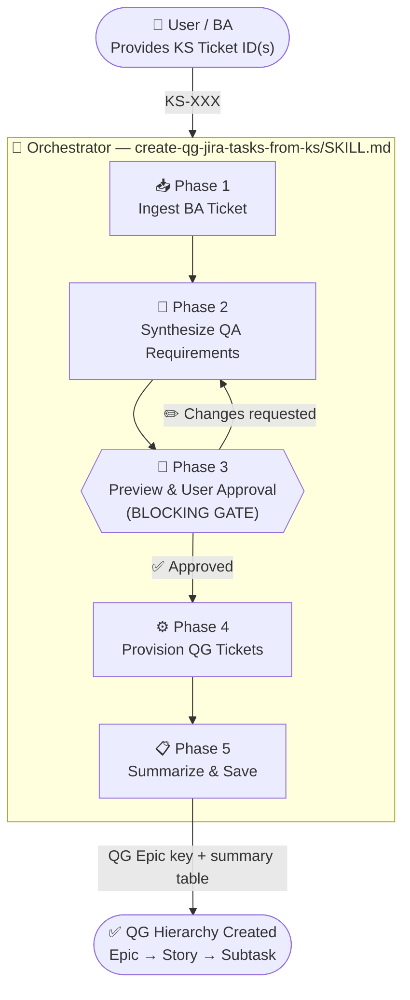
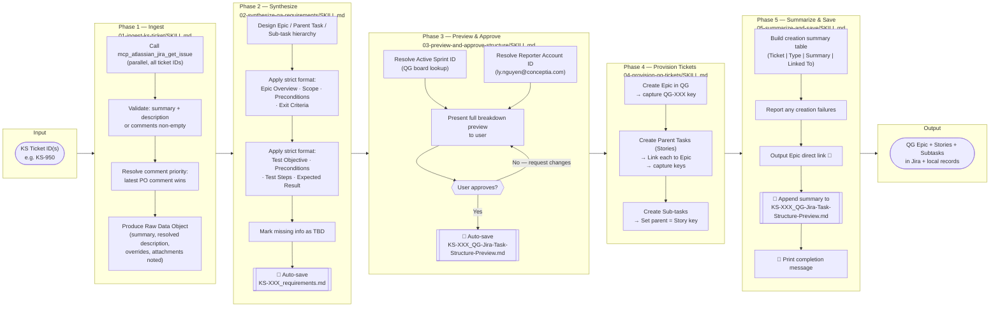
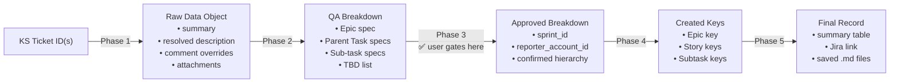
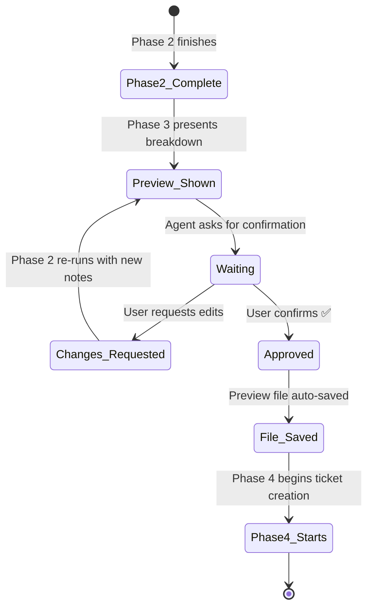

# QA Agentic Workflow — Flow Diagram

> **Source KS Ticket → QG Jira Test Hierarchy (Epic → Story → Sub-task)**

---

## High-Level Flow



---

## Detailed Phase Breakdown



---

## Skills Inventory

| # | Skill Folder | Role | Invoked When |
|---|---|---|---|
| — | `create-qg-jira-tasks-from-ks/` | **Master Orchestrator** — entry point, chains all phases | User provides a BA ticket and asks to generate QG tasks |
| 1 | `01-ingest-ks-ticket/` | Fetch & validate BA ticket data from Jira | Always — first phase of every run |
| 2 | `02-synthesize-qa-requirements/` | Convert raw data to Epic/Task/Sub-task QA plan | Always — after Phase 1 succeeds |
| 3 | `03-preview-and-approve-structure/` | Present breakdown to user; block until approved | Always — before any Jira write |
| 4 | `04-provision-qg-tickets/` | Create all QG tickets in strict order | After user approval in Phase 3 |
| 5 | `05-summarize-and-save/` | Produce summary table, save files, show Epic link | After Phase 4 completes |

---

## Data Flow Between Phases



---

## Auto-Saved Files (Historical Record)

```
QA skills/create-qg-jira-tasks-from-ks/task-analysis-records/
├── KS-950_requirements.md                        ← saved at end of Phase 2
└── KS-950_QG-Jira-Task-Structure-Preview.md      ← saved at end of Phase 3,
                                                     appended at end of Phase 5
```

> Files are **never overwritten**. Each run creates new files, building a historical audit trail.

---

## Approval Gate Detail



---

## Skills Section

This section provides detailed descriptions of every skill involved in the workflow — what each skill does, when it is triggered, what it consumes, what it produces, and how it handles errors.

---

### 🎯 Orchestrator — `create-qg-jira-tasks-from-ks/SKILL.md`

**Role:** Master entry point that chains all five phases into a single end-to-end run.

**Trigger conditions — activate when the user:**
- Provides a KS Jira ticket ID (e.g. `KS-950`) and asks to create QG tasks
- Says "set up test cases from KS-950", "generate QA hierarchy for this BA ticket", or similar
- Pastes a BA ticket description and asks to break it down into test tasks

**Execution order (strict — do not reorder):**

| Step | Skill | Gate |
|------|-------|------|
| 1 | `01-ingest-ks-ticket` | Always first |
| 2 | `02-synthesize-qa-requirements` | After Step 1 succeeds |
| 3 | `03-preview-and-approve-structure` | **BLOCKING** — user must approve |
| 4 | `04-provision-qg-tickets` | After explicit approval |
| 5 | `05-summarize-and-save` | After all tickets are created |

**Auto-saved files** (stored under `create-qg-jira-tasks-from-ks/task-analysis-records/`):
- `<SMALLEST-BA-ID>_requirements.md` — written at the end of Phase 2
- `<SMALLEST-BA-ID>_QG-Jira-Task-Structure-Preview.md` — written at the end of Phase 3, appended at the end of Phase 5

**Error handling:**

| Scenario | Action |
|---|---|
| Invalid BA ticket ID | Report the error, ask the user to verify the ID |
| Step 1 returns empty data | Halt; surface the issue; do not continue |
| Step 3 approval denied with changes | Re-run Step 2 with updated notes, re-present Step 3 |
| Step 4 fails mid-creation | Report last successfully created key; ask how to proceed |
| Any MCP tool error | Show the exact error message; never guess or skip silently |

---

### 📥 Phase 1 — `01-ingest-ks-ticket/SKILL.md`

**Purpose:** Fetch every piece of information from one or more KS Jira tickets in a single pass so downstream phases have a complete, conflict-free data source.

**Trigger:** Always — first phase of every run. Also triggered when the user provides a BA ticket ID and asks to "read", "fetch", or "ingest" it.

**Prerequisites:**

| Requirement | Details |
|---|---|
| MCP server | `mcp_atlassian` must be running and authenticated |
| Jira access | Read permission on the KS project |
| Input | One or more BA ticket IDs (e.g. `KS-950`, `BA-124`) |

**Key steps:**

1. **Accept input** — parse ticket IDs from any format (comma-separated, space-separated, natural language); normalise to uppercase with hyphen (e.g. `KS-950`).
2. **Fetch tickets in parallel** — call `mcp_atlassian_jira_get_issue` for all IDs simultaneously, retrieving `summary`, `description`, `comment` (full body + author + timestamp), `status`, `assignee`, `reporter`, `priority`, `labels`, `issuetype`, `parent`, and `attachment`.
3. **Validate completeness** — ensure `summary` is non-empty and at least `description` or one comment exists; halt and notify the user if not.
4. **Resolve comment priority** — apply precedence: _most-recent PO/BA comment > earlier comments > original description_; flag any comment that explicitly overrides or removes a requirement.
5. **Produce Raw Data Object** — output a structured summary (ticket ID, summary, status, description, chronological comments, detected overrides, attachments noted) for handoff to Phase 2.

**Output:** Raw Data Object (printed clearly to chat and passed to Phase 2).

**Error handling:**

| Scenario | Action |
|---|---|
| Ticket ID not found | Notify user, skip that ID, continue with remaining IDs |
| API rate limit hit | Wait 2 s and retry once; surface error on second failure |
| Authentication failure | Stop immediately; display error; ask user to re-authenticate |
| Description is empty | Warn the user; proceed using comments only |

---

### 🧠 Phase 2 — `02-synthesize-qa-requirements/SKILL.md`

**Purpose:** Distil the raw, potentially contradictory BA ticket data into a clean, conflict-free QA requirement hierarchy (Epic → Parent Task → Sub-task) in the mandatory QG format.

**Trigger:** Always — after Phase 1 succeeds. Also triggered when the user asks to "analyze", "break down", or "structure" requirements from a BA ticket.

**Prerequisites:**

| Requirement | Details |
|---|---|
| Input | Raw Data Object from Phase 1 |
| Format spec | QG project ticket format defined in this skill |

**Key steps:**

1. **Apply conflict resolution** — process every requirement override flagged by Phase 1 (most-recent authoritative comment wins); pause and ask the user if two PO comments contradict each other; log every resolution.
2. **Build requirement hierarchy** — decompose resolved requirements into three levels:
   - **Epic** — the entire feature or initiative (e.g. "Login Flow Verification")
   - **Parent Task** — a major independently-testable component (e.g. "API Contract Tests")
   - **Sub-task** — a single, atomic test for one engineer (e.g. "Verify 401 on expired token")
3. **Apply mandatory QG format** — every ticket level must include all required headings; use `[TBD …]` for missing information; never omit a heading:
   - *Epic:* `Epic Overview · Scope · Preconditions · Exit Criteria`
   - *Parent Task / Sub-task:* `Test Objective · Preconditions · Test Steps · Expected Result`
4. **Write the requirements document** — auto-save to `task-analysis-records/<SMALLEST-BA-ID>_requirements.md` **before** showing anything to the user; include header, conflict log, exclusions, and full hierarchy.
5. **Hand off to Phase 3** — print a concise completion summary (counts of Epics, Parent Tasks, Sub-tasks, conflicts resolved, requirements excluded).

**Output:** Structured QA breakdown + auto-saved `_requirements.md`.

**Error handling:**

| Scenario | Action |
|---|---|
| No Phase 1 data supplied | Ask the user to run Phase 1 first |
| Unresolvable conflict between PO comments | Pause; surface both versions; ask user to decide |
| Not enough info to fill a required heading | Use `[TBD - <explanation>]` |
| Requirement scope is unclear | Document the ambiguity; ask the user before finalising |

---

### 🛑 Phase 3 — `03-preview-and-approve-structure/SKILL.md`

**Purpose:** Pre-resolve the active QG sprint and reporter account ID, present the complete ticket breakdown to the user, and **block all further progress** until explicit approval is received. No Jira tickets are created until this gate is passed.

**Trigger:** Always — after Phase 2 completes. Also triggered when the user asks to "preview", "review", or "confirm" the ticket structure.

**Prerequisites:**

| Requirement | Details |
|---|---|
| Input | Synthesized hierarchy from Phase 2 |
| MCP server | `mcp_atlassian` must be running and authenticated |
| Jira access | Read permission on QG project boards |

**Key steps:**

1. **Resolve active sprint** — call `mcp_atlassian_jira_get_agile_boards` (project `QG`) for the board ID, then `mcp_atlassian_jira_get_sprints_from_board` with `state = "active"`; handle zero, one, or multiple active sprints.
2. **Resolve reporter account ID** — call `mcp_atlassian_jira_get_user_profile` with the reporter email (e.g. `ly.nguyen@conceptia.com`); **never hard-code an account ID**.
3. **Present the full breakdown preview** — display all fields: Sprint name, Reporter name, Epic (Overview / Scope / Preconditions / Exit Criteria), each Parent Task (Objective / Preconditions / Steps / Expected Result), and all Sub-tasks; call out any `[TBD]` values that need user action.
4. **Request explicit approval** — ask *"Does this breakdown look correct? Should anything be changed before I create the Jira tickets?"*; wait for one of: ✅ approval → Phase 4, ✏️ change request → re-display, ❌ rejection → return to Phase 2.
5. **Auto-save approved preview** — immediately after approval, save to `task-analysis-records/<SMALLEST-BA-ID>_QG-Jira-Task-Structure-Preview.md`; never overwrite an existing file (append a version suffix instead).

**Output:** User-confirmed breakdown + Sprint ID + Reporter `accountId` + saved preview file.

**Error handling:**

| Scenario | Action |
|---|---|
| Board not found for QG project | Surface the error; ask user to verify the project key |
| Reporter email resolves to no account | Ask user for the correct email or accountId |
| User requests a change affecting Phase 2 logic | Return to Phase 2, rerun synthesis, then return to Phase 3 |
| User does not respond or is ambiguous | Re-ask the approval question once; do not auto-proceed |

---

### ⚙️ Phase 4 — `04-provision-qg-tickets/SKILL.md`

**Purpose:** Translate the approved breakdown into real Jira tickets in the QG project, in strict parent-before-child dependency order. Every error must be surfaced immediately — no guessing or silent skipping.

**Trigger:** Only after Phase 3 explicit approval — never run this phase without it. Also triggered when the user says "create the tickets", "provision", "go ahead", or equivalent.

**Prerequisites:**

| Requirement | Details |
|---|---|
| Input | Approved breakdown + Sprint ID + Reporter `accountId` from Phase 3 |
| MCP server | `mcp_atlassian` must be running and authenticated |
| Jira access | **Create Issue** permission on the QG project |
| Gate | Phase 3 must be explicitly approved |

**Key steps:**

1. **Create the Epic** — call `mcp_atlassian_jira_create_issue` with `issue_type = "Epic"`, full four-heading description, and reporter `accountId`; capture the returned key (e.g. `QG-100`); halt immediately if no key is returned.
2. **Create Parent Tasks (Stories/Tasks) sequentially** — for each Parent Task: create with `issue_type = "Story"` or `"Task"`, sprint field (`customfield_10020`), and reporter; capture the key; then immediately call `mcp_atlassian_jira_link_to_epic` to link it to the Epic. ⚠️ Do **not** set `customfield_10014` or `epicLink` — blocked on QG screens.
3. **Create Sub-tasks** — for each sub-task: create with `issue_type = "Subtask"` and `parent = <PARENT_TASK_KEY>`; sub-tasks under the same Parent Task may run in parallel, but the parent key must be confirmed first.
4. **Handle mid-creation change requests** — finish the current ticket, acknowledge the change, confirm the scope with the user, resume with updated info, and note the change in Phase 5.

**Creation order:**
```
Epic                     ← create first, capture key
  └── Parent Task 1      ← create, link to Epic
        └── Sub-task 1.1 ← create, set parent = Parent Task 1
        └── Sub-task 1.2
  └── Parent Task 2      ← create, link to Epic
        └── Sub-task 2.1
```

**Output:** All created ticket keys (Epic, Stories, Sub-tasks) passed to Phase 5.

**Error handling:**

| Scenario | Action |
|---|---|
| Epic creation fails | Stop all creation; surface exact error; do not proceed |
| A field is rejected by Jira | Report field name and error; ask how to proceed |
| Parent Task key not returned | Halt sub-task creation for that branch; surface error |
| `link_to_epic` call fails | Note the failure; continue other tickets; report in Phase 5 |
| User requests a full restart | Ask for confirmation; note which tickets were already created |

---

### 📋 Phase 5 — `05-summarize-and-save/SKILL.md`

**Purpose:** Give the user a single, clear view of everything that was created, finalise the persistent file record, and output a direct link to the Epic in Jira.

**Trigger:** After Phase 4 completes all ticket creation.

**Prerequisites:**

| Requirement | Details |
|---|---|
| Input | All ticket keys and metadata from Phase 4 |
| File | `<SMALLEST-BA-ID>_QG-Jira-Task-Structure-Preview.md` saved in Phase 3 |

**Key steps:**

1. **Build creation summary table** — one markdown table row per ticket created (columns: Ticket key, Type, Summary, Linked To); include **every** ticket in creation order.
2. **Report any failures** — list failures immediately after the table (e.g. `link_to_epic` 403 errors); omit this section if there were none.
3. **Output the Epic direct link** — provide a clickable URL: `🔗 Epic in Jira: https://<JIRA_HOST>/browse/<EPIC_KEY>`.
4. **Finalise the preview file** — append the creation summary table and failure report to `task-analysis-records/<SMALLEST-BA-ID>_QG-Jira-Task-Structure-Preview.md`; **never overwrite or delete Phase 3 content** — only append.
5. **Print completion message** — show source KS tickets, QG Epic key, Parent Task keys, Sub-task keys, failure count, and saved file paths.

**Output:** Final summary table, Epic Jira link, updated preview file.

**Error handling:**

| Scenario | Action |
|---|---|
| Some tickets were not created in Phase 4 | Produce the summary; mark missing rows as "FAILED – not created" |
| Preview file cannot be written | Warn the user; output full content to chat so nothing is lost |
| Epic key is unknown (Epic creation failed) | Omit the Epic link; note in the summary the run was incomplete |
