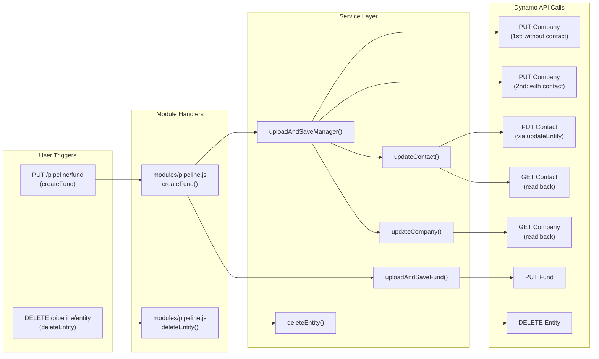
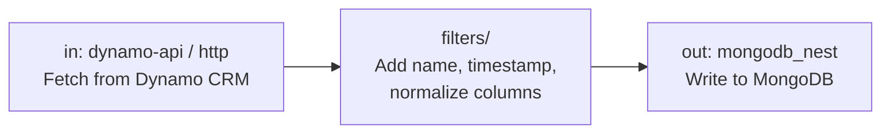
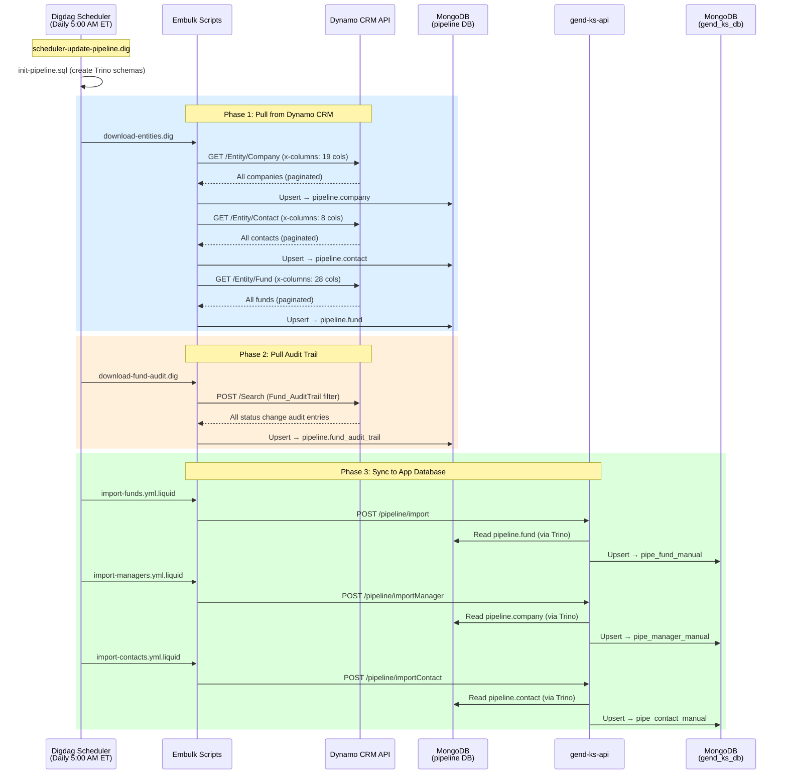

# Dynamo CRM Pipeline API v2.1 — Detailed Usage Guide

> [!NOTE]
> This document details every outbound HTTP call to the external **Dynamo CRM** system via its REST API from **both** projects:
> - **gend-ks-api** — Node.js API server, calls `/api/v2.1/Entity` for real-time CRUD operations
> - **ks-model** — ETL pipeline, calls Dynamo API via Embulk plugins to bulk-pull entity data into the Data Lake

---

## 1. API Connection Configuration

### 1.1 gend-ks-api Configuration

Defined in [config.js](file:///d:/SourceCode/FADProject/Gend/main-project/gend-ks-api/config/config.js#L73-L76):

```javascript
pipeline: {
    url: process.env.PIPELINE_URL,       // e.g., "https://api.dynamo.com"
    token: process.env.PIPELINE_TOKEN    // Bearer token for authentication
}
```

The Dynamo CRM link base for deep links:
```javascript
dynamoLink: process.env.DYNAMO_HOME_URI || 'https://staging.netagesolutions.com/new/Home/Link'
```

### 1.2 ks-model Configuration (ETL)

Defined in [config.dig](file:///d:/SourceCode/FADProject/Gend/ks-model/digdag/workflow/projects/pipeline/config/config.dig) and environment variables:

| Variable | Used In | Description |
|----------|---------|-------------|
| `PIPLINE_URL` | Embulk scripts | Dynamo CRM base URL (note: typo `PIPLINE` is in actual code) |
| `PIPLINE_TOKEN` | Embulk scripts | Bearer token for Dynamo CRM auth |
| `WBAPI_URL` | Import scripts | gend-ks-api base URL for triggering imports |
| `MONGO_HOST` / `MONGO_PORT` | Output templates | MongoDB target for storing pulled data |
| `MONGO_DB_USER` / `MONGO_DB_PWD` | Output templates | MongoDB credentials |

### HTTP Client

All Dynamo API calls go through `common.request()` defined in [common.js](file:///d:/SourceCode/FADProject/Gend/main-project/gend-ks-api/src/utils/common.js#L83-L100), which wraps the Node.js `request` library:

```javascript
request(request_uri, call_back = undefined) {
    return new Promise(function (resolve, reject) {
        request(request_uri, function (err, resp, body) {
            if (err) return reject(err);
            resolve(body);
        });
    });
}
```

> [!IMPORTANT]
> When `method: 'PUT'` is used with `json: data`, the `request` library automatically serializes the body as JSON. For `GET` and `DELETE`, no body is sent.

---

## 2. Low-Level API Methods (4 Methods)

All defined in [services/pipeline.js](file:///d:/SourceCode/FADProject/Gend/main-project/gend-ks-api/src/services/pipeline.js). These are the **only** functions that make direct HTTP calls to Dynamo CRM.

---

### 2.1 `createAndUpdateEntity` — [Line 25–70](file:///d:/SourceCode/FADProject/Gend/main-project/gend-ks-api/src/services/pipeline.js#L25-L70)

**Purpose**: Create a new entity or update an existing one by `_id`.

```
PUT {PIPELINE_URL}/api/v2.1/Entity/{entityName}/{entityId}
```

| Component | Detail |
|-----------|--------|
| **HTTP Method** | `PUT` |
| **URL** | `config.pipeline.url + /api/v2.1/Entity/{entityName}/{entityId}` |
| **entityId** | Omitted (empty string) when creating new; provided when updating |

**Request Headers**:

| Header | Value | Condition |
|--------|-------|-----------|
| `Content-Type` | `application/json` | Always |
| `Authorization` | `Bearer {PIPELINE_TOKEN}` | Always |
| `x-keycolumns` | `_id` | Only when `data._id` exists |

**Request Body** (JSON):

The `data` object varies by entity type (see Section 4). Key behavior:
- If `entityId` is provided and `data._id` is missing → sets `data._id = entityId`
- If `entityId` is NOT provided → removes `data._id` (signals "create new")

**Response**: Dynamo returns `{ data: { _id, ...fields } }` on success, or `{ error: "..." }` on failure.

**Error Handling**: On failure, resolves with `undefined` (does NOT reject) — caller must check for `undefined`.

```javascript
// Actual code
const bodyRequest = {
    url: url,
    method: 'PUT',
    headers: headers,
    json: data || {}   // auto-serialized by `request` lib
};
Logger.info('send to dynamo', url, data);
return common.request(bodyRequest)
    .then(response => Promise.resolve(response))
    .catch(ex => {
        Logger.error('Error in createAndUpdateEntity', ex);
        return Promise.resolve(undefined);  // graceful degradation
    });
```

---

### 2.2 `updateEntity` — [Line 71–100](file:///d:/SourceCode/FADProject/Gend/main-project/gend-ks-api/src/services/pipeline.js#L71-L100)

**Purpose**: Update an entity using a custom key column (not necessarily `_id`).

```
PUT {PIPELINE_URL}/api/v2.1/Entity/{entityName}/{entityId}
```

| Component | Detail |
|-----------|--------|
| **HTTP Method** | `PUT` |
| **Key Difference** | `x-keycolumns` is set to a **custom field** (e.g., `FullName`) instead of `_id` |

**Request Headers**:

| Header | Value | Condition |
|--------|-------|-----------|
| `Content-Type` | `application/json` | Always |
| `Authorization` | `Bearer {PIPELINE_TOKEN}` | Always |
| `x-keycolumns` | `{keycolumns}` parameter | When `keycolumns` is provided |

**Usage**: Only used for Contact entity updates (match by `FullName` rather than `_id`).

---

### 2.3 `getEntity` — [Line 101–128](file:///d:/SourceCode/FADProject/Gend/main-project/gend-ks-api/src/services/pipeline.js#L101-L128)

**Purpose**: Retrieve an entity's data by ID, with optional column selection.

```
GET {PIPELINE_URL}/api/v2.1/Entity/{entityName}/{entityId}
```

| Component | Detail |
|-----------|--------|
| **HTTP Method** | `GET` |
| **Body** | None |
| **Early Return** | If `entityId` is falsy → immediately returns `undefined` |

**Request Headers**:

| Header | Value | Condition |
|--------|-------|-----------|
| `Content-Type` | `application/json` | Always |
| `Authorization` | `Bearer {PIPELINE_TOKEN}` | Always |
| `x-columns` | Semicolon-separated column names | When `columns` parameter is provided |

**Column Strings** (passed via `x-columns` header):

For **Company** (`COMPANY_COLUMNS`):
```
name;Businessaddress;Businessphone;Companytype;DateCreated;PrimaryAddress_Street;
PrimaryAddress_FullAddress;Primarycontact;PrimarycontactEmail;Responsible;
ContactInfo_BusinessAddress_Latitude;ContactInfo_BusinessAddress_Longitude;
Businessaddresscity;Businessaddresscountry;Businessaddressstate;
Businessaddressstreet;Businessaddressstreet2;ContactInfo_BusinessAddress_Street3;
BusinessaddressZIP
```

For **Contact** (`CONTACT_COLUMNS`):
```
fullname;DateCreated;Company;Companyname;Contacttype;email;ContactInfo_Email
```

**Response**: Parsed via `common.convertToJsonObject()` (handles NaN/Infinity edge cases).

---

### 2.4 `deleteEntity` — [Line 956–978](file:///d:/SourceCode/FADProject/Gend/main-project/gend-ks-api/src/services/pipeline.js#L956-L978)

**Purpose**: Delete an entity from Dynamo CRM by ID.

```
DELETE {PIPELINE_URL}/api/v2.1/Entity/{entityName}/{entityId}
```

| Component | Detail |
|-----------|--------|
| **HTTP Method** | `DELETE` |
| **Body** | None |

**Request Headers**:

| Header | Value |
|--------|-------|
| `Content-Type` | `application/json` |
| `Authorization` | `Bearer {PIPELINE_TOKEN}` |

**Error Handling**: On error, resolves with the `entityId` (not `undefined`) — the caller receives IDs that failed to delete.

```javascript
return common.request(bodyRequest)
    .then(response => {
        if (response.error) {
            Logger.warn('Error in delete entity', entityName, entityId, response.error);
            return Promise.resolve(entityId);  // return failed ID
        }
        return Promise.resolve();  // success = undefined (deleted)
    }).catch(ex => {
        return Promise.resolve(entityId);  // return failed ID
    });
```

---

## 3. All Call Sites — Where Dynamo API Is Actually Called

There are **8 distinct call sites** in the codebase that trigger Dynamo CRM API calls:



---

### Call Site #1 — Upload Company (First Pass)

| Detail | Value |
|--------|-------|
| **Source** | [services/pipeline.js L464](file:///d:/SourceCode/FADProject/Gend/main-project/gend-ks-api/src/services/pipeline.js#L464) |
| **Method** | `createAndUpdateEntity(ENTITY.COMPANY, uploadCompanyObj, pipelineCompanyId)` |
| **API Call** | `PUT /api/v2.1/Entity/Company/{pipelineCompanyId}` |
| **Caller** | `uploadAndSaveManager()` |
| **Trigger** | User calls `PUT /pipeline/fund` and primary data has changed |

**What It Does**: Uploads company data to Dynamo CRM **without** contact info (Primarycontact, PrimarycontactEmail are excluded in this first pass because they require a second API call).

**Payload Fields Sent**:

The payload is filtered by two rules:
1. Only fields in `PRIMARY_COMPANY_PROPS` are included
2. Fields in `filterFields` (locked by status) are excluded

| Field | Dynamo Property | Example |
|-------|----------------|---------|
| `_id` | `_id` | `"abc-123-def"` |
| `Name` | `Name` | `"Blackrock Capital"` |
| `Companytype` | `Companytype` | `"Fund Manager"` (set when creating new) |
| `Businessaddress` | `Businessaddress` | — (deleted before upload, handled via address components) |

**Address fields are expanded** via `buildUploadCompany()` using Google Address Validation API into:

| Dynamo Property | Source |
|----------------|--------|
| `Businessaddressstreet` | Google address components |
| `Businessaddressstreet2` | `administrative_area_level_3` |
| `ContactInfo_BusinessAddress_Street3` | `administrative_area_level_2` |
| `Businessaddresscity` | `locality` or `postal_town` |
| `Businessaddressstate` | `administrative_area_level_1` |
| `BusinessaddressZIP` | `postal_code` (+ suffix if present) |
| `Businessaddresscountry` | `country` (mapped via `COUNTRY_MAP`) |
| `ContactInfo_BusinessAddress_Latitude` | `geometry.location.lat` |
| `ContactInfo_BusinessAddress_Longitude` | `geometry.location.lng` |
| `ContactInfo_PrimaryAddress_Latitude` | Same as business latitude |
| `ContactInfo_PrimaryAddress_Longitude` | Same as business longitude |

---

### Call Site #2 — Upload Company (Second Pass: With Contact)

| Detail | Value |
|--------|-------|
| **Source** | [services/pipeline.js L474](file:///d:/SourceCode/FADProject/Gend/main-project/gend-ks-api/src/services/pipeline.js#L474) |
| **Method** | `createAndUpdateEntity(ENTITY.COMPANY, uploadCompanyObj, managerId)` |
| **API Call** | `PUT /api/v2.1/Entity/Company/{managerId}` |
| **Condition** | Only runs if `Primarycontact` and `PrimarycontactEmail` are NOT locked |

**What It Does**: Re-uploads the company with contact fields added.

**Additional Payload Fields** (appended to first pass):

| Field | Dynamo Property | Example |
|-------|----------------|---------|
| `Primarycontact` | `Primarycontact` | `"John Smith"` |
| `PrimarycontactEmail` | `PrimarycontactEmail` | `"john@blackrock.com"` |

> [!TIP]
> The **two-pass company upload** exists because Dynamo CRM has a limitation: contact fields may conflict with the company creation if set simultaneously on the first call. The second call adds contact info to the already-created/existing company.

---

### Call Site #3 — Upload/Update Contact (via `updateEntity`)

| Detail | Value |
|--------|-------|
| **Source** | [services/pipeline.js L549](file:///d:/SourceCode/FADProject/Gend/main-project/gend-ks-api/src/services/pipeline.js#L549) |
| **Method** | `updateEntity(ENTITY.CONTACT, pipeData, CONTACT_PROPS.FULL_NAME)` |
| **API Call** | `PUT /api/v2.1/Entity/Contact/` |
| **Caller** | `updateContact()` ← `uploadAndSaveManager()` |
| **Key Match** | `x-keycolumns: FullName` (matches by name, not `_id`) |

**What It Does**: Creates or updates a Contact entity in Dynamo CRM, matching by full name.

**Payload Fields Sent**:

| Field | Dynamo Property | Example |
|-------|----------------|---------|
| `FullName` | `FullName` | `"John Smith"` |
| `ContactInfo_Email` | `ContactInfo_Email` | `"john@blackrock.com"` |

---

### Call Site #4 — Read Back Contact (via `getEntity`)

| Detail | Value |
|--------|-------|
| **Source** | [services/pipeline.js L551](file:///d:/SourceCode/FADProject/Gend/main-project/gend-ks-api/src/services/pipeline.js#L551) |
| **Method** | `getEntity(ENTITY.CONTACT, CONTACT_COLUMNS, x?.data?._id)` |
| **API Call** | `GET /api/v2.1/Entity/Contact/{contactId}` |
| **Caller** | `updateContact()` — immediately after the PUT call |

**What It Does**: After creating/updating a contact in Dynamo, reads back the full contact data to save in MongoDB (`pipe_contact_manual`).

**Header**: `x-columns: fullname;DateCreated;Company;Companyname;Contacttype;email;ContactInfo_Email`

```mermaid
sequenceDiagram
    participant Service as updateContact()
    participant Dynamo as Dynamo CRM
    participant Mongo as MongoDB

    Service->>Mongo: Upsert pipe_contact_manual (by name+email)
    Service->>Dynamo: PUT /api/v2.1/Entity/Contact/<br/>x-keycolumns: FullName<br/>{ FullName, ContactInfo_Email }
    Dynamo-->>Service: { data: { _id, ...contact } }
    Service->>Dynamo: GET /api/v2.1/Entity/Contact/{_id}<br/>x-columns: fullname;DateCreated;...
    Dynamo-->>Service: { data: { fullname, Company, email, ... } }
    Service->>Mongo: Upsert pipe_contact_manual (by id)<br/>with full Dynamo data
```

---

### Call Site #5 — Read Back Company (via `getEntity`)

| Detail | Value |
|--------|-------|
| **Source** | [services/pipeline.js L529](file:///d:/SourceCode/FADProject/Gend/main-project/gend-ks-api/src/services/pipeline.js#L529) |
| **Method** | `getEntity(ENTITY.COMPANY, COMPANY_COLUMNS, id)` |
| **API Call** | `GET /api/v2.1/Entity/Company/{managerId}` |
| **Caller** | `updateCompany()` ← `uploadAndSaveManager()` |

**What It Does**: After uploading a company to Dynamo CRM, reads back the full company data with all columns to save in MongoDB (`pipe_manager_manual`).

**Header**: `x-columns: name;Businessaddress;Businessphone;Companytype;DateCreated;...;BusinessaddressZIP` (19 columns)

```mermaid
sequenceDiagram
    participant Service as updateCompany()
    participant Dynamo as Dynamo CRM
    participant Mongo as MongoDB

    Service->>Dynamo: GET /api/v2.1/Entity/Company/{managerId}<br/>x-columns: name;Businessaddress;...
    Dynamo-->>Service: { data: { name, Businessaddress, ... } }
    Service->>Mongo: Upsert pipe_manager_manual<br/>{ manager_id, manager_name, data: entityData.data }
```

---

### Call Site #6 — Upload Fund

| Detail | Value |
|--------|-------|
| **Source** | [services/pipeline.js L671](file:///d:/SourceCode/FADProject/Gend/main-project/gend-ks-api/src/services/pipeline.js#L671) |
| **Method** | `createAndUpdateEntity(ENTITY.FUND, uploadFundObj, pipelineFundId)` |
| **API Call** | `PUT /api/v2.1/Entity/Fund/{pipelineFundId}` |
| **Caller** | `uploadAndSaveFund()` |

**What It Does**: Creates or updates a Fund entity in Dynamo CRM.

**Payload Fields Sent** (filtered by `FUND_PROPS` + locked field exclusion):

| Field | Dynamo Property | Example |
|-------|----------------|---------|
| `Name` | `Name` | `"Growth Fund IV"` |
| `Fundmanager` | `Fundmanager` | `"Blackrock Capital"` |
| `Responsible` | `Responsible` | `"Amy Chamberlain"` |
| `SecondaryResponsible` | `SecondaryResponsible` | `"Daniel Jenkins"` |
| `Assetclass` | `Assetclass` | `"Private Equity"` |
| `Sub-assetclass` | `Sub-assetclass` | `"Venture Capital"` |
| `Sub-AssetClass2` | `Sub-AssetClass2` | `"US Venture Capital"` |
| `Sub-AssetClass3` | `Sub-AssetClass3` | `"US Venture Capital"` |
| `Fundpipelinestatus` | `Fundpipelinestatus` | `"2 - One Pager"` |
| `FundLiquidityType` | `FundLiquidityType` | `"General"` |
| `FundSize` | `FundSize` | `"500"` |
| `FundingAmount` | `FundingAmount` | `"25"` |
| `DocsDueDate` | `DocsDueDate` | `"2026-12-01"` |
| `Targetclosedate` | `Targetclosedate` | `"2027-03-15"` |
| `Vintage/InceptionNew` | `Vintage/InceptionNew` | `"2027"` |
| `Geography` | `Geography` | `"United States"` |
| `Description` | `Description` | `"Growth-focused VC fund..."` |
| `Reportingcurrency` | `Reportingcurrency` | `"USD"` |
| `Sector` | `Sector` | `"Technology"` |
| `LPACSeat` | `LPACSeat` | `"Yes"` |

> [!IMPORTANT]
> **Asset Class Mapping**: Before upload, `mappingAssetFromAlohaToDynamo()` sets duplicate sub-asset values to `"Not Applicable"`. For example, if `Assetclass == Sub-assetclass == Sub-AssetClass2 == Sub-AssetClass3`, then all sub-assets become `"Not Applicable"`.

**Field Filtering by Status** (determines which fields are actually sent):

| Current Status | Fields Excluded From Upload |
|---------------|---------------------------|
| New / Pre-One Pager / One Pager | None (all fields sent) |
| Back Burner / Turned Down | None (all fields sent) |
| Memo (3) | All `LOCKED_FUND_FIELDS` **except** `Fundpipelinestatus` |
| RFA (4) / Portfolio statuses | All `LOCKED_FUND_FIELDS` |

**After Dynamo Response**:
1. Extracts `_id` from response → becomes `pipeline_id`
2. Calls `generatePipelineFundId()` to compute a numeric `fund_id` (SHA-1 hash → 9 digits)
3. Saves the complete fund object to MongoDB (`pipe_fund_manual`)
4. Records statistics via `tracePiplineStatistics()`
5. Propagates company changes to all other funds sharing the same `manager_id`

---

### Call Site #7 — Delete Entity (Bulk)

| Detail | Value |
|--------|-------|
| **Source** | [modules/pipeline.js L509–522](file:///d:/SourceCode/FADProject/Gend/main-project/gend-ks-api/src/modules/pipeline.js#L509-L522) → [services/pipeline.js L956](file:///d:/SourceCode/FADProject/Gend/main-project/gend-ks-api/src/services/pipeline.js#L956) |
| **Method** | `deleteEntity(entityName, entityId)` called in a loop |
| **API Call** | `DELETE /api/v2.1/Entity/{entityName}/{entityId}` |
| **Trigger** | User calls `DELETE /pipeline/entity?name={entityType}` with array of IDs in body |

**What It Does**: Deletes one or more entities from Dynamo CRM. All deletions run in parallel via `Promise.all()`.

```javascript
// Handler code
entityIds.forEach(id => {
    promises.push(PipelineServices.deleteEntity(entityName, id));
});
return Promise.all(promises);
```

**Request**:
```
DELETE /api/v2.1/Entity/Fund/abc-123-def
Authorization: Bearer {token}
Content-Type: application/json
```

**Response Handling**: Returns array of IDs — `undefined` for successful deletes, the `entityId` string for failed ones.

---

## 4. Complete Call Flow: Creating a Fund (`PUT /pipeline/fund`)

This is the most complex flow, generating **up to 6-8 Dynamo API calls** per fund creation:

```mermaid
sequenceDiagram
    participant User
    participant Handler as modules/pipeline.js<br/>createFund()
    participant Service as services/pipeline.js
    participant Dynamo as Dynamo CRM<br/>/api/v2.1
    participant Google as Google Address API
    participant Mongo as MongoDB

    User->>Handler: PUT /pipeline/fund<br/>{ primary_data, extra_data, manager_check_list }
    
    Note over Handler: Validate: status ∈ PIPELINE_STATUS<br/>liquidity ∈ LIQUIDITY_TYPE<br/>contact name not empty<br/>manager name not empty
    
    Handler->>Service: saveFundWithoutUpload()
    Service->>Mongo: Find existing fund
    
    alt Primary data UNCHANGED
        Service-->>Handler: Return saved doc (skip Dynamo)
        Handler-->>User: 200 { data, status: "Not upload" }
    else Primary data CHANGED
        Note over Service: === uploadAndSaveManager() ===
        
        Service->>Mongo: Query pipe_manager_manual<br/>(check if manager exists)
        
        alt Manager not found
            Note over Service: Set Companytype = "Fund Manager"
        else Manager found
            Note over Service: Use existing pipelineCompanyId
        end
        
        Service->>Mongo: Find existing pipeline fund<br/>(get current status for field locking)
        Service->>Service: filterManagerFields()<br/>(determine locked company fields)
        Service->>Service: buildUploadCompany()<br/>(parse address components)
        
        rect rgb(255, 240, 220)
            Note over Service,Dynamo: API CALL #1: Create/Update Company
            Service->>Dynamo: PUT /api/v2.1/Entity/Company/{id}<br/>x-keycolumns: _id<br/>{ Name, Businessaddressstreet,<br/>Businessaddresscity, ... }
            Dynamo-->>Service: { data: { _id, Name, ... } }
        end
        
        alt Contact fields NOT locked
            rect rgb(255, 240, 220)
                Note over Service,Dynamo: API CALL #2: Update Company with Contact
                Service->>Dynamo: PUT /api/v2.1/Entity/Company/{managerId}<br/>{ ...company, Primarycontact,<br/>PrimarycontactEmail }
                Dynamo-->>Service: { data: { ... } }
            end
            
            rect rgb(255, 240, 220)
                Note over Service,Dynamo: API CALL #3: Create/Update Contact
                Service->>Dynamo: PUT /api/v2.1/Entity/Contact/<br/>x-keycolumns: FullName<br/>{ FullName, ContactInfo_Email }
                Dynamo-->>Service: { data: { _id, ... } }
            end
            
            rect rgb(220, 240, 255)
                Note over Service,Dynamo: API CALL #4: Read Back Contact
                Service->>Dynamo: GET /api/v2.1/Entity/Contact/{_id}<br/>x-columns: fullname;...;ContactInfo_Email
                Dynamo-->>Service: { data: { fullname, Company, ... } }
            end
            
            Service->>Mongo: Upsert pipe_contact_manual
        end
        
        rect rgb(220, 240, 255)
            Note over Service,Dynamo: API CALL #5: Read Back Company
            Service->>Dynamo: GET /api/v2.1/Entity/Company/{managerId}<br/>x-columns: name;...;BusinessaddressZIP
            Dynamo-->>Service: { data: { name, Businessphone, ... } }
        end
        
        Service->>Mongo: Upsert pipe_manager_manual
        
        Note over Service: === uploadAndSaveFund() ===
        
        Service->>Service: filterFundFields()<br/>(determine locked fund fields)
        
        rect rgb(255, 240, 220)
            Note over Service,Dynamo: API CALL #6: Create/Update Fund
            Service->>Dynamo: PUT /api/v2.1/Entity/Fund/{pipelineId}<br/>x-keycolumns: _id<br/>{ Name, Fundmanager, Assetclass,<br/>Fundpipelinestatus, ... }
            Dynamo-->>Service: { data: { _id, Name, ... } }
        end
        
        Service->>Service: generatePipelineFundId()<br/>(SHA-1 hash → numeric ID)
        Service->>Mongo: Upsert pipe_fund_manual
        Service->>Mongo: tracePiplineStatistics()
        Service->>Mongo: Propagate company to sibling funds
        
        Service-->>Handler: { data: fundDoc, status: "Done" }
        Handler->>Handler: Generate dynamoLink
        Handler-->>User: 200 { data, sync: "Done", status: "Done" }
    end
```

---

## 5. API Call Summary Matrix

| # | Method | Entity | API URL | When | Source Line |
|---|--------|--------|---------|------|-------------|
| 1 | `PUT` | Company | `/api/v2.1/Entity/Company/{id}` | Creating/updating fund (1st pass: company without contact) | [L464](file:///d:/SourceCode/FADProject/Gend/main-project/gend-ks-api/src/services/pipeline.js#L464) |
| 2 | `PUT` | Company | `/api/v2.1/Entity/Company/{id}` | Creating/updating fund (2nd pass: add contact fields) | [L474](file:///d:/SourceCode/FADProject/Gend/main-project/gend-ks-api/src/services/pipeline.js#L474) |
| 3 | `PUT` | Contact | `/api/v2.1/Entity/Contact/` | Creating/updating fund (upsert contact by FullName) | [L549](file:///d:/SourceCode/FADProject/Gend/main-project/gend-ks-api/src/services/pipeline.js#L549) |
| 4 | `GET` | Contact | `/api/v2.1/Entity/Contact/{id}` | Read back contact after upsert | [L551](file:///d:/SourceCode/FADProject/Gend/main-project/gend-ks-api/src/services/pipeline.js#L551) |
| 5 | `GET` | Company | `/api/v2.1/Entity/Company/{id}` | Read back company after upload | [L529](file:///d:/SourceCode/FADProject/Gend/main-project/gend-ks-api/src/services/pipeline.js#L529) |
| 6 | `PUT` | Fund | `/api/v2.1/Entity/Fund/{id}` | Creating/updating the fund itself | [L671](file:///d:/SourceCode/FADProject/Gend/main-project/gend-ks-api/src/services/pipeline.js#L671) |
| 7 | `DELETE` | Any | `/api/v2.1/Entity/{name}/{id}` | User deletes entities via `DELETE /pipeline/entity` | [L961](file:///d:/SourceCode/FADProject/Gend/main-project/gend-ks-api/src/services/pipeline.js#L961) |

---

## 6. Payload Field Reference by Entity

### 6.1 Fund Entity — Fields Sent to Dynamo

Defined by [FUND_PROPS](file:///d:/SourceCode/FADProject/Gend/main-project/gend-ks-api/src/constants/pipeline_value.js#L1-L22):

| Constant Key | Dynamo Field Name | Type | Description |
|-------------|-------------------|------|-------------|
| `NAME` | `Name` | String | Fund name |
| `FUND_MANAGER` | `Fundmanager` | String | Manager/company name |
| `RESPONSIBLE` | `Responsible` | String | Primary responsible person |
| `SECONDARY_RESPONSIBLE` | `SecondaryResponsible` | String | Secondary responsible |
| `ASSET_CLASS` | `Assetclass` | String | Asset class |
| `SUB_ASSET` | `Sub-assetclass` | String | Sub-asset level 1 |
| `SUB_ASSET2` | `Sub-AssetClass2` | String | Sub-asset level 2 |
| `SUB_ASSET3` | `Sub-AssetClass3` | String | Sub-asset level 3 |
| `FUND_PIPELINE_STATUS` | `Fundpipelinestatus` | String | Pipeline status value |
| `FUND_LIQUID_TYPE` | `FundLiquidityType` | String | Liquidity type |
| `FUND_SIZE` | `FundSize` | String | Fund size (mm) |
| `FUND_AMOUNT` | `FundingAmount` | String | Funding amount (local CCY) |
| `DOC_DUE_DATE` | `DocsDueDate` | String | Documents due date |
| `TARGET_CLOSE_DATE` | `Targetclosedate` | String | Target close date |
| `VINTAGE` | `Vintage/InceptionNew` | String | Vintage/inception year |
| `GEOGRAPHY` | `Geography` | String | Geographic focus |
| `DESCRIPTION` | `Description` | String | Fund description |
| `REPORT_CURRENCY` | `Reportingcurrency` | String | Reporting currency |
| `SECTOR` | `Sector` | String | Sector |
| `LPACSET` | `LPACSeat` | String | LPAC seat |

### 6.2 Company Entity — Fields Sent to Dynamo

Defined by [COMPANY_PROPS](file:///d:/SourceCode/FADProject/Gend/main-project/gend-ks-api/src/constants/pipeline_value.js#L32-L52):

| Constant Key | Dynamo Field Name | Sent In |
|-------------|-------------------|---------|
| `ID` | `_id` | All PUT calls (x-keycolumns) |
| `NAME` | `Name` | 1st pass |
| `BUSSINESS_STREET` | `Businessaddressstreet` | 1st pass (from Google) |
| `BUSSINESS_STREET2` | `Businessaddressstreet2` | 1st pass (from Google) |
| `BUSSINESS_STREET3` | `ContactInfo_BusinessAddress_Street3` | 1st pass (from Google) |
| `BUSSINESS_CITY` | `Businessaddresscity` | 1st pass (from Google) |
| `BUSSINESS_STATE` | `Businessaddressstate` | 1st pass (from Google) |
| `BUSSINESS_ZIP` | `BusinessaddressZIP` | 1st pass (from Google) |
| `BUSSINESS_COUNTRY` | `Businessaddresscountry` | 1st pass (mapped via COUNTRY_MAP) |
| `CONTACT_LATITUDE` | `ContactInfo_BusinessAddress_Latitude` | 1st pass (from Google) |
| `CONTACT_LONGITUDE` | `ContactInfo_BusinessAddress_Longitude` | 1st pass (from Google) |
| `CONTACT_P_LATITUDE` | `ContactInfo_PrimaryAddress_Latitude` | 1st pass (from Google) |
| `CONTACT_P_LONGITUDE` | `ContactInfo_PrimaryAddress_Longitude` | 1st pass (from Google) |
| `PRIMARY_CONTACT` | `Primarycontact` | 2nd pass only |
| `PRIMARY_EMAIL` | `PrimarycontactEmail` | 2nd pass only |

> [!NOTE]
> `Companytype` is set to `"Fund Manager"` **only** when creating a new company (not found in `pipe_manager_manual`). Defined in [OTHER_PROPS](file:///d:/SourceCode/FADProject/Gend/main-project/gend-ks-api/src/constants/pipeline_value.js#L93-L103).

### 6.3 Contact Entity — Fields Sent to Dynamo

Defined by [CONTACT_PROPS](file:///d:/SourceCode/FADProject/Gend/main-project/gend-ks-api/src/constants/pipeline_value.js#L80-L83):

| Constant Key | Dynamo Field Name | Purpose |
|-------------|-------------------|---------|
| `FULL_NAME` | `FullName` | Contact name (also used as key column) |
| `CONTACT_EMAIL` | `ContactInfo_Email` | Contact email address |

---

## 7. Dynamo CRM Custom Headers

The Dynamo API uses custom `x-` headers for controlling behavior:

| Header | Used In | Purpose | Example |
|--------|---------|---------|---------|
| `x-keycolumns` | `createAndUpdateEntity`, `updateEntity` | Tells Dynamo which field to match on for upsert | `_id` or `FullName` |
| `x-columns` | `getEntity` | Specifies which columns to return (semicolon-separated) | `name;Businessaddress;...` |

### Key Column Behavior

| Entity | Key Column | Meaning |
|--------|-----------|---------|
| Fund | `_id` | Match by Dynamo internal ID |
| Company | `_id` | Match by Dynamo internal ID |
| Contact | `FullName` | Match by contact's full name |

---

## 8. Dynamo CRM Deep Links

After a fund is saved, a deep link to the Dynamo CRM UI is generated via [getDynamoLink()](file:///d:/SourceCode/FADProject/Gend/main-project/gend-ks-api/src/services/pipeline.js#L573-L586):

**Format** (from [fund_data_fields.js](file:///d:/SourceCode/FADProject/Gend/main-project/gend-ks-api/src/constants/fund_data_fields.js#L53)):
```
DYNAMO_LINK_FORMAT: '?op={"es":"Fund","id":"%s"}&tn=kamehameha'
```

**Full URL Example**:
```
https://staging.netagesolutions.com/new/Home/Link?op={"es":"Fund","id":"abc-123-def"}&tn=kamehameha
```

This link is returned in the API response as `data.dynamoLink`.

---

## 9. Error Handling Patterns

| Method | On HTTP Error | On API Error Response | On Success |
|--------|--------------|----------------------|------------|
| `createAndUpdateEntity` | Resolves `undefined` | Returns error response | Returns response body |
| `updateEntity` | Resolves `undefined` | Returns error response | Returns response body |
| `getEntity` | Resolves `undefined` | Returns parsed JSON | Returns parsed JSON |
| `deleteEntity` | Resolves `entityId` | Resolves `entityId` (warns) | Resolves `undefined` |

> [!WARNING]
> All Dynamo API methods use **graceful degradation** — they never reject the Promise on HTTP errors. Callers must check for `undefined` or inspect the `response.error` property. This means a Dynamo CRM outage will **not crash** the fund creation flow, but the data will only be saved locally in MongoDB.

---

## 10. ks-model — ETL Calls to Dynamo CRM API (Data Pull)

The **ks-model** project pulls data **from** Dynamo CRM into the Data Lake using **Embulk** (a bulk data loader) with a custom `dynamo-api` input plugin. These are all **read-only** operations — they download entity data for local storage in MongoDB/Trino.

### 10.1 Embulk Input Plugin Types

Two Embulk input plugin types are used to call Dynamo:

| Plugin Type | Used By | Description |
|-------------|---------|-------------|
| `dynamo-api` | `entity.yml.liquid`, `entity-fund.yml.liquid`, `entity-contact.yml.liquid`, `fund-audit-trail.yml.liquid` | Custom pagination-aware Dynamo API client. Uses `root_url` for paginated fetches. |
| `http` | `entity-list-suggest.yml.liquid`, `entity-list-schema.yml.liquid`, `entity-properties.yml.liquid` | Standard HTTP plugin for simple GET requests. |

### 10.2 All Dynamo API Calls from ks-model

---

#### ETL Call #1 — Download Company Entities

| Detail | Value |
|--------|-------|
| **Script** | [entity.yml.liquid](file:///d:/SourceCode/FADProject/Gend/ks-model/embulk/script/pipeline/entity.yml.liquid) |
| **Plugin** | `dynamo-api` |
| **HTTP Method** | `GET` |
| **URL** | `{PIPLINE_URL}/Entity/Company` |
| **Triggered By** | [download-entities.dig](file:///d:/SourceCode/FADProject/Gend/ks-model/digdag/workflow/projects/pipeline/download-entities.dig), [download-manager.dig](file:///d:/SourceCode/FADProject/Gend/ks-model/digdag/workflow/projects/pipeline/download-manager.dig), [download-entities-with-props.dig](file:///d:/SourceCode/FADProject/Gend/ks-model/digdag/workflow/projects/pipeline/download-entities-with-props.dig) |
| **Output** | MongoDB → `pipeline.company` (via Trino) |

**Request**:
```
GET {PIPLINE_URL}/Entity/Company?utcOffset=0&mobile=false
Authorization: Bearer {PIPLINE_TOKEN}
Content-Type: application/json
x-columns: name;Businessaddress;Businessphone;Companytype;DateCreated;
           PrimaryAddress_Street;PrimaryAddress_FullAddress;Primarycontact;
           PrimarycontactEmail;Responsible;ContactInfo_BusinessAddress_Latitude;
           ContactInfo_BusinessAddress_Longitude;Businessaddresscity;
           Businessaddresscountry;Businessaddressstate;Businessaddressstreet;
           Businessaddressstreet2;ContactInfo_BusinessAddress_Street3;
           BusinessaddressZIP
```

**Response Parsing** (JSONPath `$.data`):

| Parsed Column | Type | JSON Path | Description |
|---------------|------|-----------|-------------|
| `id` | string | `_id` | Dynamo entity ID |
| `type` | string | `_es` | Entity schema type |
| `name` | string | `Name` | Company name |
| `data` | json | `""` (full object) | Complete entity data blob |

---

#### ETL Call #2 — Download Fund Entities

| Detail | Value |
|--------|-------|
| **Script** | [entity-fund.yml.liquid](file:///d:/SourceCode/FADProject/Gend/ks-model/embulk/script/pipeline/entity-fund.yml.liquid) |
| **Plugin** | `dynamo-api` |
| **HTTP Method** | `GET` |
| **URL** | `{PIPLINE_URL}/Entity/Fund` |
| **Triggered By** | [download-entities.dig](file:///d:/SourceCode/FADProject/Gend/ks-model/digdag/workflow/projects/pipeline/download-entities.dig), [download-entities-with-props.dig](file:///d:/SourceCode/FADProject/Gend/ks-model/digdag/workflow/projects/pipeline/download-entities-with-props.dig) |
| **Output** | MongoDB → `pipeline.fund` (via Trino) |

**Request**:
```
GET {PIPLINE_URL}/Entity/Fund?utcOffset=0&mobile=false
Authorization: Bearer {PIPLINE_TOKEN}
Content-Type: application/json
x-columns: name;Description;AssetClass;EntityKey;Fundmanager;Sub-assetclass;
           Sub-assetclass2;Sub-assetclass3;ReportingCurrency;Responsible;
           Fundpipelinestatus;DateCreated;Fulllegalname;Geography;
           Investmentstrategy;FundmanagerBusinessCity;FundmanagerManagerStatus;
           FundmanagerPrimaryContact;Strategydescription;DocsDueDate;
           FundingAmount;Targetclosedate;Vintage/InceptionNew;FundLiquidityType;
           Sector;FundSize;SecondaryResponsible;Reportingcurrency;LPACSeat
```

**Response Parsing** (JSONPath `$.data`) — Fund has **extra parsed columns** vs. Company:

| Parsed Column | Type | JSON Path | Description |
|---------------|------|-----------|-------------|
| `id` | string | `_id` | Dynamo entity ID |
| `type` | string | `_es` | Entity schema type |
| `name` | string | `Name` | Fund name |
| `manager_name` | string | `Fundmanager` | Fund manager name |
| `pipeline_status` | string | `Fundpipelinestatus` | Pipeline status value |
| `liquidity_type` | string | `FundLiquidityType` | Liquidity type |
| `data` | json | `""` (full object) | Complete entity data blob |

---

#### ETL Call #3 — Download Contact Entities

| Detail | Value |
|--------|-------|
| **Script** | [entity-contact.yml.liquid](file:///d:/SourceCode/FADProject/Gend/ks-model/embulk/script/pipeline/entity-contact.yml.liquid) |
| **Plugin** | `dynamo-api` |
| **HTTP Method** | `GET` |
| **URL** | `{PIPLINE_URL}/Entity/Contact` |
| **Triggered By** | [download-entities.dig](file:///d:/SourceCode/FADProject/Gend/ks-model/digdag/workflow/projects/pipeline/download-entities.dig), [download-manager.dig](file:///d:/SourceCode/FADProject/Gend/ks-model/digdag/workflow/projects/pipeline/download-manager.dig) |
| **Output** | MongoDB → `pipeline.contact` (via Trino) |

**Request**:
```
GET {PIPLINE_URL}/Entity/Contact?utcOffset=0&mobile=false
Authorization: Bearer {PIPLINE_TOKEN}
Content-Type: application/json
x-columns: fullname;DateCreated;Company;Companyname;Contacttype;email;
           ContactInfo_Email;AlohaPipelineResponsibleContact
```

**Response Parsing** (JSONPath `$.data`):

| Parsed Column | Type | JSON Path | Description |
|---------------|------|-----------|-------------|
| `id` | string | `_id` | Dynamo entity ID |
| `type` | string | `_es` | Entity schema type |
| `name` | string | `FullName` | Contact full name (note: uses `FullName` not `Name`) |
| `data` | json | `""` (full object) | Complete entity data blob |

---

#### ETL Call #4 — Download Entity Suggestions (Dropdown Values)

| Detail | Value |
|--------|-------|
| **Script** | [entity-list-suggest.yml.liquid](file:///d:/SourceCode/FADProject/Gend/ks-model/embulk/script/pipeline/entity-list-suggest.yml.liquid) |
| **Plugin** | `http` (standard) |
| **HTTP Method** | `GET` |
| **URL** | `{PIPLINE_URL}/Entity/{entityName}` |
| **Triggered By** | [download-entities-suggestions.dig](file:///d:/SourceCode/FADProject/Gend/ks-model/digdag/workflow/projects/pipeline/download-entities-suggestions.dig) |
| **Output** | MongoDB → `pipeline.entity_list` (via Trino) |

This script is called **8 times** with different entity names:

| Entity Name | `x-columns` / `ref_name` | Description |
|-------------|--------------------------|-------------|
| `L_FundLiquidityType` | `LookupName` | Liquidity type dropdown |
| `L_Sector` | `LookupName` | Sector dropdown |
| `L_FundPipelineStatus` | `FundPipelineStatus` | Pipeline status dropdown |
| `L_CompanyType` | `CompanyType` | Company type dropdown |
| `L_AssetClass` | `LookupName` | Asset class dropdown |
| `L_Sub-assetClass` | `LookupName` | Sub-asset class 1 dropdown |
| `L_Sub-assetClass2` | `LookupName` | Sub-asset class 2 dropdown |
| `L_Sub-assetClass3` | `LookupName` | Sub-asset class 3 dropdown |

**Request** (example for Pipeline Status):
```
GET {PIPLINE_URL}/Entity/L_FundPipelineStatus?utcOffset=0&mobile=false
Authorization: Bearer {PIPLINE_TOKEN}
Content-Type: application/json
x-columns: FundPipelineStatus
```

**Response Parsing** (JSONPath `$` root):

| Parsed Column | Type | JSON Path | Description |
|---------------|------|-----------|-------------|
| `data` | json | `data` | Array of suggestion values |

**Filters Applied**: Adds `name` (entity name), `ref_name`, and `_time_` (upload timestamp) columns.

---

#### ETL Call #5 — Download Entity Schemas

| Detail | Value |
|--------|-------|
| **Script** | [entity-list-schema.yml.liquid](file:///d:/SourceCode/FADProject/Gend/ks-model/embulk/script/pipeline/entity-list-schema.yml.liquid) |
| **Plugin** | `http` (standard) |
| **HTTP Method** | `GET` |
| **URL** | `{PIPLINE_URL}/Entity/{entityName}/schema` |
| **Triggered By** | [download-entities-suggestions.dig](file:///d:/SourceCode/FADProject/Gend/ks-model/digdag/workflow/projects/pipeline/download-entities-suggestions.dig) (second phase) |
| **Output** | MongoDB → `pipeline.entity_list` (update mode) |

Called for the **same 8 entity types** as Call #4, but fetches the `/schema` endpoint to get the `identity` field mapping.

**Request**:
```
GET {PIPLINE_URL}/Entity/L_FundPipelineStatus/schema?mobile=false
Authorization: Bearer {PIPLINE_TOKEN}
Content-Type: application/json
```

**Response Parsing** (JSONPath `$.data`):

| Parsed Column | Type | JSON Path | Description |
|---------------|------|-----------|-------------|
| `identity` | string | `identity` | Schema identity field name |

> [!TIP]
> The schema `identity` value is later used in gend-ks-api's `getEntityList()` query to map entity list values:
> `transform(data, x -> json_extract_scalar(x, concat_ws('.', array['$', coalesce("identity", ref_name)])))`

---

#### ETL Call #6 — Download Entity Properties

| Detail | Value |
|--------|-------|
| **Script** | [entity-properties.yml.liquid](file:///d:/SourceCode/FADProject/Gend/ks-model/embulk/script/pipeline/entity-properties.yml.liquid) |
| **Plugin** | `http` (standard) |
| **HTTP Method** | `GET` |
| **URL** | `{PIPLINE_URL}/Entity/{entityName}/properties` |
| **Triggered By** | [download-entities-with-props.dig](file:///d:/SourceCode/FADProject/Gend/ks-model/digdag/workflow/projects/pipeline/download-entities-with-props.dig), [download-prop-entities.dig](file:///d:/SourceCode/FADProject/Gend/ks-model/digdag/workflow/projects/pipeline/download-prop-entities.dig) |
| **Output** | MongoDB → `pipeline.entity_prop` (via Trino) |

Called for 3 entities: **Fund**, **Company**, **Contact**.

**Request**:
```
GET {PIPLINE_URL}/Entity/Fund/properties?mobile=false
Authorization: Bearer {PIPLINE_TOKEN}
Content-Type: application/json
```

**Response Parsing** (JSONPath `$` root):

| Parsed Column | Type | JSON Path |
|---------------|------|-----------|
| `data` | json | (full response) |

---

#### ETL Call #7 — Search Fund Audit Trail

| Detail | Value |
|--------|-------|
| **Script** | [fund-audit-trail.yml.liquid](file:///d:/SourceCode/FADProject/Gend/ks-model/embulk/script/pipeline/fund-audit-trail.yml.liquid) |
| **Plugin** | `dynamo-api` |
| **HTTP Method** | `POST` |
| **URL** | `{PIPLINE_URL}/Search` |
| **Triggered By** | [download-fund-audit.dig](file:///d:/SourceCode/FADProject/Gend/ks-model/digdag/workflow/projects/pipeline/download-fund-audit.dig) |
| **Output** | MongoDB → `pipeline.fund_audit_trail` (via Trino) |

> [!IMPORTANT]
> This is the **only POST call** from ks-model to Dynamo CRM. It uses the `/Search` endpoint (not `/Entity`), which is a different Dynamo API for advanced filtered queries.

**Request**:
```
POST {PIPLINE_URL}/Search?utcOffset=0&mobile=false
Authorization: Bearer {PIPLINE_TOKEN}
Content-Type: application/json
Accept: application/json
x-columns: InstanceID;EntityKey;ItemType;Date;User,Action;Property;OldValue;NewValue

{
  "advf": {
    "e": [{
      "_name": "Fund_AuditTrail",
      "rule": [{
        "_op": "is",
        "_prop": "Property",
        "values": ["Fund pipeline status"]
      }]
    }]
  }
}
```

This searches for all audit trail entries where `Property = "Fund pipeline status"` — i.e., every pipeline status change ever made.

**Response Parsing** (JSONPath `$.data`):

| Parsed Column | Type | JSON Path | Description |
|---------------|------|-----------|-------------|
| `id` | string | `_id` | Audit entry ID |
| `type` | string | `_es` | Entity schema type |
| `instanceid` | string | `InstanceID` | Fund instance ID |
| `audit_date` | string | `Date` | Date of the change |
| `user` | string | `User` | User who made the change |
| `action` | string | `Action` | Action performed |
| `property` | string | `Property` | Property changed (always "Fund pipeline status") |
| `oldvalue` | string | `OldValue` | Previous status value |
| `newvalue` | string | `NewValue` | New status value |
| `entitykey` | string | `EntityKey` | Related entity key |
| `itemtype` | string | `ItemType` | Item type |

---

### 10.3 Embulk Data Pipeline — Common Patterns

#### Input → Filter → Output Pattern

All Embulk scripts follow a 3-stage pipeline using Liquid template includes:



#### Filter Templates

| Filter | File | What It Does |
|--------|------|--------------|
| `entity_rule` | [_entity_rule.yml.liquid](file:///d:/SourceCode/FADProject/Gend/ks-model/embulk/script/pipeline/filters/_entity_rule.yml.liquid) | Adds `name` column (entity type), `_time_` (upload timestamp), normalizes column names to lowercase |
| `entity_suggestion_rule` | [_entity_suggestion_rule.yml.liquid](file:///d:/SourceCode/FADProject/Gend/ks-model/embulk/script/pipeline/filters/_entity_suggestion_rule.yml.liquid) | Same as entity_rule + adds `ref_name` column |
| `prop_rule` | [_prop_rule.yml.liquid](file:///d:/SourceCode/FADProject/Gend/ks-model/embulk/script/pipeline/filters/_prop_rule.yml.liquid) | Same as entity_rule (for property data) |

#### Output Templates

| Output | File | MongoDB Write Mode |
|--------|------|-------------------|
| `out_mongodb` | [_out_mongodb.yml.liquid](file:///d:/SourceCode/FADProject/Gend/ks-model/embulk/script/pipeline/out/_out_mongodb.yml.liquid) | Plain columns, upsert by key |
| `out_mongodb_jsonobject` | [_out_mongodb_jsonobject.yml.liquid](file:///d:/SourceCode/FADProject/Gend/ks-model/embulk/script/pipeline/out/_out_mongodb_jsonobject.yml.liquid) | `data` column stored as `jsonObj` |
| `out_mongodb_jsonarr` | [_out_mongodb_jsonarr.yml.liquid](file:///d:/SourceCode/FADProject/Gend/ks-model/embulk/script/pipeline/out/_out_mongodb_jsonarr.yml.liquid) | `data` column stored as `jsonArray` |

All output templates write to:
```
mongodb://{MONGO_HOST}:{MONGO_PORT}/{db_name}.{table_name}{COLLECTION_NAME_SUFFIX}
```

---

### 10.4 Indirect API Calls (ks-model → gend-ks-api → Dynamo)

Three Embulk scripts don't call Dynamo directly. Instead, they call gend-ks-api endpoints, which in turn read from the local Trino database (data previously pulled from Dynamo) and sync it into MongoDB:

| Script | HTTP Call | Target API | Purpose |
|--------|-----------|------------|---------|
| [import-funds.yml.liquid](file:///d:/SourceCode/FADProject/Gend/ks-model/embulk/script/pipeline/import-funds.yml.liquid) | `POST {WBAPI_URL}/pipeline/import` | gend-ks-api | Triggers fund import/sync from Trino → MongoDB |
| [import-managers.yml.liquid](file:///d:/SourceCode/FADProject/Gend/ks-model/embulk/script/pipeline/import-managers.yml.liquid) | `POST {WBAPI_URL}/pipeline/importManager` | gend-ks-api | Triggers manager import from Trino → MongoDB |
| [import-contacts.yml.liquid](file:///d:/SourceCode/FADProject/Gend/ks-model/embulk/script/pipeline/import-contacts.yml.liquid) | `POST {WBAPI_URL}/pipeline/importContact` | gend-ks-api | Triggers contact import from Trino → MongoDB |

Auth is via `x-access-token` header. Output goes to `stdout` (log only).

---

### 10.5 Complete ETL Data Flow



### 10.6 Dynamo API Endpoints Used by ks-model

| # | HTTP Method | Dynamo Endpoint | Plugin | Purpose | Calls Per Run |
|---|-------------|-----------------|--------|---------|---------------|
| 1 | `GET` | `/Entity/Company` | `dynamo-api` | Download all companies | 1 (paginated) |
| 2 | `GET` | `/Entity/Fund` | `dynamo-api` | Download all funds | 1 (paginated) |
| 3 | `GET` | `/Entity/Contact` | `dynamo-api` | Download all contacts | 1 (paginated) |
| 4 | `GET` | `/Entity/{L_*}` | `http` | Download dropdown values | 8 entities |
| 5 | `GET` | `/Entity/{L_*}/schema` | `http` | Download entity schemas | 8 entities |
| 6 | `GET` | `/Entity/{name}/properties` | `http` | Download entity properties | 3 entities |
| 7 | `POST` | `/Search` | `dynamo-api` | Search fund audit trail | 1 (paginated) |

**Total Dynamo API calls per daily run**: ~22 calls (3 entity downloads + 8 suggestions + 8 schemas + 3 properties)

---

### 10.7 `dynamo-api` Plugin vs `http` Plugin

| Feature | `dynamo-api` | `http` |
|---------|-------------|--------|
| **Pagination** | Built-in via `root_url` (auto-follows pages) | No pagination |
| **Retry** | `max_retries: 2`, `retry_interval: 40000ms` | Same settings |
| **Timeout** | `read_timeout: 40000ms` | Same |
| **Used For** | Large datasets (funds, companies, contacts, audit trail) | Small datasets (dropdowns, schemas, properties) |
| **Response Root** | `$.data` (array of entities) | `$` or `$.data` |

The `dynamo-api` plugin is a **custom Embulk plugin** that handles Dynamo CRM's pagination automatically. The `root_url` parameter tells it the base URL to construct page requests.

---

## 11. Dynamo API Endpoints — Complete Summary (Both Projects)

| # | Direction | Project | Method | Endpoint | Purpose |
|---|-----------|---------|--------|----------|---------|
| 1 | **Push** | gend-ks-api | `PUT` | `/api/v2.1/Entity/Company/{id}` | Create/update company |
| 2 | **Push** | gend-ks-api | `PUT` | `/api/v2.1/Entity/Fund/{id}` | Create/update fund |
| 3 | **Push** | gend-ks-api | `PUT` | `/api/v2.1/Entity/Contact/` | Create/update contact |
| 4 | **Pull** | gend-ks-api | `GET` | `/api/v2.1/Entity/Company/{id}` | Read back single company |
| 5 | **Pull** | gend-ks-api | `GET` | `/api/v2.1/Entity/Contact/{id}` | Read back single contact |
| 6 | **Delete** | gend-ks-api | `DELETE` | `/api/v2.1/Entity/{name}/{id}` | Delete entity |
| 7 | **Bulk Pull** | ks-model | `GET` | `/Entity/Company` | Download all companies |
| 8 | **Bulk Pull** | ks-model | `GET` | `/Entity/Fund` | Download all funds |
| 9 | **Bulk Pull** | ks-model | `GET` | `/Entity/Contact` | Download all contacts |
| 10 | **Bulk Pull** | ks-model | `GET` | `/Entity/{L_*}` | Download dropdown values (×8) |
| 11 | **Bulk Pull** | ks-model | `GET` | `/Entity/{L_*}/schema` | Download entity schemas (×8) |
| 12 | **Bulk Pull** | ks-model | `GET` | `/Entity/{name}/properties` | Download entity properties (×3) |
| 13 | **Search** | ks-model | `POST` | `/Search` | Search fund audit trail |

> [!NOTE]
> **Key difference**: gend-ks-api uses the versioned path `/api/v2.1/Entity/...` while ks-model uses the shorter path `/Entity/...`. The base URL (`PIPELINE_URL` vs `PIPLINE_URL`) is configured differently to account for this — ks-model's `PIPLINE_URL` likely already includes the `/api/v2.1` prefix.

---

## 12. File Reference

### gend-ks-api

| File | What It Contains |
|------|-----------------|
| [services/pipeline.js](file:///d:/SourceCode/FADProject/Gend/main-project/gend-ks-api/src/services/pipeline.js) | All 4 Dynamo API methods + 8 call sites |
| [modules/pipeline.js](file:///d:/SourceCode/FADProject/Gend/main-project/gend-ks-api/src/modules/pipeline.js) | Route handlers that trigger Dynamo calls |
| [constants/pipeline_value.js](file:///d:/SourceCode/FADProject/Gend/main-project/gend-ks-api/src/constants/pipeline_value.js) | Entity names, field names, status enums |
| [constants/fund_data_fields.js](file:///d:/SourceCode/FADProject/Gend/main-project/gend-ks-api/src/constants/fund_data_fields.js) | Dynamo link format |
| [utils/common.js](file:///d:/SourceCode/FADProject/Gend/main-project/gend-ks-api/src/utils/common.js) | HTTP client wrapper (`common.request`) |
| [config/config.js](file:///d:/SourceCode/FADProject/Gend/main-project/gend-ks-api/config/config.js) | `PIPELINE_URL`, `PIPELINE_TOKEN`, `DYNAMO_HOME_URI` |

### ks-model — Embulk Scripts (Direct Dynamo API calls)

| File | Plugin | Dynamo Endpoint | Entities |
|------|--------|-----------------|----------|
| [entity.yml.liquid](file:///d:/SourceCode/FADProject/Gend/ks-model/embulk/script/pipeline/entity.yml.liquid) | `dynamo-api` | `GET /Entity/{name}` | Company |
| [entity-fund.yml.liquid](file:///d:/SourceCode/FADProject/Gend/ks-model/embulk/script/pipeline/entity-fund.yml.liquid) | `dynamo-api` | `GET /Entity/Fund` | Fund |
| [entity-contact.yml.liquid](file:///d:/SourceCode/FADProject/Gend/ks-model/embulk/script/pipeline/entity-contact.yml.liquid) | `dynamo-api` | `GET /Entity/Contact` | Contact |
| [entity-list-suggest.yml.liquid](file:///d:/SourceCode/FADProject/Gend/ks-model/embulk/script/pipeline/entity-list-suggest.yml.liquid) | `http` | `GET /Entity/{L_*}` | 8 lookup entities |
| [entity-list-schema.yml.liquid](file:///d:/SourceCode/FADProject/Gend/ks-model/embulk/script/pipeline/entity-list-schema.yml.liquid) | `http` | `GET /Entity/{L_*}/schema` | 8 lookup entities |
| [entity-properties.yml.liquid](file:///d:/SourceCode/FADProject/Gend/ks-model/embulk/script/pipeline/entity-properties.yml.liquid) | `http` | `GET /Entity/{name}/properties` | Fund, Company, Contact |
| [fund-audit-trail.yml.liquid](file:///d:/SourceCode/FADProject/Gend/ks-model/embulk/script/pipeline/fund-audit-trail.yml.liquid) | `dynamo-api` | `POST /Search` | Fund_AuditTrail |

### ks-model — Embulk Scripts (Indirect: call gend-ks-api)

| File | Target API | Purpose |
|------|------------|---------|
| [import-funds.yml.liquid](file:///d:/SourceCode/FADProject/Gend/ks-model/embulk/script/pipeline/import-funds.yml.liquid) | `POST /pipeline/import` | Trigger fund sync |
| [import-managers.yml.liquid](file:///d:/SourceCode/FADProject/Gend/ks-model/embulk/script/pipeline/import-managers.yml.liquid) | `POST /pipeline/importManager` | Trigger manager sync |
| [import-contacts.yml.liquid](file:///d:/SourceCode/FADProject/Gend/ks-model/embulk/script/pipeline/import-contacts.yml.liquid) | `POST /pipeline/importContact` | Trigger contact sync |

### ks-model — Digdag Workflows

| File | Schedule | Dynamo Calls |
|------|----------|-------------|
| [scheduler-update-pipeline.dig](file:///d:/SourceCode/FADProject/Gend/ks-model/digdag/workflow/projects/pipeline/scheduler-update-pipeline.dig) | Daily 5:00 AM ET | Orchestrates all ETL calls |
| [download-entities.dig](file:///d:/SourceCode/FADProject/Gend/ks-model/digdag/workflow/projects/pipeline/download-entities.dig) | Sub-workflow | Calls #1, #2, #3 |
| [download-entities-suggestions.dig](file:///d:/SourceCode/FADProject/Gend/ks-model/digdag/workflow/projects/pipeline/download-entities-suggestions.dig) | Sub-workflow | Calls #4, #5 (×8 each) |
| [download-entities-with-props.dig](file:///d:/SourceCode/FADProject/Gend/ks-model/digdag/workflow/projects/pipeline/download-entities-with-props.dig) | Sub-workflow | Calls #1, #2, #3, #6 |
| [download-fund-audit.dig](file:///d:/SourceCode/FADProject/Gend/ks-model/digdag/workflow/projects/pipeline/download-fund-audit.dig) | Sub-workflow | Call #7 |
| [download-manager.dig](file:///d:/SourceCode/FADProject/Gend/ks-model/digdag/workflow/projects/pipeline/download-manager.dig) | Sub-workflow | Calls #1, #3 |
| [download-prop-entities.dig](file:///d:/SourceCode/FADProject/Gend/ks-model/digdag/workflow/projects/pipeline/download-prop-entities.dig) | Sub-workflow | Call #6 (×3) |
| [import-funds-managers.dig](file:///d:/SourceCode/FADProject/Gend/ks-model/digdag/workflow/projects/pipeline/import-funds-managers.dig) | Sub-workflow | Indirect (calls gend-ks-api) |

### ks-model — Support Files

| File | Purpose |
|------|---------|
| [filters/_entity_rule.yml.liquid](file:///d:/SourceCode/FADProject/Gend/ks-model/embulk/script/pipeline/filters/_entity_rule.yml.liquid) | Add entity name + timestamp columns |
| [filters/_entity_suggestion_rule.yml.liquid](file:///d:/SourceCode/FADProject/Gend/ks-model/embulk/script/pipeline/filters/_entity_suggestion_rule.yml.liquid) | Add entity name + ref_name + timestamp |
| [filters/_prop_rule.yml.liquid](file:///d:/SourceCode/FADProject/Gend/ks-model/embulk/script/pipeline/filters/_prop_rule.yml.liquid) | Add entity name + timestamp |
| [out/_out_mongodb.yml.liquid](file:///d:/SourceCode/FADProject/Gend/ks-model/embulk/script/pipeline/out/_out_mongodb.yml.liquid) | MongoDB output (plain columns) |
| [out/_out_mongodb_jsonobject.yml.liquid](file:///d:/SourceCode/FADProject/Gend/ks-model/embulk/script/pipeline/out/_out_mongodb_jsonobject.yml.liquid) | MongoDB output (data as JSON object) |
| [out/_out_mongodb_jsonarr.yml.liquid](file:///d:/SourceCode/FADProject/Gend/ks-model/embulk/script/pipeline/out/_out_mongodb_jsonarr.yml.liquid) | MongoDB output (data as JSON array) |
| [config/config.dig](file:///d:/SourceCode/FADProject/Gend/ks-model/digdag/workflow/projects/pipeline/config/config.dig) | Column definitions for all entity downloads |
