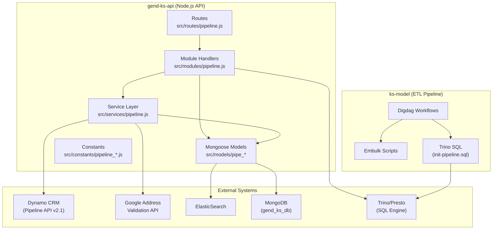
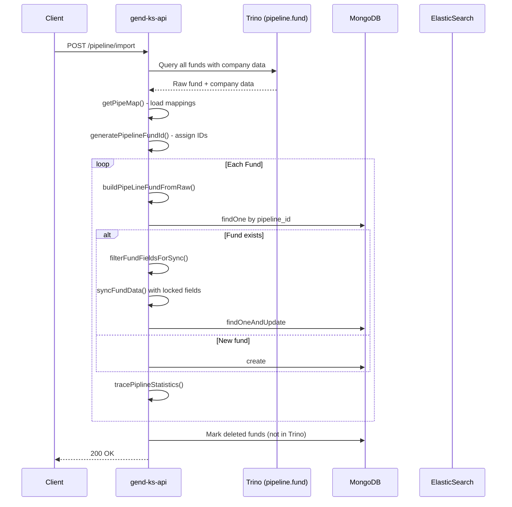
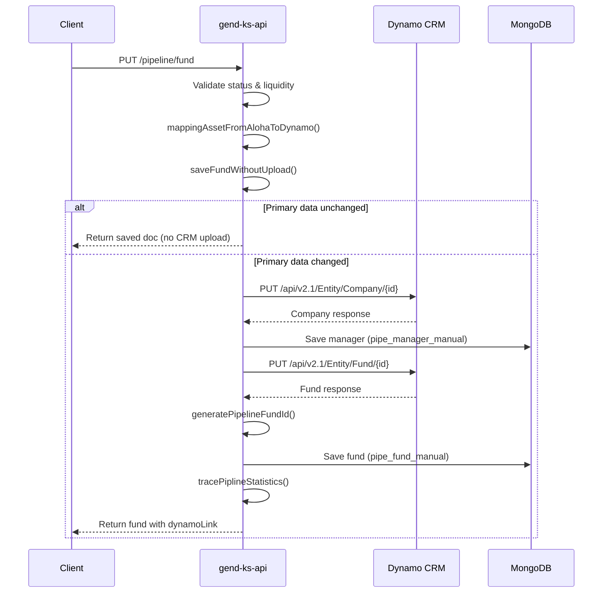
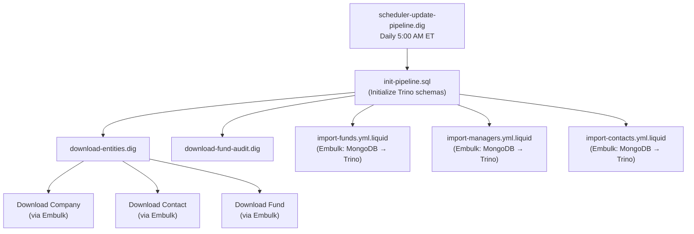

# Pipeline API in Use

> [!NOTE]
> This document covers all pipeline-related APIs, services, models, constants, and ETL workflows across both workspace projects:
> - **gend-ks-api** — Node.js API server (Express + MongoDB)
> - **ks-model** — Data Lake ETL Pipeline (Digdag + Embulk + Trino)

---

## 1. Architecture Overview



---

## 2. REST API Endpoints

All endpoints are defined in [pipeline.js](file:///d:/SourceCode/FADProject/Gend/main-project/gend-ks-api/src/routes/pipeline.js) and require authentication (`auth.ensureAuthenticated()`) unless noted.

| Method | Endpoint | Auth | Handler | Description |
|--------|----------|------|---------|-------------|
| `GET` | `/pipeline/entity_props` | ✅ | `getEntityProps` | Get entity property definitions from `pipeline.entity_prop` |
| `GET` | `/pipeline/entity_list` | ✅ | `getEntityList` | Get entity list values (pipeline statuses, responsible, geography) |
| `GET` | `/pipeline/fund` | ✅ | `getFund` | Get a single pipeline fund by id/name/source |
| `GET` | `/pipeline/pipefund` | ✅ | `getPipelineFund` | List pipeline funds (filtered or all active) |
| `GET` | `/pipeline/pipefund/match` | ✅ | `findMatchPipelineFund` | Fuzzy-match pipeline funds by name |
| `PUT` | `/pipeline/fund` | ✅ | `createFund` | Create or update a pipeline fund (uploads to Dynamo CRM) |
| `GET` | `/pipeline/company` | ✅ | `getCompany` | Get a company/manager by name from `pipeline.company` |
| `GET` | `/pipeline/map` | ✅ | `getMapping` | Get all pipeline mapping tables (asset, prop, status, liquidity) |
| `GET` | `/pipeline/contact` | ✅ | `getContact` | Get a contact by name from `pipeline.contact` |
| `GET` | `/pipeline/company/search/` | ✅ | `searchCompany` | Search companies by partial name match |
| `GET` | `/pipeline/contact/search/` | ✅ | `searchContact` | Search contacts by partial name match |
| `POST` | `/pipeline/map` | ✅ | `changeMapValue` | Update a pipeline mapping table value |
| `POST` | `/pipeline/download` | ✅ | `downloadPipelineData` | Trigger ETL pipeline workflow (Digdag `update-pipeline`) |
| `DELETE` | `/pipeline/entity` | ✅ | `deleteEntity` | Delete entities from Dynamo CRM |
| `POST` | `/pipeline/import` | ❌ | `importPipelineFunds` | Bulk import/sync pipeline funds from Trino to MongoDB |
| `POST` | `/pipeline/importManager` | ❌ | `importPipelineManager` | Bulk import managers from Trino to MongoDB |
| `POST` | `/pipeline/importContact` | ❌ | `importPipelineContact` | Bulk import contacts from Trino to MongoDB |
| `DELETE` | `/pipeline/funds` | ✅ | `deleteFunds` | Bulk delete pipeline funds from MongoDB |
| `POST` | `/pipeline/es/reload` | ❌ | `reloadElastic` | Reload ElasticSearch index for pipeline funds |
| `GET` | `/pipeline/dashboard` | ✅ | `getPipelineDashboard` | Get pipeline dashboard metrics (counts, movements, selectivity) |

---

## 3. External API — Dynamo CRM (Pipeline v2.1)

The service layer communicates with an external CRM system (Dynamo) via its REST API v2.1. Configuration is defined in [config.js](file:///d:/SourceCode/FADProject/Gend/main-project/gend-ks-api/config/config.js#L73-L76):

```javascript
pipeline: {
    url: process.env.PIPELINE_URL,       // Base URL of Dynamo CRM
    token: process.env.PIPELINE_TOKEN    // Bearer token for auth
}
```

### 3.1 Dynamo CRM API Methods

Defined in [pipeline.js (service)](file:///d:/SourceCode/FADProject/Gend/main-project/gend-ks-api/src/services/pipeline.js):

#### `createAndUpdateEntity(entityName, data, entityId)`
| Detail | Value |
|--------|-------|
| **HTTP Method** | `PUT` |
| **URL** | `{pipeline.url}/api/v2.1/Entity/{entityName}/{entityId}` |
| **Headers** | `Authorization: Bearer {token}`, `Content-Type: application/json`, `x-keycolumns: _id` (when entity has ID) |
| **Purpose** | Create or update an entity (Fund, Company, Contact) in Dynamo CRM |

#### `updateEntity(entityName, data, keycolumns, entityId)`
| Detail | Value |
|--------|-------|
| **HTTP Method** | `PUT` |
| **URL** | `{pipeline.url}/api/v2.1/Entity/{entityName}/{entityId}` |
| **Headers** | `x-keycolumns` set to custom key columns |
| **Purpose** | Update an entity with custom key matching |

#### `getEntity(entityName, columns, entityId)`
| Detail | Value |
|--------|-------|
| **HTTP Method** | `GET` |
| **URL** | `{pipeline.url}/api/v2.1/Entity/{entityName}/{entityId}` |
| **Headers** | `x-columns` header to specify return columns |
| **Purpose** | Retrieve a specific entity from Dynamo CRM |

#### `deleteEntity(entityName, entityId)`
| Detail | Value |
|--------|-------|
| **HTTP Method** | `DELETE` |
| **URL** | `{pipeline.url}/api/v2.1/Entity/{entityName}/{entityId}` |
| **Purpose** | Remove an entity from Dynamo CRM |

### 3.2 Entity Types

Defined in [pipeline_value.js](file:///d:/SourceCode/FADProject/Gend/main-project/gend-ks-api/src/constants/pipeline_value.js#L84-L92):

```javascript
const ENTITY = {
    L_FPIPELINESTATUS: 'L_FundPipelineStatus',
    L_RESPONSIBLE: 'L_Responsible',
    L_PRIMARY_RESPONSIBLE: 'L_Primary_Responsible',
    L_GEOGRAPHY: 'L_Geography',
    FUND: 'Fund',
    COMPANY: 'Company',
    CONTACT: 'Contact'
};
```

---

## 4. MongoDB Models

All models are in [src/models/](file:///d:/SourceCode/FADProject/Gend/main-project/gend-ks-api/src/models).

### 4.1 `pipe_fund_manual` — [PipeFundManual](file:///d:/SourceCode/FADProject/Gend/main-project/gend-ks-api/src/models/pipe_fund_manual.js)

The primary pipeline fund model with ElasticSearch integration via `mongoosastic`.

| Field | Type | Required | ES Indexed | Description |
|-------|------|----------|------------|-------------|
| `fund_id` | Number | ✅ | ✅ | Unique fund identifier |
| `source` | String | ✅ | ✅ | Data source (e.g., `pipeline`, `solovis`) |
| `fund_type` | String | — | ✅ | `public` (default) or `private` |
| `pipeline_id` | String | — | — | Dynamo CRM entity ID |
| `name` | String | — | ✅ | Fund name |
| `manager_id` | String | — | ✅ | Dynamo CRM company ID |
| `manager_name` | String | — | ✅ | Manager/Company name |
| `pipeline_status` | String | — | — | Human-readable status (e.g., `Portfolio`) |
| `liquidity_type` | String | — | — | Liquidity type label |
| `primary_data` | Object | — | — | Dynamo fund properties (FUND_PROPS) |
| `extra_data` | Object | — | — | Fee model & supplementary data |
| `manager_check_list` | Object | — | — | Manager checklist data |
| `status` | String | — | ✅ | `active` or `deleted` |
| `asset_class` | String | — | ✅ | Asset class category |

**Unique Index**: `{ fund_id: 1, source: 1 }`

**ElasticSearch Methods**:
- `searchFund(condition)` — Full-text search
- `synchronizeEs()` — Sync all docs to ES
- `reloadElasticSearch()` — Truncate + re-sync ES index
- `syncReloadElasticSearch()` — Synchronous truncate + re-sync

---

### 4.2 `pipe_manager_manual` — [PipeManagerManual](file:///d:/SourceCode/FADProject/Gend/main-project/gend-ks-api/src/models/pipe_manager_manual.js)

| Field | Type | Required | Description |
|-------|------|----------|-------------|
| `manager_id` | String | ✅ | Dynamo CRM company ID |
| `manager_name` | String | — | Company/manager name |
| `data` | Object | — | Full Dynamo company data |
| `status` | String | — | `active` (default) |

**Unique Index**: `{ manager_id: 1 }`

---

### 4.3 `pipe_contact_manual` — [PipeContactManual](file:///d:/SourceCode/FADProject/Gend/main-project/gend-ks-api/src/models/pipe_contact_manual.js)

| Field | Type | Required | Description |
|-------|------|----------|-------------|
| `id` | String | — | Dynamo CRM contact ID |
| `name` | String | ✅ | Contact full name |
| `email` | String | — | Contact email |
| `data` | Object | — | Full Dynamo contact data |

**Unique Index**: `{ name: 1, email: 1 }`

---

### 4.4 `pipe_fund_statistics` — [PipelineStatistics](file:///d:/SourceCode/FADProject/Gend/main-project/gend-ks-api/src/models/pipe_fund_statistics.js)

Audit trail for pipeline fund status changes.

| Field | Type | Required | Description |
|-------|------|----------|-------------|
| `fund_id` | Number | ✅ | Fund identifier |
| `source` | String | ✅ | Data source |
| `pipeline_id` | String | — | Dynamo CRM entity ID |
| `name` | String | — | Fund name |
| `activity` | String | — | `Created`, `Updated`, `Change Status`, `Deleted` |
| `from_status` | String | — | Previous pipeline status |
| `to_status` | String | — | New pipeline status |
| `from_data` | Object | — | Snapshot of old fund data |
| `to_data` | Object | — | Snapshot of new fund data |
| `user` | String | — | User who made the change |

**Unique Index**: `{ fund_id: 1, source: 1, updated_at: 1 }`

---

## 5. Constants & Enums

### 5.1 Pipeline Status — [PIPELINE_STATUS](file:///d:/SourceCode/FADProject/Gend/main-project/gend-ks-api/src/constants/pipeline_value.js#L122-L125)

```javascript
const PIPELINE_STATUS = {
    BACKBUNER:    '0 - Back Burner',
    PREONE:       '1 - Pre-One Pager',
    ONEPAGER:     '2 - One Pager',
    MEMO:         '3 - Memo',
    RFA:          '4 - RFA',
    PORTFOLIO:    'P - Portfolio',
    REDEEMING:    'R - Redeeming',
    ZERO_BALANCE: 'Z - Zero Balance',
    EXIT:         'X - Exited',
    TURNDOWN:     'T - Turned Down',
    INTERNAL:     'I - Internal'
};
```

### 5.2 Status Groups

| Group | Values | Purpose |
|-------|--------|---------|
| `ALOHA_PIPESTATUS` | Back Burner, Pre-One Pager, One Pager, Memo, RFA, Turned Down | Active pipeline statuses for Aloha system |
| `ALOHA_ACTIVE_STATUS` | Pre-One Pager, One Pager, Memo, RFA | Active (non-declined) statuses |
| `PORTFOLIO_STATUS` | Redeeming, Portfolio, Exited, Zero Balance | Portfolio lifecycle statuses |
| `SOLOVIS_STATUS` | Portfolio, Redeeming | Solovis integration statuses |
| `DECLINE_FUND_STATUS` | Turned Down, Back Burner | Declined/rejected statuses |
| `DYNAMO_STATUS` | Memo, RFA | Statuses synced to Dynamo CRM |

### 5.3 Pipeline Activity Types — [PIPELINE_ACTIVITY](file:///d:/SourceCode/FADProject/Gend/main-project/gend-ks-api/src/constants/pipeline_value.js#L162-L168)

```javascript
const PIPELINE_ACTIVITY = {
    CREATED:       'Created',
    UPDATED:       'Updated',
    CHANGE_STATUS: 'Change Status',
    CHANGE_REASON: 'Change Reason',
    DELETED:       'Deleted'
};
```

### 5.4 Fund Properties — [FUND_PROPS](file:///d:/SourceCode/FADProject/Gend/main-project/gend-ks-api/src/constants/pipeline_value.js#L1-L22)

Maps Aloha field names to Dynamo CRM property names:

| Constant | Dynamo Property | Description |
|----------|----------------|-------------|
| `FUND_MANAGER` | `Fundmanager` | Fund manager name |
| `RESPONSIBLE` | `Responsible` | Primary responsible person |
| `SECONDARY_RESPONSIBLE` | `SecondaryResponsible` | Secondary responsible |
| `TARGET_CLOSE_DATE` | `Targetclosedate` | Target close date |
| `DOC_DUE_DATE` | `DocsDueDate` | Documents due date |
| `FUND_AMOUNT` | `FundingAmount` | Funding amount |
| `FUND_SIZE` | `FundSize` | Fund size |
| `ASSET_CLASS` | `Assetclass` | Asset class |
| `FUND_PIPELINE_STATUS` | `Fundpipelinestatus` | Pipeline status |
| `FUND_LIQUID_TYPE` | `FundLiquidityType` | Liquidity type |
| `SUB_ASSET` / `SUB_ASSET2` / `SUB_ASSET3` | `Sub-assetclass` / `Sub-AssetClass2` / `Sub-AssetClass3` | Sub-asset class hierarchy |
| `NAME` | `Name` | Fund name |
| `VINTAGE` | `Vintage/InceptionNew` | Vintage/inception date |
| `GEOGRAPHY` | `Geography` | Geographic focus |
| `DESCRIPTION` | `Description` | Fund description |
| `REPORT_CURRENCY` | `Reportingcurrency` | Reporting currency |
| `LPACSET` | `LPACSeat` | LPAC seat flag |

### 5.5 Fund Source — [FundSource](file:///d:/SourceCode/FADProject/Gend/main-project/gend-ks-api/src/constants/fund_source.js)

```javascript
const FundSource = {
    SOLOVIS: 'solovis',
    ALBOURNE: 'ALB',
    MANUAL: 'manual',
    PRIVATE_MANUAL: 'private_manual',
    ALT_EVEST: 'aevest',
    EVEST: 'evest',
    CAMBRIDGE: 'cambridge',
    PIPELINE: 'pipeline'
};
```

### 5.6 Locked Fields (Read-Only by Status)

Fields that become read-only based on pipeline status:

**Fund Locked Fields** (`LOCKED_FUND_FIELDS`): Name, Fundmanager, Fundpipelinestatus, FundSize, DocsDueDate, Targetclosedate, Vintage, FundingAmount, FundLiquidityType, Responsible, SecondaryResponsible, Assetclass, Sub-assetclass (1–3), Reportingcurrency

**Company Locked Fields** (`LOCKED_COMP_FIELDS`): Name, Businessaddress, Primarycontact, PrimarycontactEmail

**Lock Rules**:
| Status | Fund Fields Locked | Manager Fields Locked |
|--------|-------------------|-----------------------|
| New / Pre-One Pager / One Pager | None | None |
| Memo (3) | All except `Fundpipelinestatus` | All |
| RFA (4) | All | All |
| Portfolio statuses | All | All |
| Back Burner / Turned Down | None | None |

---

## 6. Service Layer Functions

Defined in [pipeline.js (services)](file:///d:/SourceCode/FADProject/Gend/main-project/gend-ks-api/src/services/pipeline.js):

### 6.1 Core CRUD

| Function | Description |
|----------|-------------|
| `createAndUpdateEntity(entityName, data, entityId)` | PUT entity to Dynamo CRM |
| `updateEntity(entityName, data, keycolumns, entityId)` | PUT entity with custom key matching |
| `getEntity(entityName, columns, entityId)` | GET entity from Dynamo CRM |
| `deleteEntity(entityName, entityId)` | DELETE entity from Dynamo CRM |

### 6.2 Fund Operations

| Function | Description |
|----------|-------------|
| `findPipelineFund(fundId, source, fundName)` | Find a fund in MongoDB by ID/source/name |
| `saveFundWithoutUpload(fundId, source, fundObject, userInfo)` | Save fund locally without pushing to Dynamo CRM (when primary data unchanged) |
| `uploadAndSaveFund(fundId, source, fundObjectData, companyName, managerId, userInfo)` | Upload fund to Dynamo CRM, generate fund ID, and save to MongoDB |
| `generatePipelineFundId(pipelineIds)` | Generate unique numeric fund IDs from Dynamo pipeline IDs (handles duplicates) |
| `buildPipeLineFundFromRaw(rawData, pipeMap)` | Build a pipeline fund object from raw Trino query data |
| `buildEmptyPortfolioPipelineFund(pipeMap)` | Create an empty portfolio fund template |
| `matchPipelineFund(name, pipelineLists)` | Match fund by name in Trino `pipeline.fund` table |
| `syncFundData(fundDataObject, pipebuiltFund, lockedFields)` | Merge synced data respecting locked fields |

### 6.3 Manager/Company Operations

| Function | Description |
|----------|-------------|
| `uploadAndSaveManager(fundId, fundName, source, companyBody, addressObj)` | Upload company to Dynamo CRM, save to MongoDB, update contacts |
| `updateCompany(id, name, pipeData)` | Update company data in MongoDB |
| `buildUploadCompany(uploadObj, addressObj)` | Parse Google address and build upload-ready company object |
| `buildAddress(addressObject)` | Build a formatted address string from address components |

### 6.4 Contact Operations

| Function | Description |
|----------|-------------|
| `updateContact(name, email, pipeData)` | Upsert contact in Dynamo CRM + MongoDB |

### 6.5 Field Filtering

| Function | Description |
|----------|-------------|
| `filterManagerFields(fundPipelineId, pipeFundStatus)` | Determine which manager fields are locked based on status |
| `filterFundFields(fundPipelineId, pipeFundStatus)` | Determine which fund fields are locked based on status |
| `filterFundFieldsForSync(fundPipelineId, pipeFundStatus, alohaStatus)` | Determine locked fields for sync operations (uses `alohaStatus`) |

### 6.6 Data Mapping

| Function | Description |
|----------|-------------|
| `mappingAssetFromAlohaToDynamo(uploadFundObject)` | Map asset class hierarchy from Aloha → Dynamo (sets "Not Applicable" for duplicates) |
| `mappingAssetFromDynamoToAloha(dynamoDataObject)` | Reverse mapping: Dynamo → Aloha (inherits parent class when "Not Applicable") |
| `mappingGeographyFromDynamoToAloha(dynamoDataObject)` | Map geography values (e.g., `US` → `United States`) |
| `mapAssetClass(asset_class)` | Normalize `Public Equity` → `Public Equities` |
| `setTrackingErrorBySubAsset(fundObjectData)` | Set tracking error defaults based on sub-asset class |
| `getPipeMap()` | Load all mapping tables from `pipeline.pipeline_map` (with fallbacks) |

### 6.7 Statistics & Dashboard

| Function | Description |
|----------|-------------|
| `tracePiplineStatistics(oldDoc, newDoc, userInfo)` | Record pipeline fund activity (create/update/status change/delete) |
| `countPipelineDashboard(auditList, startDate, endDate)` | Count funds by status at start date, end date, and today |
| `countPipeline(auditList, timing)` | Count funds grouped by pipeline status |
| `movePipelineDashboard(auditList, startDate, endDate)` | Track status transitions (from → to movements) |
| `selectivityDashboard(moveStatusData)` | Calculate selectivity metrics (new vs. declined per stage) |

### 6.8 Utility

| Function | Description |
|----------|-------------|
| `getDynamoLink(pipeData)` | Generate a Dynamo CRM deep link for a fund |
| `validateAddress(address)` | Validate an address via Google Address Validation API |
| `updateExtra(extra, pipelineId)` | Parse and normalize extra data fields (e.g., side pocket probability) |

---

## 7. Data Sync & Import Flow

### 7.1 Import Pipeline Funds (`POST /pipeline/import`)

Supports three sync modes via `PIPELINE_SYNC`:

```javascript
const PIPELINE_SYNC = {
    EXTRA: 'extra',    // Only update extra_data
    FILTER: 'filter',  // Update specific fund IDs
    ALL: 'all'         // Full sync (default)
};
```



### 7.2 Create/Update Fund (`PUT /pipeline/fund`)



---

## 8. Trino/Presto SQL Tables

The pipeline data is stored in the **`pipeline`** database accessed via Trino:

| Table | Used In | Description |
|-------|---------|-------------|
| `pipeline.fund` | Module queries | Dynamo fund data (synced via ETL) |
| `pipeline.company` | Module queries | Dynamo company data (synced via ETL) |
| `pipeline.contact` | Module queries | Dynamo contact data (synced via ETL) |
| `pipeline.entity_list` | `getEntityList` | Entity dropdown values |
| `pipeline.entity_prop` | `getEntityProps` | Entity property definitions |
| `pipeline.pipeline_map` | `getPipeMap`, `changeMapValue` | Asset/status/liquidity mappings |
| `gend_ks_db.pipe_fund_manual` | Various | MongoDB fund data via Trino connector |
| `gend_ks_db.pipe_manager_manual` | `searchCompany` | MongoDB manager data via Trino connector |
| `gend_ks_db.pipe_contact_manual` | `searchContact` | MongoDB contact data via Trino connector |
| `gend_ks_db.pipe_fund_statistics` | Dashboard | Fund status change audit trail |

---

## 9. ETL Pipeline — ks-model (Digdag Workflows)

All ETL workflows are located in [pipeline/](file:///d:/SourceCode/FADProject/Gend/ks-model/digdag/workflow/projects/pipeline).

### 9.1 Workflow Configuration

Defined in [config.dig](file:///d:/SourceCode/FADProject/Gend/ks-model/digdag/workflow/projects/pipeline/config/config.dig):

```yaml
DB_NAME_PIPLINE: pipeline
DB_NAME_KS_MODEL: ks_model
PRESTO_CATALOG: mongodb
DATALAKE_SOURCE: http://workbench.conceptia.com:3000
```

Entity column sets configured for extraction:
- **fund_cols**: Name, Description, AssetClass, Fundmanager, Sub-assetclasses, etc. (28 columns)
- **company_cols**: Name, Businessaddress, Businessphone, PrimarycontactEmail, etc. (19 columns)
- **contact_cols**: fullname, Company, Contacttype, email, etc. (8 columns)

### 9.2 Workflow Files

| Workflow | Schedule | Description |
|----------|----------|-------------|
| [scheduler-update-pipeline.dig](file:///d:/SourceCode/FADProject/Gend/ks-model/digdag/workflow/projects/pipeline/scheduler-update-pipeline.dig) | Daily at 5:00 AM ET | Main scheduled ETL: downloads entities, fund audits, imports data |
| [update-pipeline.dig](file:///d:/SourceCode/FADProject/Gend/ks-model/digdag/workflow/projects/pipeline/update-pipeline.dig) | On-demand | On-demand ETL triggered via API `POST /pipeline/download` |
| [download-entities.dig](file:///d:/SourceCode/FADProject/Gend/ks-model/digdag/workflow/projects/pipeline/download-entities.dig) | Sub-workflow | Download Company, Contact, Fund entities from Dynamo CRM |
| [download-entities-suggestions.dig](file:///d:/SourceCode/FADProject/Gend/ks-model/digdag/workflow/projects/pipeline/download-entities-suggestions.dig) | Sub-workflow | Download entity suggestion lists (L_FundPipelineStatus, etc.) |
| [download-entities-with-props.dig](file:///d:/SourceCode/FADProject/Gend/ks-model/digdag/workflow/projects/pipeline/download-entities-with-props.dig) | Sub-workflow | Download entities with property definitions |
| [download-fund-audit.dig](file:///d:/SourceCode/FADProject/Gend/ks-model/digdag/workflow/projects/pipeline/download-fund-audit.dig) | Sub-workflow | Download fund audit/history data |
| [download-manager.dig](file:///d:/SourceCode/FADProject/Gend/ks-model/digdag/workflow/projects/pipeline/download-manager.dig) | Sub-workflow | Download manager/company entities |
| [download-prop-entities.dig](file:///d:/SourceCode/FADProject/Gend/ks-model/digdag/workflow/projects/pipeline/download-prop-entities.dig) | Sub-workflow | Download property-enriched entities |
| [load-pipeline-init.dig](file:///d:/SourceCode/FADProject/Gend/ks-model/digdag/workflow/projects/pipeline/load-pipeline-init.dig) | On-demand | Initialize pipeline mappings from Excel (`pipeLineSetup.xlsx`) |
| [load-manual-files.dig](file:///d:/SourceCode/FADProject/Gend/ks-model/digdag/workflow/projects/pipeline/load-manual-files.dig) | On-demand | Load manual data files |
| [import-funds-managers.dig](file:///d:/SourceCode/FADProject/Gend/ks-model/digdag/workflow/projects/pipeline/import-funds-managers.dig) | Sub-workflow | Import funds and managers via Embulk |

### 9.3 Scheduled Workflow Flow



### 9.4 Pipeline Init Data (`load-pipeline-init.dig`)

Loads mapping tables from Excel file `/gend-document/pipeline/pipeLineSetup.xlsx` into `pipeline.pipeline_map`:

| Sheet → CSV | DB Table | Description |
|-------------|----------|-------------|
| `asset_map.csv` | `pipeline_map` | Asset class mappings |
| `props_map.csv` | `pipeline_map` | Property mappings (Aloha ↔ Dynamo) |
| `country_map.csv` | `pipeline_map` | Country name mappings |
| `status_map.csv` | `pipeline_map` | Pipeline status mappings |
| `liquiditytype_map.csv` | `pipeline_map` | Liquidity type mappings |
| `img_responsible.csv` | (reference) | Responsible person images |
| `geography.csv` | (reference) | Geography reference data |

---

## 10. Default Mapping Data

When `pipeline.pipeline_map` table data is unavailable, these fallbacks are used from [pipeline_default.js](file:///d:/SourceCode/FADProject/Gend/main-project/gend-ks-api/src/constants/pipeline_default.js):

| Constant | Items | Description |
|----------|-------|-------------|
| `ASSET_MAP` | 24 entries | Asset class → Sub-asset class hierarchy |
| `PROP_MAP` | 25 entries | Property name mappings (Aloha ↔ Dynamo) |
| `PIPESTATUS_MAP` | 11 entries | Name → Value status mappings |
| `LIQUIDITYTYPE_MAP` | 3 entries | General, Tranche-Based, Drawdown |
| `TRACKING_DEFAULT` | 8 entries | Sub-asset class → tracking error defaults |

---

## 11. Pipeline Dashboard API

`GET /pipeline/dashboard?startDate={date}&endDate={date}`

Returns three data sets:

### 11.1 Count Dashboard
Funds counted by pipeline status at three points in time: **today**, **startDate**, and **endDate**.

### 11.2 Move Dashboard
Status transition matrix showing fund movements between statuses in the date range.

### 11.3 Selectivity Metrics
Calculates selectivity by tracking:
- **New**: Funds entering a stage from earlier stages
- **Declined**: Funds moving to Turned Down or Back Burner
- **Passed**: New − Declined
- **Decline Reasons**: Grouped by `kill_by` user

Data is sourced from both the ks-model engine (`/pipeline/fund_audit`) and `pipe_fund_statistics` in MongoDB.

---

## 12. File Reference Map

### gend-ks-api

| Layer | File | Purpose |
|-------|------|---------|
| Routes | [routes/pipeline.js](file:///d:/SourceCode/FADProject/Gend/main-project/gend-ks-api/src/routes/pipeline.js) | 20 REST endpoint definitions |
| Handlers | [modules/pipeline.js](file:///d:/SourceCode/FADProject/Gend/main-project/gend-ks-api/src/modules/pipeline.js) | Request handlers (866 lines) |
| Services | [services/pipeline.js](file:///d:/SourceCode/FADProject/Gend/main-project/gend-ks-api/src/services/pipeline.js) | Business logic (1152 lines) |
| Models | [models/pipe_fund_manual.js](file:///d:/SourceCode/FADProject/Gend/main-project/gend-ks-api/src/models/pipe_fund_manual.js) | Fund model + ES integration |
| Models | [models/pipe_manager_manual.js](file:///d:/SourceCode/FADProject/Gend/main-project/gend-ks-api/src/models/pipe_manager_manual.js) | Manager model |
| Models | [models/pipe_contact_manual.js](file:///d:/SourceCode/FADProject/Gend/main-project/gend-ks-api/src/models/pipe_contact_manual.js) | Contact model |
| Models | [models/pipe_fund_statistics.js](file:///d:/SourceCode/FADProject/Gend/main-project/gend-ks-api/src/models/pipe_fund_statistics.js) | Statistics/audit model |
| Constants | [constants/pipeline_value.js](file:///d:/SourceCode/FADProject/Gend/main-project/gend-ks-api/src/constants/pipeline_value.js) | All pipeline enums & field mappings |
| Constants | [constants/pipeline_default.js](file:///d:/SourceCode/FADProject/Gend/main-project/gend-ks-api/src/constants/pipeline_default.js) | Default mapping fallback data |
| Constants | [constants/fund_source.js](file:///d:/SourceCode/FADProject/Gend/main-project/gend-ks-api/src/constants/fund_source.js) | Data source enums |
| Constants | [constants/db_table.js](file:///d:/SourceCode/FADProject/Gend/main-project/gend-ks-api/src/constants/db_table.js) | Fee/pipe field mappings |
| Config | [config/config.js](file:///d:/SourceCode/FADProject/Gend/main-project/gend-ks-api/config/config.js) | Pipeline URL/token, workflow project name |

### ks-model

| Layer | File | Purpose |
|-------|------|---------|
| Workflows | [pipeline/scheduler-update-pipeline.dig](file:///d:/SourceCode/FADProject/Gend/ks-model/digdag/workflow/projects/pipeline/scheduler-update-pipeline.dig) | Daily scheduled ETL |
| Workflows | [pipeline/update-pipeline.dig](file:///d:/SourceCode/FADProject/Gend/ks-model/digdag/workflow/projects/pipeline/update-pipeline.dig) | On-demand ETL |
| Workflows | [pipeline/download-entities.dig](file:///d:/SourceCode/FADProject/Gend/ks-model/digdag/workflow/projects/pipeline/download-entities.dig) | Entity download |
| Workflows | [pipeline/load-pipeline-init.dig](file:///d:/SourceCode/FADProject/Gend/ks-model/digdag/workflow/projects/pipeline/load-pipeline-init.dig) | Initialize mappings from Excel |
| Config | [pipeline/config/config.dig](file:///d:/SourceCode/FADProject/Gend/ks-model/digdag/workflow/projects/pipeline/config/config.dig) | ETL configuration & column sets |

---

## 13. Environment Variables

| Variable | Required | Used In | Description |
|----------|----------|---------|-------------|
| `PIPELINE_URL` | ✅ | gend-ks-api | Dynamo CRM API base URL |
| `PIPELINE_TOKEN` | ✅ | gend-ks-api | Dynamo CRM bearer token |
| `DYNAMO_HOME_URI` | — | gend-ks-api | Dynamo CRM link base (default: staging.netagesolutions.com) |
| `GGAPI_URL` | — | gend-ks-api | Google Address Validation API URL |
| `GGAPI_KEY` | — | gend-ks-api | Google API key |
| `ELASTICSEARCH_ENDPOINT` | — | gend-ks-api | ElasticSearch host for fund search |
| `TRINO_HOST` | — | gend-ks-api | Trino/Presto SQL host |
| `TRINO_PORT` | — | gend-ks-api | Trino/Presto SQL port |
