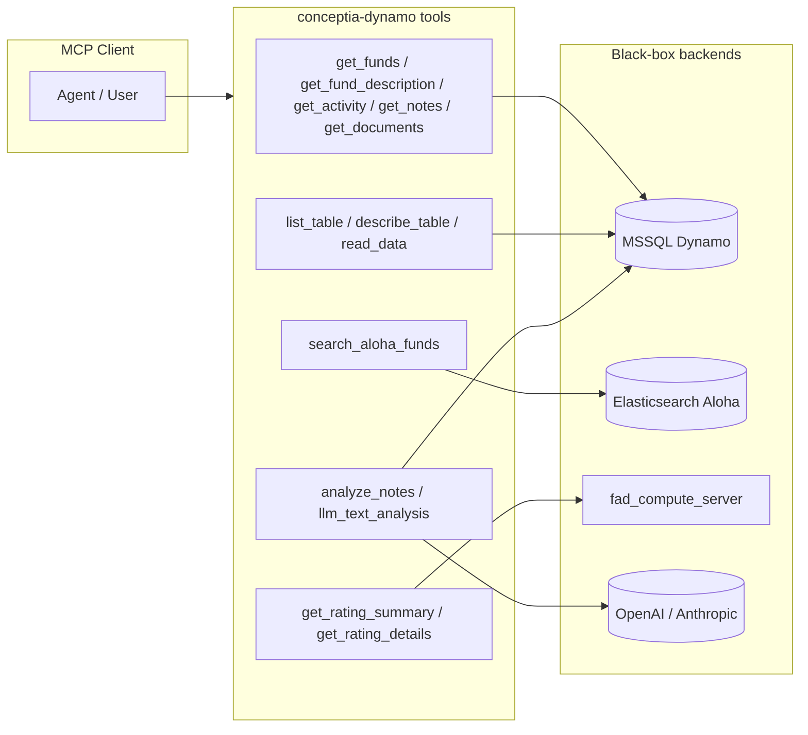
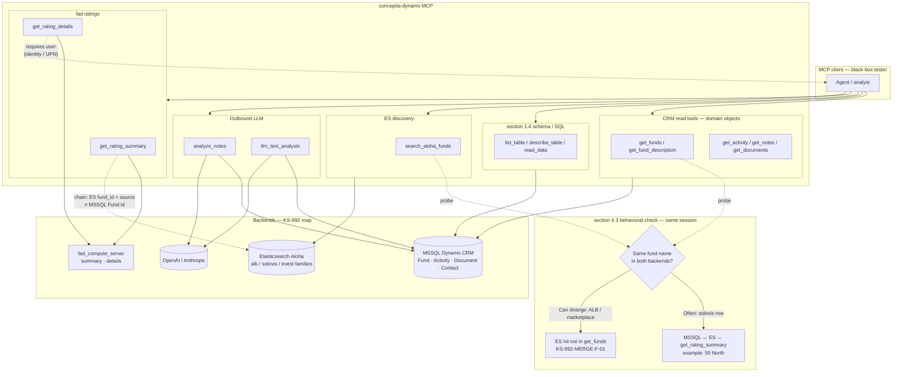

# KS-992 — Final Result: Map Domain Objects per Tool and Outbound Data Paths (MCP Black Box)

| Field | Value |
| --- | --- |
| **Jira** | [KS-992](https://gendvn.atlassian.net/browse/KS-992) |
| **Epic** | Dynamo MCP — **Discovery & Scope Enumeration** |
| **Guide** | `Dynamo Server/Test Guide/dynamo-mcp-testing-guide.md` section 4.3 |
| **MCP** | `conceptia-dynamo` · `https://mcp.conceptia.com/dynamo/sse` |
| **Sources merged** | `KS-992 - Claude Result.md` (2026-04-24, Bình Hà Khoa, **Claude Cowork**) · `KS-992 - Cursor Result.md` (**Cursor Agent**) |
| **Consolidation date** | 2026-04-24 |

---

## 1. Executive summary

**Ticket:** Black-box map of **domain objects** per tool, **outbound / LLM-mediated** paths, **section 1.4** tracking, and **behavioral** `search_aloha_funds` vs **`get_funds`** (no Dynamo UI / internal schema docs).

| Area | Claude Cowork | Cursor | Merged |
| --- | :---: | :---: | --- |
| 13-tool domain map + backends | ✅ Deep live evidence | ✅ Compact + live cross-check | **PASS** |
| MSSQL entities (Fund, Activity, Document, Contact) | ✅ Detailed | — (references KS-991) | **PASS** |
| ES indices + `fund_id` polymorphism | ✅ | ✅ “59 North” probe | **PASS** |
| fad ratings + user scope | ✅ | ✅ summary chain; **details require `user`** | **PASS** |
| Outbound LLM paths | ✅ section 8 narrative | ✅ section 4 table | **PASS** |
| section 1.4 + `INFORMATION_SCHEMA` | ✅ | ✅ | **PASS** |
| **ES vs MSSQL scope** | ✅ section 10 (no 1:1 coverage) | ✅ **ALB** hit **not** in `get_funds` | **PASS + finding** |

**Overall:** **PASS** for KS-992. **Cross-client consistency:** Solovis **59 North** aligns MSSQL ↔ ES ↔ `get_rating_summary`; **ALB** can surface funds **not** returned by `get_funds` in the same session (**merged finding** below).

---

## 2. Client coverage

| Client | Focus in this package |
| --- | --- |
| **Claude Cowork** | Full **dbo** field groupings, samples, **ER diagram**, outbound path detail, tool scoping narrative |
| **Cursor** | Explicit **procedure/steps** for section 4.3 behavioral check; **`get_rating_details`** without `user`; **flowchart** Mermaid |

---

## 3. Backend systems (unified)

| Backend | Role | Tools |
| --- | --- | --- |
| **MSSQL (Dynamo CRM)** | Funds, activities, notes, documents, contacts (denormalised strings on Activity/Document) | `get_funds`, `get_fund_description`, `get_activity`, `get_notes`, `get_documents`, `analyze_notes`, `llm_text_analysis` (optional note fetch), `list_table`, `describe_table`, `read_data` |
| **Elasticsearch (Aloha)** | `alb_funds`, `solovis_funds`, `alt_evest_funds`, `evest_funds` | `search_aloha_funds` |
| **fad_compute_server** | `/rating/summary`, `/rating/details` | `get_rating_summary`, `get_rating_details` |
| **External LLM** | OpenAI / Anthropic | `analyze_notes`, `llm_text_analysis` |

---

## 4. Tool → domain map (all 13 tools)

*Claude run adds per-tool **backend** and **access type**; Cursor run aligns on **objects**.*

| # | Tool | Primary domain | Secondary / backend | Notes |
| ---: | --- | --- | --- | --- |
| 1 | `get_funds` | **Fund** | Manager, asset class, pipeline, people lookups | MSSQL `dbo.Fund` |
| 2 | `get_fund_description` | **Fund** (projection) | Manager | Same table, fewer columns |
| 3 | `get_activity` | **Activity** | Fund, company, contact strings | **≥1 filter required** (runtime vs JSON optional — KS-991) |
| 4 | `get_notes` | **Activity** (diligence-shaped) | Same | Default category = Investment Due Diligence |
| 5 | `get_documents` | **Document** | Fund, company, contact, categories | Optional `Content` |
| 6 | `analyze_notes` | **Notes → LLM output** | Company, fund | **Outbound LLM** |
| 7 | `llm_text_analysis` | **Text/notes → LLM** | Optional note fetch | **Outbound LLM** |
| 8 | `search_aloha_funds` | **ES fund record** | Manager | ALB / solovis / evest family |
| 9 | `get_rating_summary` | **Rating summary** | Chains on ES `fund_id` + `source` | Not user-scoped |
| 10 | `get_rating_details` | **Rating detail** | User-scoped | **`user` or env required** (Cursor: error without) |
| 11 | `list_table` | **Catalog** | Schemas | section 1.4 |
| 12 | `describe_table` | **Column metadata** | Any table | section 1.4 |
| 13 | `read_data` | **Any SELECT** | + `INFORMATION_SCHEMA` | section 1.4 |

**Rich field lists & samples** for **Fund / Activity / Document / Contact**: see **`KS-992 - Claude Result.md` section 4–section 5.**

---

## 5. Outbound & exfiltration paths

| Path | Tools | Detail (merged) |
| --- | --- | --- |
| **LLM** | `analyze_notes`, `llm_text_analysis` | Note/body text (and metadata options) to **OpenAI / Anthropic** — see Claude **section 8**; align **KS-991-F-01** / **KS-992-F-01**. |
| **REST** | `get_rating_summary`, `get_rating_details` | fad_compute_server; **details** need user identity. |
| **ES discovery** | `search_aloha_funds` | Broader than MSSQL portfolio; **section 6** / Claude **section 10**. |
| **section 1.4 SQL/schema** | `list_table`, `describe_table`, `read_data` | Full schema + arbitrary SELECT — **KS-981**. |

---

## 6. Behavioral validation: `search_aloha_funds` vs `get_funds` (section 4.3)

### 6.1 Cursor procedure (reproducible)

1. `get_funds` `fundName: "59 North"` → **59 North Partners, LP** (1 row).  
2. `search_aloha_funds` `search_text: "59 North"` → **2** hits: **ALB** *59 North Master Fund LP* (`353302`) + **solovis** *59 North Partners, LP* (`"28582"`).  
3. `get_funds` `fundName: "59 North Master"` → **0** rows.  
4. `get_rating_summary` `id: "28582"`, `source: solovis`, `type: fund` → **success** with rating row.  
5. `get_rating_details` **without** `user` → **error: user required** (guard).

### 6.2 Claude narrative (complementary)

- Different backends — **no 1:1** fund coverage or ID model: ES `fund_id` **≠** MSSQL Fund GUID; chain ratings with ES **`fund_id` + `source`** verbatim (Claude **section 10**).  
- **`is_owned_by_ks`:** solovis-only slice — KS-owned semantics per tool description.

### 6.3 Merged finding (scope / assumption pending)

| ID | Severity | Description |
| --- | --- | --- |
| **KS-992-MERGE-F-01** | **Medium (assumption pending)** | **ALB (and broader ES) can return funds not present in `get_funds` for the same OAuth user** (e.g. *59 North Master Fund LP* in ES vs 0 MSSQL rows for tested filters). May be **by design** (marketplace vs CRM). **Vendor confirm**; until then: **test limitation** + **KS-981** tenant / data-classification review. *Subsumes **KS-992-CUR-F-01** and Claude section 10 “critical chaining” warning.*

---

## 7. section 1.4 high-risk tools — domain scope

| Tool | Accessible domain (black-box) |
| --- | --- |
| `list_table` | All MSSQL tables (very large payload — KS-991) |
| `describe_table` | All columns/types for any named table |
| `read_data` | SELECT on readable tables + **`INFORMATION_SCHEMA`** (**KS-992-F-05**) |

---

## 8. Merged findings register

| ID | Topic | Severity | Source |
| --- | --- | --- | --- |
| **KS-992-MERGE-F-01** | ES vs MSSQL scope / ALB visibility | Medium | Cursor + Claude section 10 |
| **KS-992-F-01** | LLM egress (`analyze_notes`, `llm_text_analysis`) | Medium | Claude |
| **KS-992-F-02** | `get_rating_details` needs valid KS UPN / empty rows | Info | Claude |
| **KS-992-F-03** | `fund_id` / `manager_id` type polymorphism ALB vs solovis | Low | Claude |
| **KS-992-F-04** | Financial columns on `dbo.Activity` | Info | Claude |
| **KS-992-F-05** | `INFORMATION_SCHEMA` via `read_data` | Medium | Claude (KS-991 carry) |

---

## 9. Diagrams

### 9.1 Data flow (Cursor)

### 9.2 Entity relationship (Claude)

See **`KS-992 - Claude Result.md` section 9** for the full **`erDiagram`** (Fund, Activity, Document, Contact, Aloha fund, Rating, LLM analysis).

### 9.3 UI/UX & Front-End Considerations — conceptual map (Mermaid)

Per BA skill: diagram for flows with **3+ entities or branches**. KS-992 is not a screen design; this map supports **reviewer comprehension** of MCP tool groups, backends, outbound paths, and the **section 4.3** ES vs MSSQL behavioral branch.

---

## 10. BDD acceptance criteria — merged

| Scenario | Result | Evidence |
| --- | --- | --- |
| **1 — Happy path** | **PASS (pending engineering sign-off)** | Full map + diagrams + live evidence in sub-reports. |
| **2 — Error path / unknown backend** | **PASS** | **KS-992-MERGE-F-01** + **F-02–F-05** logged as assumptions or follow-ups. |
| **3 — Edge case (new tool)** | **N/A** | Refresh on **KS-976** / deploy drift. |

---

## 11. Definition of Done — checklist

| Criterion | Status |
| --- | :---: |
| Domain mapping from tool names/responses | ✅ |
| Outbound / LLM paths | ✅ |
| section 1.4 flagged with domain scope | ✅ |
| `search_aloha_funds` behavioral check (MCP-only) | ✅ |
| Mermaid (≥3 entities) | ✅ (section 9.1 flow, section 9.3 UI/UX map, ER in Claude file) |
| Findings & assumptions | ✅ |

---

## 12. Paste-ready Jira comment

*KS-992 **merged** (Claude Cowork + Cursor): section 4.3 **PASS** — 13 tools mapped; MSSQL / ES / fad / LLM backends documented; section 1.4 + `INFORMATION_SCHEMA` path noted; outbound LLM paths (**KS-992-F-01**). **Scope:** Solovis **59 North** consistent with `get_funds` and `get_rating_summary`; **ALB** *59 North Master Fund LP* in ES but **not** in `get_funds` for tested queries — **KS-992-MERGE-F-01** (vendor confirm). `get_rating_details` requires `user`. Evidence: **`KS-992 Result.md`** + `KS-992 - Claude Result.md` + `KS-992 - Cursor Result.md`.*

---

## 13. References

| Document | Path |
| --- | --- |
| **This consolidated result** | `Dynamo Server/Test Result/KS-992 Result.md` |
| Claude (deep narrative, ER diagram, samples) | `Dynamo Server/Test Result/KS-992 - Claude Result.md` |
| Cursor (behavioral procedure, flowchart) | `Dynamo Server/Test Result/KS-992 - Cursor Result.md` |
| Schema baseline | `Dynamo Server/Test Result/KS-991 Result.md` |
| QA guide section 4.3 | `Dynamo Server/Test Guide/dynamo-mcp-testing-guide.md` |
