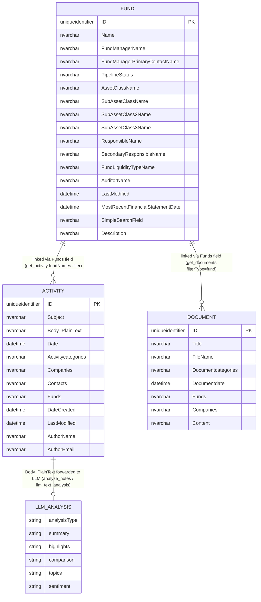

# KS-992 — Dynamo MCP QA: Domain Object Mapping and Outbound Data Paths
**Re-run Report (7-Tool Baseline)**
**Jira:** [KS-992](https://gendvn.atlassian.net/browse/KS-992) | **Epic:** Dynamo MCP — Discovery & Scope Enumeration
**Test Date:** 2026-05-07
**Tester:** Claude (Cowork Mode)
**Target:** `https://mcp.conceptia.com/dynamo/sse`
**Connector prefix:** `0c5a3b61-86e4-4c75-b19f-40c0141fb861`

---

## Re-Run Context

This report re-runs the section 4.3 domain mapping under **black-box MCP rules** (inference from tool names and observed responses only — no Dynamo schema documentation). The original mapping covered 13 tools across 6 domain entities. Since that enumeration, 6 tools have been removed and 2 tools have gained new parameters. This re-run reflects the current 7-tool surface.

**Key changes since original mapping:**

| Change | Impact on Domain Map |
|--------|---------------------|
| `search_aloha_funds` removed | Aloha Fund entity no longer has a dedicated search tool; cross-reference with `get_funds` is the only remaining path |
| `get_rating_details` + `get_rating_summary` removed | Rating entity no longer accessible via MCP |
| `list_table` + `describe_table` + `read_data` removed | Raw schema/table access path closed; section 1.4 HIGH-risk surface eliminated |
| `get_activity` gained `authorNames[]`, `fundNames[]`, `subjectSearch` | Activity entity now traversable by author and fund, not just company and category |
| `get_documents` gained `filterType`, `filterValue`, `excludeContent` | Document entity now filterable by fund or company scope directly; Content can be suppressed |

---

## Section 4.3 — Domain Object Mapping Per Tool

### 4.3.1 Domain Entities Inferred from Current 7-Tool Surface

| Domain Entity | Evidence Source | Tools That Touch It | Still Accessible |
|---------------|----------------|---------------------|-----------------|
| **Fund** | `get_funds`, `get_fund_description` — explicit `Fund` table in description | `get_funds`, `get_fund_description` | Yes |
| **Activity / Note** | `get_notes`, `get_activity` — explicit `Activity table` in description | `get_notes`, `get_activity`, `analyze_notes`, `llm_text_analysis` | Yes |
| **Document** | `get_documents` — explicit `Document table` in description | `get_documents` | Yes (sparse — 0 records returned for test query) |
| **LLM Analysis** | `analyze_notes`, `llm_text_analysis` — derived entity (not a DB table; computed output) | `analyze_notes`, `llm_text_analysis` | Yes |
| **Aloha Fund** | `search_aloha_funds` — **removed**; originally distinct from `get_funds` (different system/source) | None (tool removed) | **No** |
| **Rating** | `get_rating_summary`, `get_rating_details` — **removed** | None (tools removed) | **No** |
| **DB Schema / Raw Table** | `list_table`, `describe_table`, `read_data` — **removed** | None (tools removed) | **No** |

### 4.3.2 Per-Tool Domain Object Mapping

**`get_funds`**
Primary entity: **Fund**. Returns the richest Fund projection: manager name, manager contact, asset class hierarchy (up to 3 levels), pipeline status, responsible persons, liquidity type, auditor, financial statement date, and last activity linkage. The `LastActivityDate` and `LastActivitySubject` fields provide a cross-reference link to the Activity entity without calling `get_notes`/`get_activity`.

**`get_fund_description`**
Primary entity: **Fund** (subset). Narrow projection: ID, Name, SimpleSearchField, FundManagerName, Description. Acts as a lightweight fund lookup; Description is sparsely populated. Same filter set as `get_funds` — likely queries the same table with a SELECT projection difference.

**`get_notes`**
Primary entity: **Activity** (filtered). Targets notes categorised as `Investment Due Diligence` by default, but accepts any category array. Returns full Body_Plaintext (up to `maxBodyLength`), enabling text extraction of investment analysis content. Cross-references: Companies, Contacts, Funds fields link Activity rows to Fund and Contact entities.

**`get_activity`**
Primary entity: **Activity** (broad). Wider Activity table access — all categories, mandatory filter. Does NOT return Body_Plaintext (lighter projection than `get_notes`). New `fundNames[]` and `authorNames[]` params allow traversal from Fund → Activity and Author → Activity paths. `subjectSearch` enables keyword discovery on subject lines without body content.

**`get_documents`**
Primary entity: **Document**. Returns document metadata and optionally full Content. New `filterType`/`filterValue` params allow scoping to a specific fund or company. Sparse data observed (0 records returned for test fund). Document categories follow a coded format (e.g., `22-Capital Call;`).

**`analyze_notes`**
Primary entity: **Activity** (via internal `get_notes`-like fetch) → **LLM Analysis** (derived). Server-side LLM processes the fetched note bodies and returns: summary of themes, key highlights, and a structured comparison of the most recent note against notes from the prior 2 years (strategy, macro view, risk view, performance).

**`llm_text_analysis`**
Primary entity: **Activity** (optional fetch) or **arbitrary text** (via `texts` param) → **LLM Analysis** (derived). Most flexible analysis tool — accepts raw texts or fetches notes, then routes to OpenAI or Anthropic (caller-selectable). Supports 6 analysis types. Exposes the `instructions` param which is the primary prompt-injection surface on the server.

---

## Section 4.4 — Outbound / LLM-Mediated Data Paths

### 4.4.1 Data Flow Map

```
MCP Caller
    │
    ├─► get_funds ──────────────────► DB (Fund table) ──► Response to caller
    ├─► get_fund_description ────────► DB (Fund table) ──► Response to caller
    ├─► get_notes ───────────────────► DB (Activity table) ──► Response to caller
    ├─► get_activity ────────────────► DB (Activity table) ──► Response to caller
    ├─► get_documents ───────────────► DB (Document table) ──► Response to caller
    │
    ├─► analyze_notes
    │       └─► DB (Activity table) ──► [server-side LLM] ──► Response to caller
    │                                         │
    │                                         └── [LLM provider: internal/server-managed]
    │
    └─► llm_text_analysis
            ├─► DB (Activity table, optional) ──┐
            └─► texts param (caller-supplied) ──┴─► [OpenAI API] ──► Response to caller
                                                 └─► [Anthropic API] ──► Response to caller
```

### 4.4.2 Outbound Data Path Analysis

| Tool | Outbound Path | Data Sent Externally | Risk Level |
|------|--------------|---------------------|------------|
| `get_funds` | None — DB read only | No | None |
| `get_fund_description` | None — DB read only | No | None |
| `get_notes` | None — DB read only | No | None |
| `get_activity` | None — DB read only | No | None |
| `get_documents` | None — DB read only | No | None |
| `analyze_notes` | Server-side LLM (provider not exposed to caller) | Activity note bodies sent to internal LLM | Low — internal to Conceptia server |
| `llm_text_analysis` | **OpenAI API** (default) or **Anthropic API** (via `provider` param) | Activity note bodies AND/OR caller-supplied texts sent to external LLM API | **Medium** — note content leaves the MCP server boundary |

### 4.4.3 `llm_text_analysis` Exfiltration Path Assessment

`llm_text_analysis` is the only tool that routes data to an **external** provider (OpenAI or Anthropic). This creates two data-flow concerns:

**Concern 1 — Confidential note content to external LLM:** When called with `companyNames` or date filters (without explicit `texts`), the tool fetches Activity notes from the DB and forwards their full body text to the external LLM API. Investment due diligence notes may contain non-public information about portfolio companies.

**Observed behaviour during testing:** Prompt injection via the `instructions` parameter was blocked by the upstream LLM (all 5 PIJ-RECALL variants blocked — ref: Addendum B). However, the data routing itself is architectural, not injection-dependent.

**Concern 2 — Caller-supplied texts forwarded verbatim:** The `texts` parameter accepts arbitrary string content from the MCP caller, which is forwarded to the LLM with no sanitisation. A caller could supply crafted text to influence the LLM response (prompt injection surface).

**Severity:** Medium — present in original mapping; unchanged in re-run. Covered by PIJ-01–10 and PIJ-REC-01–05 test suites.

---

## Section 4.5 — Entity Relationship Diagram (Updated 7-Tool Baseline)

The following diagram reflects only entities accessible via the current 7-tool surface. Entities accessible only through removed tools (Aloha Fund, Rating, raw DB schema) are shown as removed.



**Removed entities (no longer accessible via MCP):**

```
ALOHA_FUND    — search_aloha_funds removed
RATING_SUMMARY — get_rating_summary removed
RATING_DETAIL  — get_rating_details removed
DB_SCHEMA      — list_table, describe_table, read_data removed
```

---

## Section 4.6 — `search_aloha_funds` Scope Hypothesis (Original + Updated)

**Original hypothesis (pre-removal):** `search_aloha_funds` was hypothesised to target a separate Aloha system (different data source from the primary CRM Fund table), distinct from `get_funds` which targets the Fund CRM table. Evidence: different tool name prefix, `search` verb vs `get` verb, distinct parameter schema, and the entity relationship diagram in KS-992 showing `ALOHA_FUND` as a separate entity with `fund_type`, `source`, and `manager_name` fields mapping differently from `FUND`.

**Updated status:** `search_aloha_funds` has been removed from the server. The hypothesis can no longer be validated behaviourally. The Aloha Fund entity is **not accessible** via any current MCP tool. The relationship `ALOHA_FUND }o--o| FUND` (same manager, different system) shown in the original ERD cannot be confirmed or denied from the current surface.

**Recommendation:** Coordinate with Conceptia to confirm whether Aloha Fund data is intentionally excluded from MCP access or whether a replacement tool is planned.

---

## BDD Scenario Outcomes

### Scenario 1 — Happy path
**Given** enumeration is complete, **When** the mapping is reviewed with engineering, **Then** upstream map is approved for use in E4.

**Outcome: PARTIAL PASS**
The domain map covers all 7 currently deployed tools with full entity-to-tool mappings, outbound path analysis, and an updated ERD. Three domain entities (Aloha Fund, Rating, raw DB schema) are no longer accessible and have been removed from the active map. The map is ready for E4 use against the 7-tool surface.

### Scenario 2 — Error path
**Given** a tool's backend is unknown, **When** vendor cannot clarify, **Then** risk is recorded as "assumption pending" with test limitations.

**Outcome: TRIGGERED (2 items)**

1. **`get_documents` Content field** — Zero records were returned for the test query (fund "2026 Fund"), so the Content field structure has not been observed in this re-run. Recorded as **assumption pending**: the field is expected to contain document body text based on the DB schema diagram in KS-992, but this has not been confirmed via live response in this re-run.

2. **`analyze_notes` internal LLM provider** — The tool description does not expose which LLM provider is used server-side (unlike `llm_text_analysis`). Recorded as **assumption pending**: the provider is managed internally by Conceptia.

### Scenario 3 — Edge case (new tool or entity post-deploy)
**Given** a new tool or entity surface appears post-deploy, **When** registered on server, **Then** mapping doc is updated before regression.

**Outcome: TRIGGERED**
This re-run was triggered by the post-deploy tool drift detected on 2026-05-07:
- 6 tools removed → entities removed from map
- 2 tools gained new params → `get_activity` traversal paths updated (Fund → Activity via `fundNames[]`, Author → Activity via `authorNames[]`); `get_documents` filter paths updated (fund/company scope via `filterType`/`filterValue`)

---

## Consolidated Findings

| Finding ID | Tool | Category | Description | Severity |
|------------|------|----------|-------------|----------|
| DMAP-F01 | `llm_text_analysis` | Outbound data path | Note body content sent to external LLM (OpenAI or Anthropic) — unchanged from original mapping | Medium |
| DMAP-F02 | `analyze_notes` | Outbound data path (internal) | Note body content processed by server-side LLM — provider unknown; internal to Conceptia | Low |
| DMAP-F03 | `get_documents` | Assumption pending | Content field structure not confirmed in re-run (0 records returned for test query) | Informational |
| DMAP-F04 | `analyze_notes` | Assumption pending | Internal LLM provider not disclosed in tool schema | Informational |
| DMAP-F05 | Aloha Fund entity | Entity inaccessible | `search_aloha_funds` removed; Aloha Fund data not accessible via any current MCP tool | Informational |
| DMAP-F06 | Rating entity | Entity inaccessible | `get_rating_summary` + `get_rating_details` removed; Rating data not accessible | Informational |

---

## Recommendations

**Update E4 test scope** to remove Aloha Fund, Rating, and raw DB schema from the attack surface. All E4 (chain/injection) tests should target the 7 remaining tools only.

**Confirm `get_documents` Content field** — run a query against a fund or company known to have associated documents. If documents exist in the system, validate Content field length and format. Update this report with observed output.

**Confirm `analyze_notes` LLM provider** with Conceptia — determine whether the server-side LLM is an internal model or also routes to OpenAI/Anthropic. If external, DMAP-F02 severity should be elevated to Medium (same as DMAP-F01).

**Update testing guide section 1.3** to reflect the 7-tool surface and the updated entity relationship diagram in this report.

**Add E4 chain test** targeting the new `get_activity` traversal paths (`fundNames[]` and `authorNames[]`) — these parameters were not present when the original CHAIN test suite was designed.

---

*End of KS-992 re-run report. Original domain map: 7 entities, 13 tools. Current baseline: 4 active entities, 3 inaccessible entities, 7 tools.*
