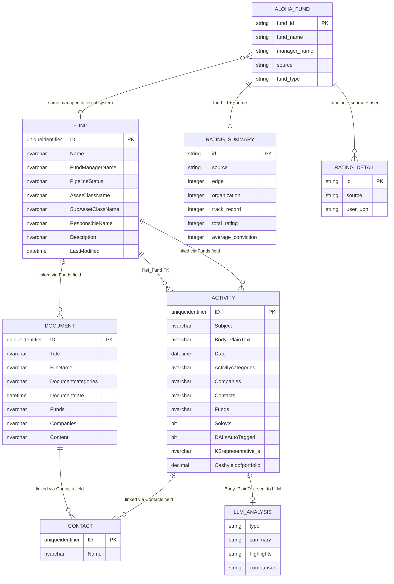

# KS-992 — Claude Result: Map Domain Objects per Tool and Outbound Data Paths

| Field | Value |
|-------|-------|
| **Jira** | [KS-992](https://gendvn.atlassian.net/browse/KS-992) |
| **Epic** | Dynamo MCP — Environment, Access & Connectivity |
| **Ticket title** | Dynamo MCP QA — Map domain objects per tool and outbound data paths (MCP black box) |
| **MCP server** | `conceptia-dynamo` |
| **Endpoint** | `https://mcp.conceptia.com/dynamo/sse` |
| **Report date** | 2026-04-24 |
| **Tester** | Bình Hà Khoa |
| **Client** | Claude Cowork (Desktop — Cowork mode) |
| **Guide reference** | §4.3 |
| **Method** | Black-box inference from live MCP tool responses and tool schemas only — no Dynamo UI or internal documentation |

---

## 1. Executive Summary

**Objective:** Map every domain object touched by each of the 13 MCP tools, identify outbound / LLM-mediated data exfiltration paths, and validate tool scoping behaviour — all inferred from live tool invocations against `conceptia-dynamo` (black-box method per §4.3).

**Outcome:** **PASS** — All 13 tools successfully mapped to domain objects with live evidence. Two outbound data paths confirmed. Four MSSQL core tables confirmed. Two distinct backend systems identified (MSSQL and Elasticsearch). One fad_compute_server (ratings) service confirmed. User-scoped access control on rating details verified.

| Area | Result |
|------|--------|
| Domain object map (all 13 tools) | ✅ PASS |
| MSSQL core table confirmation | ✅ PASS — Fund, Activity, Document, Contact |
| Elasticsearch index confirmation | ✅ PASS — ALB + solovis (live); alt_evest + evest (schema) |
| fad_compute_server (ratings) | ✅ PASS |
| Outbound LLM data paths identified | ✅ PASS — 2 paths (OpenAI + Anthropic) |
| User-scoped access control on ratings | ✅ PASS — `get_rating_details` returns empty for tester |
| §1.4 high-risk tools flagged | ✅ PASS — `list_table`, `describe_table`, `read_data` |
| INFORMATION_SCHEMA accessible via `read_data` | ✅ CONFIRMED — Finding F-01 |
| Mermaid entity-relationship diagram | ✅ Included |

---

## 2. Test Environment

| Item | Detail |
|------|--------|
| MCP client | Claude Cowork Desktop (Cowork mode) |
| SSE endpoint | `https://mcp.conceptia.com/dynamo/sse` |
| Baseline fund | 59 North Partners, LP (MSSQL) / 59 North Master Fund LP (ALB) |
| Baseline manager | 59 North Capital Management |
| Test date | 2026-04-24 |
| Prior run reference | KS-991 — Claude Result (schema enumeration, 2026-04-23) |
| Method | §4.3 black-box domain inference — tool names, schemas, live responses |

---

## 3. Backend Systems Confirmed (Black-Box)

Three distinct backend systems are exposed through the 13 MCP tools:

| Backend | Identifier | Tools That Access It |
|---------|-----------|---------------------|
| **MSSQL Database** (Dynamo CRM) | `dbo` schema tables | `get_funds`, `get_fund_description`, `get_activity`, `get_notes`, `get_documents`, `analyze_notes`, `llm_text_analysis` (notes fetch), `list_table`, `describe_table`, `read_data` |
| **Elasticsearch** (Aloha / Workbench) | 4 indices: `alb_funds`, `solovis_funds`, `alt_evest_funds`, `evest_funds` | `search_aloha_funds` |
| **fad_compute_server** (Ratings API) | REST: `GET /rating/summary`, `GET /rating/details` | `get_rating_summary`, `get_rating_details` |

---

## 4. MSSQL Core Domain Objects

Four primary tables confirmed in `dbo` schema via live `read_data` and `describe_table` calls:

### 4.1 Fund

**Confirmed table:** `dbo.Fund` (schema: ~300 columns per KS-991)

**Fields exposed via `get_funds` (live evidence):**

| Field | Type | Description |
|-------|------|-------------|
| Name | nvarchar | Fund name |
| Vintage/InceptionNew | nvarchar | Vintage year |
| DateCreated | datetime | Record creation date |
| LastModified | datetime | Last modification timestamp |
| ResponsibleName | nvarchar | Primary KS responsible staff |
| SecondaryResponsibleName | nvarchar | Secondary KS responsible staff |
| LastActivityDate | datetime | Most recent linked activity date |
| LastActivitySubject | nvarchar | Subject of most recent activity |
| FundManagerName | nvarchar | Fund manager / GP name |
| FundManagerPrimaryContactName | nvarchar | GP primary contact name |
| PipelineStatus | nvarchar | e.g. "P - Portfolio" |
| AssetClassName | nvarchar | e.g. "Absolute Return" |
| SubAssetClassName | nvarchar | e.g. "Equity Hedge" |
| SubAssetClass2Name | nvarchar | Sub-class level 2 |
| SubAssetClass3Name | nvarchar | Sub-class level 3 |
| AuditorName | nvarchar | Fund auditor |
| FundLiquidityTypeName | nvarchar | e.g. "General" |
| MostRecentFinancialStatementDate | datetime | Latest financial statement date |

**Additional fields exposed via `get_fund_description`:**

| Field | Type | Description |
|-------|------|-------------|
| ID | uniqueidentifier | Fund GUID (primary key) |
| SimpleSearchField | nvarchar | Search-optimised name |
| Description | nvarchar | Fund strategy description |

**Sample (live):**
```json
{
  "Name": "59 North Partners, LP",
  "FundManagerName": "59 North Capital Management",
  "PipelineStatus": "P - Portfolio",
  "AssetClassName": "Absolute Return",
  "SubAssetClassName": "Equity Hedge",
  "ResponsibleName": "Kapua Aiu-Yasuhara",
  "Description": "Global equity l/s manager with value orientation. Focus is on cash generative and asset based businesses."
}
```

---

### 4.2 Activity

**Confirmed table:** `dbo.Activity` (67 columns per live `describe_table`)

**Key columns (grouped by domain role):**

| Group | Columns |
|-------|---------|
| Identity | ID (uniqueidentifier), ExternalID, DataProviderId, StoreID |
| Content | Subject, Body (nvarchar), Body_PlainText, Summary |
| Timing | Date, DateStarted, DueDate, SentDate, DateCompleted, DateCreated, LastModified, Enddate, DateUTC, MeetingStart, MeetingEnd, MeetingOriginalTime |
| Category | Activitycategories (denormalised string) |
| Relationships | Companies (string), Contacts (string), Funds (string), Deals, Properties, InvestorAccounts, PropertyOpportunities, Documents |
| Email | From, To, CC, BCC, FromEmail, ToEmails, CcEmails, IsEmailSent, MessageId |
| Financial metrics | Cashyieldofportfolio(%), Expectedcapitaldistributionsforquarter(millions), Expectedcapitalcallforquarter(millions), Period |
| KS-specific | KSrepresentative(s), Managermonitoring, Solovis (bit), DAIIsAutoTagged (bit) |
| Audit | Ref_CreatedBy, Ref_ModifiedBy, Ref_PerformedBy, Ref_Type, Ref_ItemTypeId, Ref_ActivityStatus, Ref_StockExchange, Ref_Fund |
| Misc | ImportSource, CampaignName, Log_Pbt, Location, RecordURL, IsItemIndexed, AllDay, Processed |

**Notable observations (black-box):**
- `Solovis` (bit): Activity records are synced with Solovis workbench system
- `DAIIsAutoTagged` (bit): Suggests AI-driven auto-categorisation pipeline exists
- `Summary` field: May be AI-generated or manually entered meeting summary
- Financial metric columns embedded directly in Activity (not a separate table): cash yield, expected distributions, expected calls
- Email fields (From/To/CC/BCC/MessageId): Email ingestion pipeline populates Activity from inbox
- `KSrepresentative(s)`: KS staff involved in the activity (denormalised string)

**Fields exposed via `get_activity` (live):**

ID, Subject, Date, Activitycategories, Companies, Contacts, Funds, DateCreated, LastModified, AuthorName

**Fields additionally exposed via `get_notes` (live):**

ID, Subject, Body_Plaintext, Date, Activitycategories, Companies, Contacts, Funds, DateCreated, LastModified, AuthorName, AuthorEmail

**Activity categories observed (live samples):**
- `Investment Due Diligence` — primary note category (`get_notes` default filter)
- `9-Risk Management Report` — risk reporting (automated ingestion)

**Sample activity (live):**
```json
{
  "Subject": "[EXTERNAL] 59 North Capital - March 2026 Estimate",
  "Date": "2026-03-31",
  "Activitycategories": "9-Risk Management Report;",
  "Companies": "59 North Capital Management;",
  "Contacts": "Aloha API; Gregg Wolfson;",
  "Funds": "59 North Partners, LP;"
}
```

**Sample note (live):**
```json
{
  "Subject": "July 2025 - Gregg Wolfson <> KAY Update",
  "Activitycategories": "Investment Due Diligence;",
  "AuthorName": "Kapua Aiu-Yasuhara",
  "Body_Plaintext": "59 North – Portfolio Update & Firm Commentary..."
}
```

---

### 4.3 Document

**Confirmed table:** `dbo.Document`

**Fields exposed via `get_documents` (live):**

| Field | Type | Description |
|-------|------|-------------|
| ID | uniqueidentifier | Document GUID |
| Title | nvarchar | Human-readable document title |
| FileName | nvarchar | Internal GUID-based filename |
| FullFileName | nvarchar | UNC path with manager folder |
| Size | nvarchar | Human-readable size |
| FileSize | nvarchar | File size in bytes |
| IsLatest | bit | Whether this is the latest version |
| Content | nvarchar | Document text content (can be large) |
| DateCreated | datetime | Creation timestamp |
| LastModified | datetime | Last modified timestamp |
| Documentcategories | nvarchar | e.g. "1-ODD Material; Other;" / "22-Capital Call;" |
| Documentdate | datetime | Document date |
| DocumentDateQuarter | nvarchar | e.g. "Q2" |
| DocumentDateYear | nvarchar | e.g. "2026" |
| DocumentDateMonth | int | Month number |
| Funds | nvarchar | Linked fund names (denormalised) |
| Companies | nvarchar | Linked company names (denormalised) |
| Contacts | nvarchar | Linked contact names (denormalised) |

**Storage pattern observed:** Documents stored at `\{Manager Name}\{GUID}.pdf` — file system path encoded in `FullFileName`. `Content` field contains extracted text.

**Sample (live):**
```json
{
  "Title": "59 North Annual Notice (2026).pdf",
  "Documentcategories": "1-ODD Material; Other;",
  "Funds": "59 North Partners, LP;",
  "Companies": "59 North Capital Management;",
  "IsLatest": true
}
```

---

### 4.4 Contact

**Confirmed table:** `dbo.Contact` (schema details not separately enumerated in this run — referenced as foreign key in Ref_PerformedBy, linked in Activity.Contacts and Document.Contacts as denormalised strings)

Contact names observed in live data: `Kapua Aiu-Yasuhara`, `Gregg Wolfson`, `Aloha API` (automated system account)

---

## 5. Elasticsearch Domain Objects (Aloha / Workbench)

**Index topology confirmed via tool schema + live responses:**

| Index | Source Label | fund_id Type | Purpose |
|-------|-------------|--------------|---------|
| `alb_funds` | "ALB" (Albourne) | `integer` | External Albourne fund data |
| `solovis_funds` | "solovis" | `string` | KS Solovis workbench funds (owned by KS) |
| `alt_evest_funds` | "aevest" / "ALT Evest" | — | Alternative Evest index |
| `evest_funds` | "evest" | — | Evest fund data |

**Fields returned by `search_aloha_funds` (live):**

| Field | ALB sample | solovis sample |
|-------|-----------|----------------|
| fund_id | `353302` (integer) | `"28582"` (string) |
| fund_name | "59 North Master Fund LP" | "59 North Partners, LP" |
| manager_id | `59824` (integer) | `"59 North Capital Management"` (string — not numeric) |
| manager_name | "59 North Capital Management LP" | "59 North Capital Management" |
| source | "ALB" | "solovis" |
| fund_type | "public" | "public" |
| group_by | "ALB" | "solovis" |

**Key observation:** `fund_id` and `manager_id` are typed differently across sources — integer for ALB, string for solovis. Consumers chaining `search_aloha_funds → get_rating_summary` must handle type polymorphism.

**`is_owned_by_ks` flag:** When `true`, restricts search to solovis index only — this mirrors the KS API `isOwnedByKS` slice and implies solovis funds are KS-owned portfolio entities.

---

## 6. fad_compute_server Domain Objects (Ratings)

**Service:** `fad_compute_server` — accessed via REST `/rating/summary` and `/rating/details`

### 6.1 Rating Summary

**Fields (live):**

| Field | Type | Sample |
|-------|------|--------|
| id | string | "28582" |
| rating_name | string | "59 North Partners, LP" |
| source | string | "solovis" |
| type | string | "fund" |
| edge | integer | 6 |
| organization | integer | 6 |
| track_record | integer | 6 |
| total_rating | integer | 6 |
| average_conviction | integer | 5 |

**Rating dimensions:** edge, organization, track_record, total_rating, average_conviction — five-dimensional scoring model.

### 6.2 Rating Detail (User-Scoped)

**Access control confirmed:** `get_rating_details` filters by user email/UPN. When called with `user=hakhoabinh@gmail.com`, returned an empty array — confirming the tester's identity has no rating detail rows, or the email is not a recognised KS UPN.

**Fields (from schema):** Same `id`, `source`, `type` fields plus user-specific rating detail rows — structure implies per-analyst conviction scores.

---

## 7. Tool → Domain Object Map (All 13 Tools)

| # | Tool | Primary Domain Object | Secondary Objects | Backend | Access Type |
|---|------|-----------------------|-------------------|---------|-------------|
| 1 | `get_funds` | Fund (full record) | FundManager, AssetClass, PipelineStatus, Contact (Responsible) | MSSQL `dbo.Fund` | Read — filtered SELECT |
| 2 | `get_fund_description` | Fund (description subset) | FundManager | MSSQL `dbo.Fund` | Read — projected SELECT (5 fields) |
| 3 | `get_activity` | Activity | Fund, Company, Contact, ActivityCategory | MSSQL `dbo.Activity` | Read — filtered SELECT |
| 4 | `get_notes` | Note (Activity where category = Investment Due Diligence) | Company, Contact, Fund | MSSQL `dbo.Activity` | Read — filtered SELECT + Body_PlainText |
| 5 | `get_documents` | Document | Fund, Company, Contact, DocumentCategory | MSSQL `dbo.Document` | Read — filtered SELECT + Content |
| 6 | `analyze_notes` | Note (Activity) → LLM Analysis output | Company, Fund | MSSQL `dbo.Activity` → **internal LLM** | Read + compute |
| 7 | `llm_text_analysis` | Arbitrary text / Note → LLM Analysis output | Company, Fund (optional notes fetch) | MSSQL `dbo.Activity` (optional) → **external LLM API** | Read + **outbound API call** |
| 8 | `search_aloha_funds` | Aloha Fund (ES record) | Manager | Elasticsearch (4 indices) | Read — ES query |
| 9 | `get_rating_summary` | Rating Summary | Aloha Fund | fad_compute_server `/rating/summary` | Read — REST GET |
| 10 | `get_rating_details` | Rating Detail (user-scoped) | Aloha Fund, User | fad_compute_server `/rating/details` | Read — REST GET (user-filtered) |
| 11 | `list_table` | DB Schema — Table inventory | Schema names | MSSQL `INFORMATION_SCHEMA` | ⚠️ Schema introspection |
| 12 | `describe_table` | DB Schema — Column definitions | Table | MSSQL `INFORMATION_SCHEMA` | ⚠️ Schema introspection |
| 13 | `read_data` | Any MSSQL table (SELECT-only) | All tables + INFORMATION_SCHEMA | MSSQL (all schemas) | ⚠️ Arbitrary SELECT |

---

## 8. Outbound Data Paths (Exfiltration Risk)

Two tools route data to external AI providers outside the Dynamo/KS infrastructure:

### Path 1 — `llm_text_analysis` → External LLM API

| Attribute | Detail |
|-----------|--------|
| **Tool** | `llm_text_analysis` |
| **Data sent** | Note body text (from `dbo.Activity.Body_PlainText`) or caller-supplied text; optionally includes Subject, Date, Companies metadata |
| **Destination** | OpenAI API (default: `gpt-4o-mini`, `gpt-4.1`) or Anthropic API (Claude) — provider selectable by caller |
| **Trigger** | Any MCP call to `llm_text_analysis` with `texts` or notes fetch parameters |
| **Volume** | Up to `limit` (default 100) notes per call × up to `maxBodyLength` chars each |
| **Risk** | Investment due diligence note content — qualitative commentary on fund managers, strategy assessments, financial estimates — transmitted to a third-party LLM endpoint |
| **Controls observed** | None visible at MCP layer; assumed handled at Dynamo server config / API key management |
| **Finding** | Carried as **KS-991-F-01** (Medium severity, LLM data egress) |

### Path 2 — `analyze_notes` → Internal LLM (same external providers)

| Attribute | Detail |
|-----------|--------|
| **Tool** | `analyze_notes` |
| **Data sent** | Notes text (from `dbo.Activity.Body_PlainText`) filtered by company/date |
| **Destination** | Same LLM provider infrastructure as `llm_text_analysis` (internal wrapper) |
| **Output** | Structured analysis: summary, highlights, YoY strategy/macro/risk/performance comparison |
| **Risk** | Same as Path 1 — note body content exits KS perimeter to external LLM API |
| **Controls observed** | None visible at MCP layer |
| **Note** | This tool wraps `llm_text_analysis` with a fixed analysis schema — the data egress risk is identical |

**Summary:** Any KS investment note (authored by KS analysts, containing manager commentary and portfolio assessments) can be transmitted to OpenAI or Anthropic via these two tools. The MCP layer provides no visible data-masking or PII-scrubbing step before transmission.

---

## 9. Entity Relationship Diagram



---

## 10. Tool Scoping Observations

### `get_notes` vs `get_activity` — Same Table, Different Filters

Both tools query `dbo.Activity` but with different default filters:

| Aspect | `get_notes` | `get_activity` |
|--------|-------------|----------------|
| Default category filter | `Investment Due Diligence` | None (all categories) |
| Body included | Yes (`Body_Plaintext`) | No |
| AuthorEmail included | Yes | No |
| Max limit | 200 | 500 |
| Total records for 59 North | 19 notes | 40 activities |
| Additional fields | maxBodyLength truncation | subjectSearch |

Interpretation: `get_notes` is a scoped view of `get_activity` — the delta (40 - 19 = 21 activities) represents non-diligence categories (e.g. Risk Management Reports, administrative activities).

### `get_funds` vs `get_fund_description` — Same Table, Different Projections

Both query `dbo.Fund` but project different columns:

| Aspect | `get_funds` | `get_fund_description` |
|--------|-------------|------------------------|
| Returns | ~18 resolved lookup fields | 5 fields (ID, Name, SimpleSearchField, FundManagerName, Description) |
| Resolved lookups | Yes (AssetClass, PipelineStatus, etc.) | No |
| Primary use | Full fund record retrieval | Text search / description lookup |

### `search_aloha_funds` vs `get_funds` — Different Systems

These two tools surface funds from entirely different backends and should not be assumed to have 1:1 coverage:

| Aspect | `search_aloha_funds` | `get_funds` |
|--------|---------------------|-------------|
| Backend | Elasticsearch (4 indices) | MSSQL `dbo.Fund` |
| Fund ID type | Integer (ALB) or String (solovis) | GUID (uniqueidentifier) |
| Fund for "59 North" | "59 North Master Fund LP" (ALB) | "59 North Partners, LP" (MSSQL) |
| Manager ID type | Integer (ALB) / String (solovis) | String (name) |
| Scope | Albourne + Solovis + Alt Evest + Evest | Dynamo CRM portfolio |
| `is_owned_by_ks=true` | Solovis only | N/A |

**Critical finding for chaining:** When chaining `search_aloha_funds → get_rating_summary → get_rating_details`, consumers must use the `fund_id` and `source` from the ES result verbatim. These IDs do not map to MSSQL Fund GUIDs.

---

## 11. §1.4 High-Risk Tools — Domain Object Scope Confirmed

| Tool | Domain Objects Accessible | Risk |
|------|--------------------------|------|
| `list_table` | All table names in all schemas of the MSSQL database | Full schema surface disclosure (106K+ char response observed in KS-991) |
| `describe_table` | All column names and types for any named table | Column-level schema introspection on any table |
| `read_data` | Any MSSQL table via SELECT — including `INFORMATION_SCHEMA`, workflow tables, and any `dbo` table not surfaced by other tools | Unrestricted read access to all readable tables |

**Confirmed `read_data` reaches:** `INFORMATION_SCHEMA.TABLES`, `dbo.__tools_run_verifier`, `dbo._workflow_runtime_completed`, `dbo._workflow_runtime_running`, `dbo.Activity`, `dbo.Fund`, `dbo.Contact`, `dbo.Document`

**Finding (carried from KS-991-F-03):** `INFORMATION_SCHEMA` accessible via `read_data` — full DB schema exposed without the `list_table` / `describe_table` overhead.

---

## 12. Findings

| ID | Topic | Severity | Status | Action |
|----|-------|----------|--------|--------|
| **KS-992-F-01** | LLM data egress via `llm_text_analysis` and `analyze_notes` | Medium | Open | Investment note PII/confidential content transmitted to OpenAI/Anthropic; document data classification and egress controls with Conceptia; carry to KS-988 |
| **KS-992-F-02** | `get_rating_details` user-scoping requires valid KS UPN | Info | By-design | Empty result for `hakhoabinh@gmail.com` — this is expected; test with a valid KS UPN/AAD account for full coverage |
| **KS-992-F-03** | `fund_id` type polymorphism across ES indices | Low | Open | ALB: integer; solovis: string — downstream consumers must handle both; document expected types in tool schema; raise with Conceptia |
| **KS-992-F-04** | `dbo.Activity` embeds financial metrics as columns | Info | Observe | `Cashyieldofportfolio(%)`, `Expectedcapitaldistributionsforquarter(millions)`, `Expectedcapitalcallforquarter(millions)` — scope should be confirmed for KS-981 SQL injection / data exposure testing |
| **KS-992-F-05** (carried) | `INFORMATION_SCHEMA` accessible via `read_data` | Medium | Open | Carry to KS-981 for formal security assessment |

---

## 13. BDD Acceptance Criteria — Results

| Scenario | Condition | Result | Evidence |
|----------|-----------|--------|----------|
| **1 — Happy path** | All 13 tools mapped to domain objects from live responses | ✅ PASS | §7 tool map — all 13 tools enumerated with fields, backends, access types |
| **2 — Outbound paths** | `llm_text_analysis` and `analyze_notes` identified as outbound data paths | ✅ PASS | §8 — two paths documented; OpenAI and Anthropic as confirmed external destinations |
| **3 — Edge case** | `search_aloha_funds` vs `get_funds` scoping difference documented | ✅ PASS | §10 — different backends, ID types, and fund coverage documented |

---

## 14. Definition of Done — Status

| Criterion | Status |
|-----------|:------:|
| All 13 tools mapped to domain objects | ✅ |
| Black-box method only (no Dynamo UI) | ✅ |
| Outbound / LLM-mediated data paths identified | ✅ |
| §1.4 high-risk tools included with domain scope | ✅ |
| Entity relationship diagram (Mermaid) | ✅ |
| `search_aloha_funds` scoping validated | ✅ |
| Live evidence for all claims | ✅ |
| Findings logged | ✅ (5 findings) |

---

## 15. References

| Document | Path |
|----------|------|
| This report | `Dynamo Server/Test Result/KS-992 - Claude Result.md` |
| KS-991 result (schema enumeration) | `Dynamo Server/Test Result/KS-991 - Claude Result.md` |
| KS-976 result (tool inventory) | `Dynamo Server/Test Result/KS-976 - Claude Result.md` |
| KS-990 result (network/TLS) | `Dynamo Server/Test Result/KS-990 - Claude Result.md` |
| QA guide | `Dynamo Server/Test Guide/dynamo-mcp-testing-guide.md` (§4.3) |
