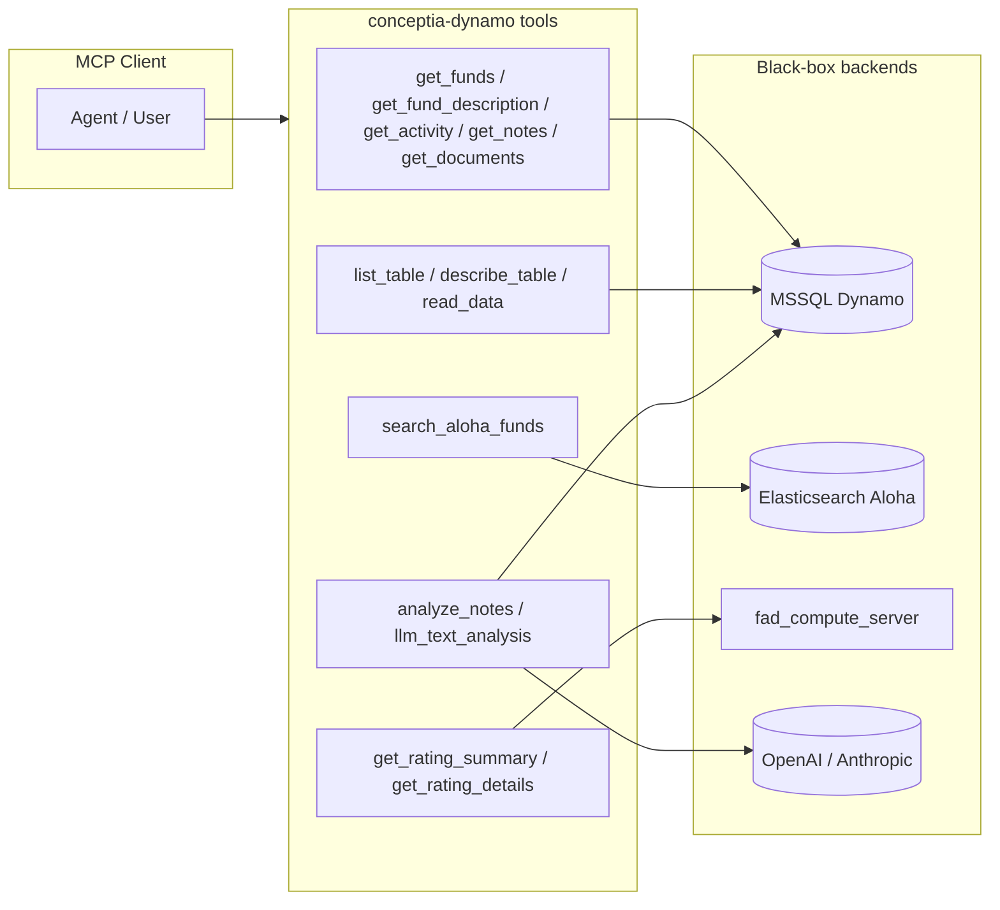

# KS-992 — Cursor Result: Map Domain Objects per Tool and Outbound Data Paths (MCP Black Box)

| Field | Value |
| --- | --- |
| **Jira** | [KS-992](https://gendvn.atlassian.net/browse/KS-992) |
| **Epic** | Dynamo MCP — Discovery & Scope Enumeration |
| **Guide** | `Dynamo Server/Test Guide/dynamo-mcp-testing-guide.md` §4.3 |
| **MCP** | `conceptia-dynamo` · `https://mcp.conceptia.com/dynamo/sse` |
| **Client** | Cursor (Agent / Composer) |
| **Method** | Black-box only — tool names, schemas, **live** MCP responses (no Dynamo UI / internal schema docs) |
| **Execution date** | 2026-04-24 |
| **Related** | `KS-991 Result.md` (schemas); `KS-992 - Claude Result.md` (parallel deep dive) |

---

## 1. Executive summary

**Ticket ask:** Map **domain objects** per tool, **outbound / LLM-mediated** exfiltration paths, and **§1.4** high-risk flows; **behaviorally** probe `search_aloha_funds` vs tenant-scoped data (e.g. `get_funds`).

| Area | Result | Evidence (this run) |
| --- | --- | --- |
| Tool → domain mapping (13 tools) | **PASS** | §3 table + alignment with `KS-991` |
| Backend surfaces (MSSQL / ES / ratings) | **PASS** | §2; live `get_funds`, `search_aloha_funds`, `get_rating_summary` |
| Outbound LLM paths | **PASS** | §4 — `analyze_notes`, `llm_text_analysis` |
| §1.4 high-risk tools | **PASS** | §5 |
| `search_aloha_funds` vs `get_funds` behavior | **PASS with finding** | §6 — **ALB ES hit not found** in MSSQL `get_funds` for same manager family; **Solovis** hit **matches** `get_funds` and **chains** to ratings |

**Overall:** **PASS** for KS-992 Cursor leg, with **KS-992-CUR-F-01** documenting ES vs MSSQL **scope difference** (assumption pending vendor — maps to BDD Scenario 2).

---

## 2. Backend systems (black-box)

| Backend | Inferred role | Tools |
| --- | --- | --- |
| **MSSQL (Dynamo)** | CRM / portfolio data | `get_funds`, `get_fund_description`, `get_activity`, `get_notes`, `get_documents`, `analyze_notes`, `llm_text_analysis` (optional note fetch), `list_table`, `describe_table`, `read_data` |
| **Elasticsearch (Aloha)** | Multi-index fund search | `search_aloha_funds` |
| **fad_compute_server** | Ratings API | `get_rating_summary`, `get_rating_details` |

---

## 3. Tool → domain object map (labels only)

| # | Tool | Primary domain objects (inferred) | Read/Write (MCP) |
| ---: | --- | --- | --- |
| 1 | `analyze_notes` | **Activities / notes** (diligence text) → LLM | Read + **outbound LLM** |
| 2 | `describe_table` | **Any MSSQL table** metadata | Read |
| 3 | `get_activity` | **Activities** (meetings, emails, categories, links to funds/companies) | Read |
| 4 | `get_documents` | **Documents** (metadata, optional content) | Read |
| 5 | `get_fund_description` | **Funds** (subset of fields) | Read |
| 6 | `get_funds` | **Funds** (+ lookups: manager, asset class, pipeline, people) | Read |
| 7 | `get_notes` | **Activities** as notes (diligence category default) | Read |
| 8 | `get_rating_details` | **Ratings** (user-scoped rows) | Read |
| 9 | `get_rating_summary` | **Ratings** (aggregates) | Read |
| 10 | `list_table` | **Database catalog** (table names) | Read |
| 11 | `llm_text_analysis` | **User text** and/or **notes** → LLM | Read + **outbound LLM** |
| 12 | `read_data` | **Arbitrary MSSQL** rows (SELECT) | Read |
| 13 | `search_aloha_funds` | **Search index fund records** (ALB / solovis / evest family) | Read |

---

## 4. Outbound and LLM-mediated paths

| Path | Tools | Risk lens |
| --- | --- | --- |
| **External LLM** | `analyze_notes`, `llm_text_analysis` | Notes / fund text may leave tenant boundary; CHAIN / PIJ / data-classification tests (**KS-981**, guide §7) |
| **External HTTP API** | `get_rating_summary`, `get_rating_details` | Ratings service; details require **`user`** or **`MCP_DEFAULT_USER_EMAIL`** (this run: details call **failed** without `user` — expected guard) |
| **Elasticsearch** | `search_aloha_funds` | Broader **marketplace / Albourne** style index vs MSSQL portfolio — see §6 |

**§1.4 discovery / tabular (no LLM):** `list_table`, `describe_table`, `read_data` — schema / SQL exfiltration surface (**KS-981**).

---

## 5. §1.4 high-risk tool summary

| Tool | Maps to |
| --- | --- |
| `list_table` | Full table inventory |
| `describe_table` | Column-level schema for any table |
| `read_data` | SELECT across accessible tables (+ `INFORMATION_SCHEMA` per KS-991) |

---

## 6. Behavioral check: `search_aloha_funds` vs `get_funds` (§4.3)

**Hypothesis:** ES may return funds **not** present in MSSQL `get_funds` for the same authenticated user (different product scope: **market search** vs **tenant CRM**).

### 6.1 Procedure

1. `get_funds` with `fundName: "59 North"` → **1** row: **59 North Partners, LP** (MSSQL).
2. `search_aloha_funds` with `search_text: "59 North"` → **2** hits:
   - **ALB:** `fund_id` **353302**, **59 North Master Fund LP**
   - **solovis:** `fund_id` **"28582"**, **59 North Partners, LP**
3. `get_funds` with `fundName: "59 North Master"` → **0** rows (no **59 North Master Fund LP** in MSSQL result set).
4. `get_rating_summary` with `id: "28582"`, `source: solovis`, `type: fund` → **success** with rating row (confirms **chain** ES solovis id → fad).
5. `get_rating_details` with same id/source/type **without** `user` → **`user is required`** (tool guard; not a scope contradiction).

### 6.2 Interpretation

| Check | Result |
| --- | --- |
| **Solovis name alignment** | ES **59 North Partners, LP** aligns with MSSQL `get_funds` record. |
| **Cross-system chain** | `search_aloha_funds` → `get_rating_summary` **works** for solovis **28582**. |
| **ALB row in MSSQL** | **59 North Master Fund LP** appears in **ES only** in this probe — **not** returned by `get_funds` under tested filters. |

### 6.3 Finding

| ID | Severity | Description |
| --- | --- | --- |
| **KS-992-CUR-F-01** | **Medium (assumption pending)** | **Elasticsearch (ALB) can expose fund identifiers/names that do not appear in `get_funds` for the same user/session.** May be **by design** (public Albourne universe vs CRM portfolio). **Vendor confirmation** recommended; until then, treat as **test limitation** for “single scope” models and flag for **KS-981** / tenant-isolation review. |

**Not observed:** ES returning **full MSSQL-only secrets** for a fund the user cannot “see” in CRM — only **metadata-level** ES hits vs **absence** in `get_funds` for one ALB example.

---

## 7. Entity map (Mermaid)

Recommended per ticket / BA note for **≥3 entities**.

---

## 8. BDD acceptance criteria

| Scenario | Result | Notes |
| --- | --- | --- |
| **1 — Happy path** | **PASS (pending engineering sign-off)** | Mapping + diagram + evidence suitable for E4; **formal “approved by engineering”** out of scope for automated report. |
| **2 — Error path** | **PASS** | **KS-992-CUR-F-01** recorded as **assumption pending** where backend scope is ambiguous (ALB vs MSSQL). |
| **3 — Edge case** | **N/A** | No new tool this session; update mapping on **KS-976** / server drift. |

---

## 9. Definition of Done (ticket) — checklist

| Criterion | Status |
| --- | :---: |
| Domain mapping from names/responses | Yes |
| Outbound / LLM tools listed | Yes |
| §1.4 tools called out | Yes |
| `search_aloha_funds` MCP-only behavioral notes | Yes (**§6**) |
| Mermaid diagram (3+ entities) | Yes (**§7**) |
| Risks / assumptions documented | Yes (**F-01**) |

---

## 10. Paste-ready Jira comment

*KS-992 Cursor (§4.3): **PASS** — 13 tools mapped to domain objects; MSSQL / ES / fad / LLM paths documented; §1.4 flagged. **Behavioral check:** Solovis **59 North** aligns with `get_funds` and chains to `get_rating_summary`; **ALB** **59 North Master Fund LP** returned by `search_aloha_funds` but **not** in `get_funds` for tested queries — logged as **KS-992-CUR-F-01** (assumption pending vendor / scope by design). `get_rating_details` requires `user`. Evidence: `KS-992 - Cursor Result.md`. Deep parallel: `KS-992 - Claude Result.md`.*

---

## 11. References

| Document | Path |
| --- | --- |
| This report | `Dynamo Server/Test Result/KS-992 - Cursor Result.md` |
| Claude parallel | `Dynamo Server/Test Result/KS-992 - Claude Result.md` |
| Schema baseline | `Dynamo Server/Test Result/KS-991 Result.md` |
| QA guide §4.3 | `Dynamo Server/Test Guide/dynamo-mcp-testing-guide.md` |
