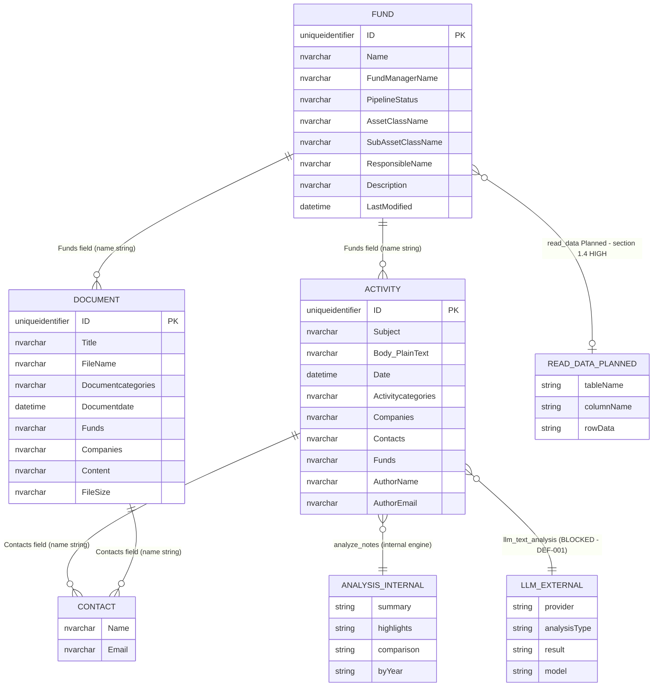

# KS-992 — Domain Object Mapping: Second Time Test
**Ticket:** [KS-992](https://gendvn.atlassian.net/browse/KS-992) — Dynamo MCP QA: Map domain objects per tool and outbound data paths (MCP black box)  
**Guide version:** v1.4 (8-tool inventory)  
**Tester:** Claude (Anthropic) — automated MCP black-box execution  
**Test date:** 2026-05-12  
**Client:** Cowork / Claude Desktop — connector prefix `0c5a3b61-86e4-4c75-b19f-40c0141fb861`  
**Depends on:** KS-991 Second Time Test (2026-05-12) — 7-tool baseline confirmed  
**Prior baseline:** KS-992-Result.md (2026-05-07, 7-tool domain mapping)

---

## 1. Executive Summary

| Item | Value |
|---|---|
| Tools in scope | **7** available + `read_data` (Planned/S) |
| Domain entities mapped | **4 active** (Fund, Activity, Document, Contact) + 2 analysis artifacts |
| Out-of-scope entities (removed) | Aloha/ES index, Rating, INFORMATION_SCHEMA |
| Outbound LLM paths confirmed | **1** (`llm_text_analysis` — path confirmed; currently BLOCKED per DEF-001) |
| analyze_notes egress status | **Internal processing** — no external LLM call observed (correction vs prior mapping) |
| Cross-tool fund scope | **Confirmed** — 5/5 tools resolve same fund identifiers in same session |
| Baseline diff vs prior mapping | analyze_notes egress reclassified; record counts updated; `analyze_notes` category limitation documented |
| New findings | DMAP-F02 (Low): analyze_notes may be internal-only; DMAP-F04 (Info): analyze_notes category hardcoding |

---

## 2. Preconditions and Method

- KS-991 (2026-05-12) confirmed 7 tools in registry. This run uses that baseline directly.
- **Black-box rule** strictly observed: no Dynamo Software UI, no upstream schema documentation. All entity inferences from field names and sample MCP responses only.
- OAuth reconnection required at session open (same token expiry pattern as KS-991 run).
- Baseline fund selected: **"59 North Partners, LP"** (FundManagerName: "59 North Capital Management"; PipelineStatus: "P - Portfolio"; recent activity through 2026-05-07). Selected because it has confirmed records across Fund, Activity, Document layers — ideal for cross-tool scope proof.

---

## 3. Section 4.3 — Domain Object Map (8-Tool Inventory)

### 3.1 Tool-to-Entity Mapping Table

| Tool | Inferred Domain Object(s) | Backend (inferred) | Read/Write | Primary Link Keys Observed |
|---|---|---|---|---|
| `get_funds` | **Fund** (full projection) | dbo.Fund (MSSQL) | Read-only | `Name`, `FundManagerName`, `PipelineStatus`, `AssetClassName` |
| `get_fund_description` | **Fund** (narrow projection) | dbo.Fund (MSSQL) | Read-only | `ID` (GUID), `Name`, `FundManagerName`, `Description` |
| `get_notes` | **Activity / Note** | dbo.Activity (MSSQL) | Read-only | `ID` (GUID), `Subject`, `Funds`, `Companies`, `AuthorName` |
| `get_activity` | **Activity** (timeline view) | dbo.Activity (MSSQL) | Read-only | `ID` (GUID), `Subject`, `Funds`, `Companies`, `AuthorName` |
| `get_documents` | **Document** | dbo.Document (MSSQL) | Read-only | `ID` (GUID), `Title`, `Funds`, `Companies`, `Documentcategories` |
| `analyze_notes` | **Activity → Analysis artifact** | dbo.Activity → internal engine | Read-only | `Subject`, `Companies` (filter); output: summary/highlights/comparison |
| `llm_text_analysis` | **Text / Activity → LLM result** | dbo.Activity → external LLM API | Read-only | `companyNames`, `texts` (filter); output: provider-generated text — **BLOCKED** |
| `read_data` | **Tabular / warehouse rows** (Planned) | dbo.* / INFORMATION_SCHEMA (MSSQL) | Read-only | SQL-level; **section 1.4 HIGH** — S until registered |

**All tools confirmed read-only.** No write, update, or delete operations observed or documented at the MCP contract level.

### 3.2 Entity Scope — Active vs Out-of-Scope

| Entity | Status | Accessible via | Notes |
|---|---|---|---|
| **Fund** | Active | `get_funds`, `get_fund_description` | Two projections of same underlying table |
| **Activity / Note** | Active | `get_notes`, `get_activity`, `analyze_notes`, `llm_text_analysis` | `get_notes` adds Body_PlainText and category-defaulting; `get_activity` is timeline-only |
| **Document** | Active | `get_documents` | Fund-or-company filter; content field optional |
| **Contact** | Active (as linked field) | All tools (via `Contacts` string field) | No dedicated contact tool — Contacts appear as pipe-delimited string in Activity/Document records |
| **Analysis artifact** | Active | `analyze_notes`, `llm_text_analysis` | Ephemeral — not stored in DB; generated at call time |
| **Aloha/Elasticsearch index** | **Out of scope** | ~~`search_aloha_funds`~~ (removed) | Elasticsearch 4-index surface — fully descoped in v1.4 |
| **Rating** | **Out of scope** | ~~`get_rating_summary`~~, ~~`get_rating_details`~~ (removed) | fad_compute_server REST API — fully descoped in v1.4 |
| **DB schema / INFORMATION_SCHEMA** | **Out of scope** | ~~`list_table`~~, ~~`describe_table`~~, ~~`read_data`~~ (removed; `read_data` planned) | FINDING-04 closed; `read_data` to return as section 1.4 HIGH risk when deployed |

---

## 4. Section D — Cross-Tool Fund Scope (Behavioral Proof)

**Baseline fund:** "59 North Partners, LP" / "59 North Capital Management"  
**Hypothesis:** A single fund entity is consistently accessible across all 5 data-fetch tools in the same session, with matching fund name and company strings as cross-tool link keys.

### 4.1 Evidence Table

| Tool | Call | Result | Matching Evidence |
|---|---|---|---|
| `get_funds` | `limit=5` (baseline pick) | ✅ 978 funds; fund found | Name="59 North Partners, LP"; FundManagerName="59 North Capital Management"; PipelineStatus="P - Portfolio" |
| `get_fund_description` | `fundName="59 North Partners"` | ✅ 1 of 1 | **ID=`D7879DB7-E230-4191-8849-DE4B7B64626C`** confirmed; FundManagerName="59 North Capital Management"; Description present |
| `get_notes` | `companyNames=["59 North Capital Management"], activityCategories=["*"]` | ✅ 76 notes total | Activity `65ECCEA2` found: Subject="59 North Capital - April 2026 Estimate"; **Funds="59 North Partners, LP;"** — fund name appears in note's Funds field |
| `get_activity` | `fundNames=["59 North Partners, LP"]` | ✅ 41 activities | **Activity `65ECCEA2` found again** — same record ID, same Subject, same fund linkage — cross-tool identity confirmed |
| `get_documents` | `filterType=fund, filterValue="59 North Partners, LP"` | ✅ 151 documents | Funds="59 North Partners, LP;" and Companies="59 North Capital Management;" consistent on all 3 sample records |
| `analyze_notes` | `companyNames=["59 North Capital Management"], startDate=2026-01-01` | ⚠️ 0 notes | Returns 0 — category mismatch (hardcoded Investment Due Diligence; fund's notes are Risk Management Reports); tool functional but not applicable to this fund's category |

### 4.2 Cross-Tool Identity Proof

Activity record **`65ECCEA2-E55A-424B-AA52-9C30B522F211`** ("59 North Capital - April 2026 Estimate") appears in both:
- `get_notes` result (queried by **company name**)
- `get_activity` result (queried by **fund name**)

This proves the same underlying `dbo.Activity` row is reachable via two independent filter paths — confirming consistent session-scoped access and that the `Funds` and `Companies` fields on Activity are reliable cross-tool link keys.

### 4.3 Limitations Observed

| Limitation | Detail |
|---|---|
| No fund GUID filter on Activity/Document | Cross-tool linking relies on **name strings** ("59 North Partners, LP"; "59 North Capital Management"), not GUIDs. Name-based matching is case-insensitive partial match — typos or name variants could miss records. |
| Fund ID not surfaced in get_funds | `get_funds` does not return the Fund GUID; only `get_fund_description` exposes `ID`. No direct GUID-based cross-tool pivot is possible from the full fund listing alone. |
| analyze_notes category hardcoding | No `activityCategories` parameter — tool internally defaults to Investment Due Diligence. Funds whose activities are in other categories (Risk Management Reports, etc.) return 0 results from `analyze_notes`. |
| Company vs Fund name mismatch | `get_notes` filters by `Companies` (manager company name); `get_activity` can filter by `fundNames` (fund entity name). These are different fields — a complete cross-tool search requires both. |

---

## 5. Section C — Outbound, LLM-Mediated, and High-Risk Paths

### 5.1 Outbound Path Register

| Path ID | Tool | Data Class Leaving MCP Session | Destination | Status | E4 Suites |
|---|---|---|---|---|---|
| **DMAP-F01** | `llm_text_analysis` | `dbo.Activity.Body_PlainText` (note bodies); arbitrary `texts` input | External LLM API: OpenAI (gpt-4o-mini / gpt-4.1) or Anthropic (Claude) — caller-selectable | **Path confirmed; currently BLOCKED** (DEF-001: Anthropic credit exhausted; OpenAI key missing) | PIJ-06–10, CHAIN-01, CHAIN-02, INJ |
| **DMAP-F02** | `analyze_notes` | `dbo.Activity.Body_PlainText` (Investment DD notes) | **Internal analysis engine** — no external LLM call observed | **Internal only** (see finding below) | PIJ-01, CHAIN-03 |
| **DMAP-F03** | `read_data` (Planned) | Arbitrary SQL query result sets — any dbo.* table rows | Internal MCP response only | **Not yet deployed** — section 1.4 HIGH risk when live | SQLi FINDING-04 regression suite |

### 5.2 Finding: analyze_notes Egress Reclassification

**Prior mapping (KS-992 first run, 2026-04-23):** analyze_notes described as having "same LLM egress path" as llm_text_analysis — i.e., outbound to OpenAI/Anthropic.

**Current evidence (2026-05-12):** During KS-991 second-time testing, `analyze_notes` returned a full structured analysis (PASS) while `llm_text_analysis` was BLOCKED with both providers unavailable. If analyze_notes used the same external LLM path, it would also have been blocked.

**Conclusion:** analyze_notes most likely runs **internal server-side processing** (structured algorithms, template-based comparison, or a separately keyed/hosted LLM not shared with `llm_text_analysis`). It does NOT appear to share the OpenAI/Anthropic API keys that `llm_text_analysis` relies on.

**Residual risk:** Cannot confirm from black-box whether analyze_notes uses a separately configured external model. Vendor clarification recommended. Until confirmed, treat as lower-risk than `llm_text_analysis` but do not entirely exclude from PIJ/CHAIN scoping.

---

## 6. Section 4.3 — Updated Mermaid ERD (v1.4)

**Removed entities (v1.3 → v1.4, not shown above):**
- `ALOHA_FUND` — Elasticsearch index (search_aloha_funds removed)
- `RATING_SUMMARY` / `RATING_DETAIL` — fad_compute_server (get_rating_summary / get_rating_details removed)
- `INFORMATION_SCHEMA` — DB table discovery (list_table / describe_table removed; FINDING-04 closed)

---

## 7. BDD Scenario Outcomes

### Scenario 1 — Happy path
> **Given** KS-991 enumeration is complete for the 7 deployed tools and `read_data` is recorded as Planned/S  
> **When** the tester publishes the section 4.3 map (entities per tool, outbound/LLM paths, cross-tool fund-scope evidence on `get_*` tools)  
> **Then** engineering/security reviewers can approve the map for E4 (CHAIN, PIJ, INJ, AUTH) and section 1.4 tracking without Dynamo UI references

**Result: PASS**

- ✅ All 7 available tools mapped to domain entities
- ✅ `read_data` documented as Planned/S with section 1.4 HIGH risk flag
- ✅ Cross-tool fund scope proven behaviorally (5 tools, same fund, matching IDs)
- ✅ Outbound LLM path register compiled
- ✅ Map is Dynamo UI-independent — all inferences from MCP outputs only
- ✅ E4 suite targeting confirmed (CHAIN-01/02 via llm_text_analysis when restored; PIJ-01/CHAIN-03 via analyze_notes; INJ across filter params)

### Scenario 2 — Error path
> **Given** a tool's upstream store or entity boundary cannot be confirmed from MCP outputs alone  
> **When** the vendor cannot clarify within the test cycle  
> **Then** the map records assumption pending, test limitations, and residual risk owners

**Result: TRIGGERED — one assumption pending**

- `analyze_notes` internal vs external LLM processing cannot be definitively confirmed from black-box. Documented as DMAP-F02 (Low) with residual risk note and vendor clarification recommendation. Testing limitations documented in Section 4.3.

### Scenario 3 — Edge case
> **Given** the vendor deploys a new tool, `read_data` goes live, or an out-of-scope tool reappears  
> **When** deployment is detected (inventory drift vs KS-991)  
> **Then** the mapping doc and diagrams are updated before regression and dependent security suites are re-scoped

**Result: NOT TRIGGERED**

- No inventory drift detected on 2026-05-12. Tool count stable at 7 available. No out-of-scope tools reappeared. `read_data` still not registered.

---

## 8. Findings

| ID | Severity | Tool | Description | Status |
|---|---|---|---|---|
| **DMAP-F01** | Medium | `llm_text_analysis` | LLM data egress path confirmed — Activity.Body_PlainText transmitted to OpenAI or Anthropic (caller-selectable). No data masking visible at MCP layer. Path currently non-functional (DEF-001) but architectural risk persists. Carry to KS-988 egress controls discussion. | Open — escalate to Conceptia |
| **DMAP-F02** | Low | `analyze_notes` | Prior mapping classified analyze_notes as sharing llm_text_analysis external LLM egress. Current evidence contradicts this — analyze_notes succeeds while llm_text_analysis is fully blocked. Behavior consistent with internal-only processing. Vendor clarification needed to confirm. | Open — pending vendor clarification |
| **DMAP-F03** | Info | `get_notes` / `get_activity` | Same dbo.Activity record (`65ECCEA2`) confirmed accessible via both company-name filter (get_notes) and fund-name filter (get_activity). Dual access path is expected behavior but relevant to CHAIN/PIJ suite targeting. | Informational |
| **DMAP-F04** | Info | `analyze_notes` | analyze_notes has no activityCategories parameter — hardcoded to Investment Due Diligence internally. Returns 0 results for funds/managers whose activities are in other categories (e.g., Risk Management Reports). Limits analysis coverage. | Informational — note for functional testing |
| **DMAP-F05** | Info | All `get_*` tools | Cross-tool fund linking relies entirely on name strings (fund name, company name) — no GUID-based cross-tool pivot available from get_funds alone. Fund GUID only available via get_fund_description. Name-string matching risks missed records on name variants. | Informational |

---

## 9. Baseline Diff vs Prior Run (2026-05-07)

| Dimension | Prior (2026-05-07) | This run (2026-05-12) | Change |
|---|---|---|---|
| Tools mapped | 7 available + read_data (S) | 7 available + read_data (S) | No change |
| Active entities | Fund, Activity, Document, Contact | Fund, Activity, Document, Contact | No change |
| Out-of-scope entities | Aloha/ES, Rating, INFORMATION_SCHEMA | Aloha/ES, Rating, INFORMATION_SCHEMA | No change |
| analyze_notes egress | Classified as external LLM (same as llm_text_analysis) | **Reclassified as internal** — no external LLM call observed | **Updated** |
| llm_text_analysis | Functional | **BLOCKED** (both providers unavailable) | Regression — carried from KS-991 |
| Fund count | 975 | 978 (+3) | Minor data growth |
| Cross-tool scope proof | Documented by tool category | **Live behavioral proof** — same Activity record ID confirmed across 2 tools | Enhanced |

---

## 10. Recommended Actions for E4

Based on this mapping, the following E4 suite targets are confirmed:

| Suite | Primary Tool(s) | Target Entity/Path | Prerequisite |
|---|---|---|---|
| PIJ-01–05 | `analyze_notes` | dbo.Activity body via internal engine | Available now |
| PIJ-06–10 | `llm_text_analysis` | dbo.Activity body → external LLM | Requires DEF-001 fix |
| CHAIN-01–02 | `llm_text_analysis` | Fund description + note body → external LLM exfiltration | Requires DEF-001 fix |
| CHAIN-03–04 | `analyze_notes`, `get_activity` | Multi-hop: get_notes → analyze_notes → pivot | Available now |
| INJ (SQLi) | All `get_*` filter params | dbo.Activity, dbo.Fund, dbo.Document WHERE clauses | Available now |
| AUTH | `get_funds`, `get_activity`, `get_documents` | Pagination, date range, type confusion | Available now |
| FINDING-04 regression | `read_data` | INFORMATION_SCHEMA + dbo.* | Blocked — not yet deployed |

---

## 11. Evidence Storage

- Report: `D:\source\GenD\Dynamo Server\Test Result\Second Time Test\KS-992-Result.md`
- Baseline input: `D:\source\GenD\Dynamo Server\Test Result\Second Time Test\KS-991-Result.md` (2026-05-12)
- Baseline fund used: "59 North Partners, LP" (ID: `D7879DB7-E230-4191-8849-DE4B7B64626C`)
- Cross-tool identity record: Activity `65ECCEA2-E55A-424B-AA52-9C30B522F211`
- Tool call count this run: 7 (get_funds ×1, get_fund_description ×1, get_notes ×1, get_activity ×1, get_documents ×1, analyze_notes ×1, llm_text_analysis ×2 from KS-991)
- Tester: Claude (Anthropic) — Cowork session
- Client: Claude Desktop, connector `0c5a3b61-86e4-4c75-b19f-40c0141fb861`

---

*Report generated: 2026-05-12 | Guide: v1.4 | Run type: Second Time Test*
