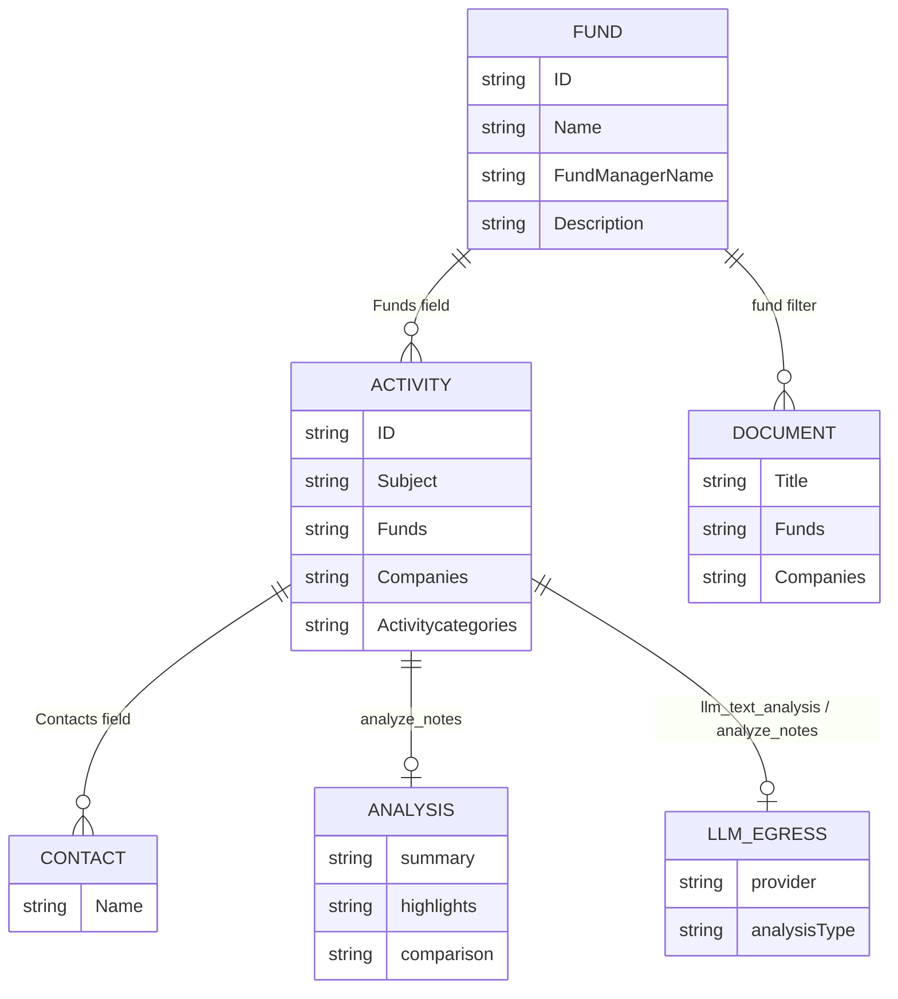

# KS-992 — Cursor Result (Second Time Test): Map Domain Objects per Tool and Outbound Data Paths

| Field | Value |
| --- | --- |
| **Jira** | [KS-992](https://gendvn.atlassian.net/browse/KS-992) |
| **Epic** | Dynamo MCP — Discovery & Scope Enumeration |
| **Guide / ticket** | `dynamo-mcp-testing-guide_v1.4.md` section 4.3; Jira description **Updated requirements — guide v1.4** |
| **Client** | Cursor Agent; MCP server `user-conceptia-dynamo` |
| **Test date (UTC)** | 2026-05-12 |
| **Tester** | Cursor Agent |
| **Enumeration baseline** | [KS-991](https://gendvn.atlassian.net/browse/KS-991) second-time Cursor run (`KS-991 - Cursor Result.md`, same folder) |
| **Prior mapping baseline** | `Dynamo Server/Test Result/First Time Test/KS-992 Result.md` (13-tool surface, 2026-04-24) |
| **Consolidation** | Awaits parallel Claude run; merged report TBD |

---

## 0. Executive summary

| Dimension | Result |
| --- | --- |
| **Overall (v1.4 update section)** | **PASS with open items** — section 4.3 map published for **7** deployed tools; **`read_data` Planned/S**; **no** `search_aloha_funds` / ratings / warehouse discovery in scope |
| **Domain object map (B)** | **PASS** — labels and link keys inferred from live payloads for all **7** available tools |
| **Outbound / LLM paths (C)** | **PASS with environment gap** — `analyze_notes` egress confirmed; **`llm_text_analysis` BLOCKED** (provider credentials on MCP host) |
| **Cross-tool fund scope (D)** | **PASS with limitations** — baseline fund **2026 Fund** consistent across `get_fund_description`, `get_activity`, `get_notes`; `get_documents` returned **soft-empty** (`success: true`, `data: []`) |
| **Inventory drift vs KS-991 (2026-05-12)** | **No tool drift** (7 tools); `get_funds` **totalRecords 978** (unchanged vs KS-991 same-day run) |
| **BDD (v1.4)** | Scenario 1 **PASS**; Scenario 2 **PASS** (assumptions documented); Scenario 3 **N/A** (no post-deploy inventory change during run) |

---

## 1. Preconditions (update section A)

| Check | Status | Notes |
| --- | --- | --- |
| **[KS-991](https://gendvn.atlassian.net/browse/KS-991)** section 4.1–4.2 complete | **Assumed met** | Same MCP session and registry as KS-991 second-time Cursor enumeration (7 tools; `read_data` absent) |
| Black-box (no Dynamo UI) | **PASS** | Mapping from MCP tool names, descriptors, and responses only |
| **2–3 fund identifiers** for cross-tool checks | **PASS** | **2026 Fund** (primary baseline), **59 North Partners, LP**, **36 South** sampled from `get_funds` |
| Second MCP client (e.g. Antigravity) | **Not run** | Single-client mapping; recommend Claude leg for cross-client drift |
| Redacted JSON exports (`~/dynamo-mcp-tests/logs/YYYY-MM-DD/`) | **Not written locally** | Evidence summarized in this report; full note bodies **not** duplicated (PII / egress) |

---

## 2. v1.4 tool inventory (client registry)

| # | Tool | Category | v1.4 availability | In Cursor registry | section 1.4 |
| --- | --- | --- | --- | --- | --- |
| 1 | `analyze_notes` | Analysis | Available | Yes | — |
| 2 | `get_activity` | Data fetch | Available | Yes | — |
| 3 | `get_documents` | Data fetch | Available | Yes | — |
| 4 | `get_fund_description` | Data fetch | Available | Yes | — |
| 5 | `get_funds` | Data fetch | Available | Yes | — |
| 6 | `get_notes` | Data fetch | Available | Yes | — |
| 7 | `llm_text_analysis` | Analysis | Available | Yes | — |
| 8 | `read_data` | Data fetch | **Planned** | **No** | **HIGH** when live |

**Out of scope (v1.4):** `describe_table`, `get_rating_details`, `get_rating_summary`, `list_table`, `search_aloha_funds` — **not** invoked; legacy ticket diagram retained for history only.

---

## 3. Domain object map — section 4.3 (B)

Labels are **inferred from field names and sample payloads** only. **RW** = read/write at MCP boundary.

| Tool | Domain object(s) | Primary link keys (observed) | RW (MCP) | Overlap / notes |
| --- | --- | --- | --- | --- |
| `get_funds` | **Fund** (+ manager, asset class, pipeline, responsible lookups) | `Name`, `FundManagerName`, `PipelineStatus`, `AssetClassName`, `LastActivityDate` | Read-only | Broad fund list; **978** total rows (`limit: 5` smoke) |
| `get_fund_description` | **Fund** (narrow projection) | `ID`, `Name`, `SimpleSearchField`, `FundManagerName`, `Description` | Read-only | Same fund **Name** as `get_funds`; adds **GUID `ID`** |
| `get_activity` | **Activity** (timeline / categories / links) | `ID`, `Subject`, `Date`, `Funds`, `Companies`, `Contacts`, `Activitycategories` | Read-only | `Funds` semicolon-delimited string; fund-name filter `fundNames[]` |
| `get_notes` | **Activity / note** (diligence notes) | Same family as activity: `ID`, `Subject`, `Funds`, `Companies`, `Body_Plaintext` (optional) | Read-only | Default category **Investment Due Diligence**; filters by **company** more naturally than fund name |
| `get_documents` | **Document** (metadata; optional content) | Fund/company filters via `filterType` + `filterValue`; category and date filters | Read-only | **≥1 filter** required at runtime; `excludeContent: true` supported |
| `analyze_notes` | **Activity / note → analysis artifact** | Input filters: `companyNames[]`; output `summary`, `highlights`, `comparison`, embedded note `body` | Read + **LLM processing** | Returns structured analysis plus **full note text** in payload |
| `llm_text_analysis` | **Arbitrary text and/or fetched notes → external LLM** | `texts`, `provider` (`openai` \| `anthropic`), optional note-fetch filters | Read + **external API** (when callable) | **Smoke BLOCKED** — see section 5 |
| `read_data` | **Tabular / warehouse** (when live) | n/a | n/a | **S (skipped)** — not registered |

**Assumption pending (Scenario 2):** Tool descriptions reference **Fund**, **Activity**, and **Document** tables; upstream physical schema **not** confirmed from MCP alone.

---

## 4. v1.4 entity relationship (fund-centric)

---

## 5. Outbound, LLM-mediated, and high-risk paths (C)

| Tool | Data classes that may leave MCP session | Provider / path (observed) | Recommended E4 suites |
| --- | --- | --- | --- |
| `analyze_notes` | Note **body** text (diligence content), subject/metadata | **Internal/ vendor LLM** (analysis JSON returned in MCP response; full `body` in `data[]`) | **PIJ**, **CHAIN**, data-classification |
| `llm_text_analysis` | Caller-supplied **texts** and/or note bodies if note-fetch filters used | **`openai`** or **`anthropic`** per schema | **PIJ**, **CHAIN**, **INJ** (prompt injection on instructions) |
| `read_data` | Arbitrary **tabular rows** (when live) | Warehouse / SQL read surface | **section 1.4 HIGH** — **CHAIN**, **AUTH**, tabular exfiltration |

**Smoke — `llm_text_analysis`:** `analysisType: summary` with synthetic probe text → **BLOCKED** — `openai`: `Missing OPENAI_API_KEY`; `anthropic`: credit balance error. Classified as **environment / provider config**, not MCP contract defect.

**Write tools:** **None** observed in the **7-tool** registry.

---

## 6. Cross-tool fund scope — behavioral (D)

### 6.1 Baseline fund: **2026 Fund**

| Step | Tool | Request (summary) | Result | Scope evidence |
| --- | --- | --- | --- | --- |
| 1 | `get_funds` | `limit: 5` | **PASS** | **2026 Fund** present; `FundManagerName`: Phoenix Equity; **totalRecords: 978** |
| 2 | `get_fund_description` | `fundName: "2026 Fund"`, `limit: 1` | **PASS** | `ID`: `3F554983-6C4B-470F-B7A0-AC823EA4AFD1`; `Name`: 2026 Fund; `Description`: null |
| 3 | `get_activity` | `fundNames: ["2026 Fund"]`, `limit: 3` | **PASS** | 1 activity; `Funds`: `2026 Fund;`; `Companies`: Phoenix Equity |
| 4 | `get_notes` | `companyNames: ["Phoenix Equity"]`, `includeBody: false` | **PASS** | Same activity `ID` `7272B173-5B0B-44E8-AB55-A198ACF8AAC6`; `Funds`: `2026 Fund;` |
| 5 | `get_documents` | `filterType: fund`, `filterValue: "2026 Fund"`, `excludeContent: true` | **PASS (empty)** | `success: true`, **0** documents — soft-empty, not an error |

**Hypothesis:** Session-visible fund scope is **consistent** for **2026 Fund** across overlapping **`get_*`** tools.

**Evidence:** Matching fund **Name** and shared activity **ID** across `get_activity` and `get_notes`; fund **ID** only exposed on `get_fund_description`.

**Limitations:**

* `get_notes` was filtered by **company** (Phoenix Equity), not `fundNames` — fund linkage confirmed on returned row only.
* `get_documents` returned **no rows** for the fund filter; cannot prove document linkage without a populated document sample.
* `search_aloha_funds` **not used** (v1.4 exclusion).

### 6.2 Additional fund identifiers

| Fund | `get_fund_description` | `get_activity` (`fundNames`) |
| --- | --- | --- |
| **59 North Partners, LP** | **PASS** — `ID` `D7879DB7-E230-4191-8849-DE4B7B64626C`; non-null `Description` | **PASS** — 41 activities; sample rows show `Funds`: `59 North Partners, LP;` |
| **36 South** | Not re-run (listed in `get_funds` page 1) | Not re-run |

---

## 7. Drift vs baselines

| Signal | First Time Test (2026-04-24, 13-tool map) | KS-991 / KS-992 (2026-05-12) | Assessment |
| --- | --- | --- | --- |
| Test inventory | 13 tools incl. ratings, ES, schema tools | **8-tool v1.4** view (**7** live) | **Scope change** per guide v1.4 — not deployment drift |
| Deployed tool count | 7 in later KS-991 baseline | **7** | **Stable** |
| `read_data` | Absent / removed | Still **absent** | **Planned/S** |
| `get_funds` totalRecords | 975 (2026-05-07 KS-991) | **978** | **Data growth** (+3) |
| Cross-tool fund keys | ES vs MSSQL scope (legacy ticket) | **Not in v1.4 scope** | Prior finding **out of scope** unless vendor restores `search_aloha_funds` |

---

## 8. Findings and open items

| ID | Severity | Topic | Detail |
| --- | --- | --- | --- |
| **KS-992-G01** | Medium (environment) | `llm_text_analysis` | Provider keys/credits unavailable on MCP host — outbound path **documented from schema** only |
| **KS-992-G02** | Low | Filter semantics | `get_notes` centers on **company** filters; `get_activity` / `get_documents` support **fund** filters — cross-tool proofs may need mixed filter types |
| **KS-992-G03** | Medium | LLM egress | `analyze_notes` returned **full note body** in MCP response — redact in shared artifacts; track under **PIJ** / **CHAIN** |
| **KS-992-G04** | Info | Soft-empty reads | `get_documents` **success** with zero rows for baseline fund — distinguish from hard errors in E4 targeting |
| **KS-992-G05** | Info | `read_data` | **S (skipped)** until registered — **section 1.4 HIGH** row reserved |

No new Jira defects filed from this mapping pass.

---

## 9. Acceptance criteria (v1.4 update section)

| Scenario | Verdict | Notes |
| --- | --- | --- |
| **1 — Happy path** | **PASS** | Map covers **7** tools + **`read_data` Planned/S**; outbound table and cross-tool fund evidence on **`get_*`** tools without Dynamo UI |
| **2 — Error path** | **PASS** | Upstream table boundaries **assumption pending**; `llm_text_analysis` limitation recorded without blocking observed behavior |
| **3 — Edge case (inventory drift)** | **N/A** | No new tool registration during run; drift table compares to KS-991 same-day enumeration |

---

## 10. Evidence index

| Artifact | Path |
| --- | --- |
| This report | `Dynamo Server/Test Result/Second Time Test/KS-992 - Cursor Result.md` |
| Enumeration baseline | `Dynamo Server/Test Result/Second Time Test/KS-991 - Cursor Result.md` |
| Prior consolidated map (13-tool era) | `Dynamo Server/Test Result/First Time Test/KS-992 Result.md` |
| Guide v1.4 | `Dynamo Server/Test Guide/dynamo-mcp-testing-guide_v1.4.md` |
| Stories v1.2 | `Dynamo Server/Test Guide/dynamo_mcp_testing_stories_v1.2.md` |

---

*KS-992 second-time Cursor mapping per Jira v1.4 update section: **7/7** tools mapped; **`read_data` Planned/S**; cross-tool fund scope **PASS with limitations**; **PASS with open items** (LLM provider env, note egress, soft-empty documents). Awaits Claude parallel run for consolidation.*
