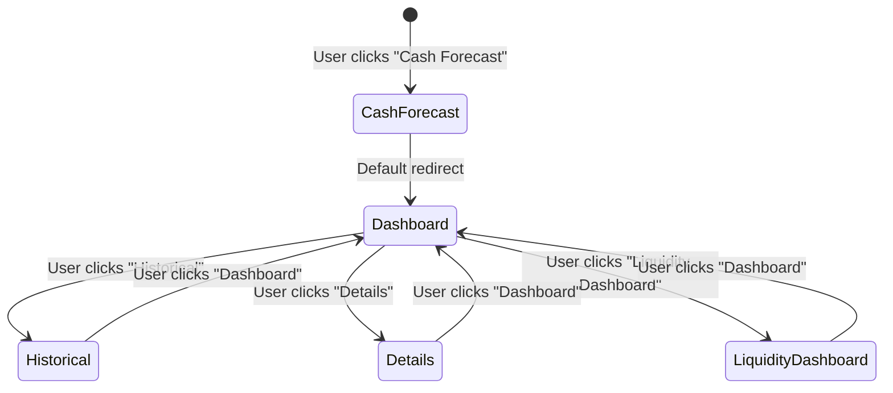
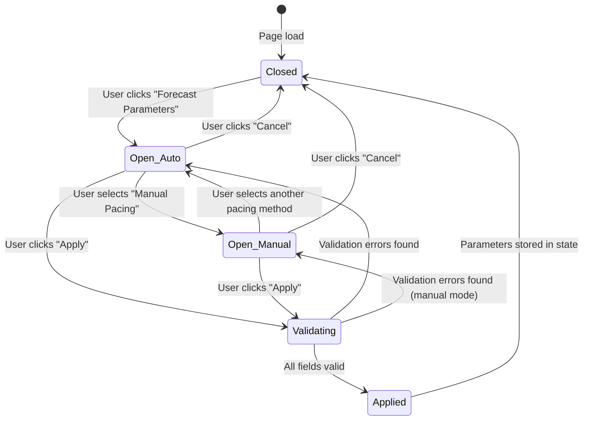
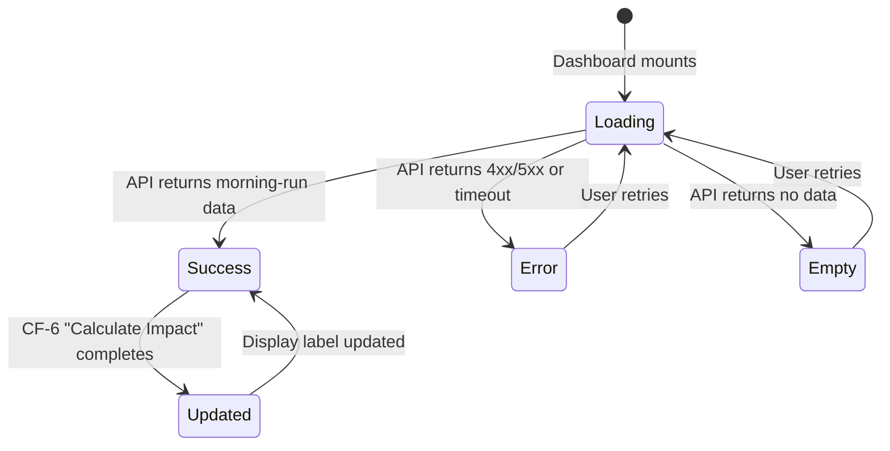
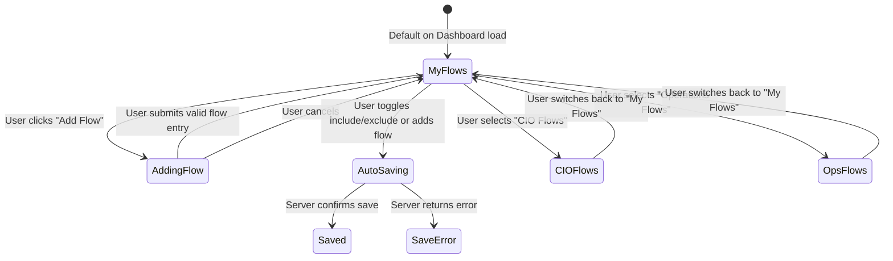
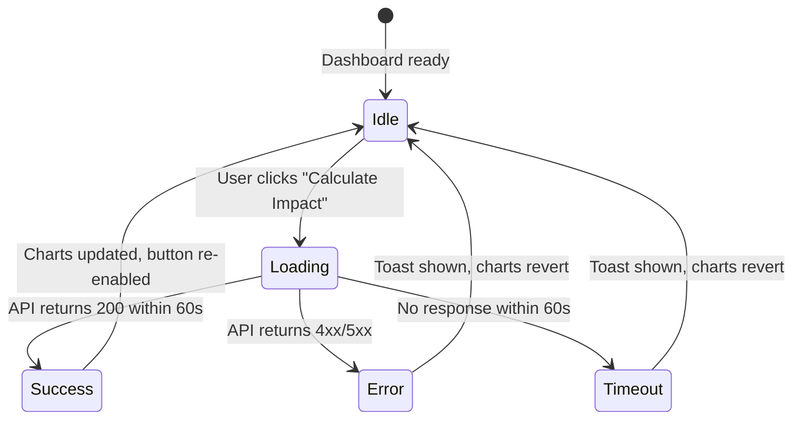
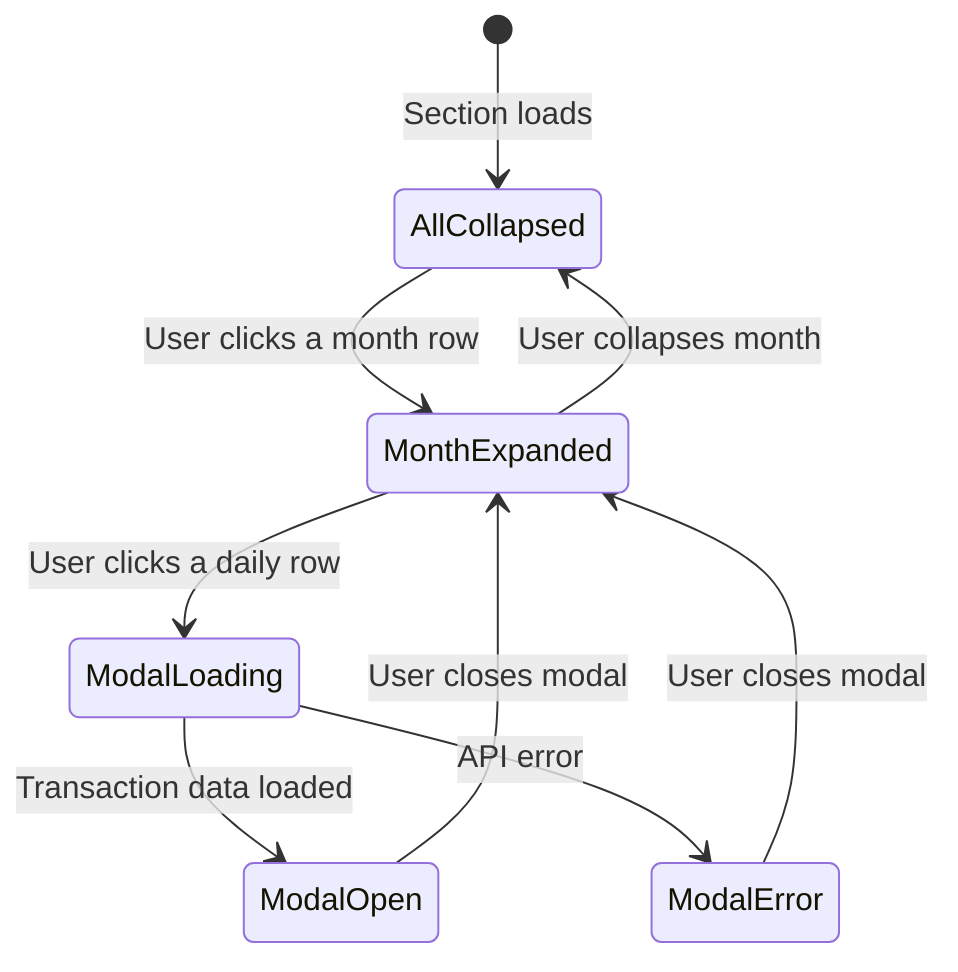

# 📋 Cash Forecast Feature — Full Ticket Breakdown

> **Epic:** [`KS-950`](https://gendvn.atlassian.net/browse/KS-950) — Cash Forecasting Model
> **Total Tickets:** 14 stories (story level, full-stack collaboration per ticket)
> **Team:** 1 Frontend Developer + 1 Backend Developer
> **Currency:** USD only · **Display format:** Whole numbers (no decimal), HALF_UP rounding *(note: decimal precision may be updated in future)*
> **Figma:** [Cash Forecast ↗](https://www.figma.com/design/snoshiSrFZ7c0i08Mvmcrm/Cash-Forecast?node-id=0-1&m=dev&t=qfA6kQm8fndkeZIs-1)
> **Generated:** 2026-04-02

---

## Dependency Order (Suggested Sprint Sequence)

```
Sprint 1 (Foundation — no dependencies):
  CF-1  Navigation Shell
  CF-14 fad_beta Integration
  CF-3  Summary Table

Sprint 2 (Dashboard core — depends on CF-1, CF-14):
  CF-2  Forecast Parameters Panel
  CF-4  Projected Balance Chart
  CF-5  Hypothetical Flows Management

Sprint 3 (Dashboard advanced — depends on CF-4, CF-5):
  CF-6  Calculate Impact Integration
  CF-7  Projected Cash Flow Drill-Down
  CF-8  Historical As-Of-Date Lookup

Sprint 4 (Historical Tab — depends on CF-1):
  CF-9  Net Cash Flow Graph
  CF-10 Capital Calls & Distributions Chart
  CF-11 Asset Class Filter + % of NAV Table

Sprint 5 (Details Tab + Placeholder):
  CF-12 Transactions Table with Filters & Export
  CF-13 Liquidity Dashboard (Placeholder/Spike)
```

---
---

## CF-1 — Cash Forecast Navigation Shell

**Ticket Title:** `Cash Forecast - Add "Cash Forecast" Tab and Sub-Navigation to Aloha Platform`

**Epic:** Cash Forecasting Model (KS-950)

**User Story:**
> As a **Portfolio Manager**, I want a dedicated "Cash Forecast" tab in the Aloha main navigation so that I can access all cash forecasting tools from a single, consistent entry point without leaving the platform.

**Overview:**
This ticket implements the top-level "Cash Forecast" navigation tab in Aloha, positioned immediately after the "Overview" tab. It establishes the routing shell and four sub-tabs — Dashboard, Historical, Details, and Liquidity Dashboard — that all subsequent Cash Forecast feature tickets will populate. This is the foundational ticket that must be completed before any other Cash Forecast UI work begins.

**Detailed Requirements:**
- Add a new tab labeled **"Cash Forecast"** to the Aloha main navigation bar, positioned immediately after the "Overview" tab.
- The tab must render four sub-tabs in this exact order: **Dashboard** (default), **Historical**, **Details**, **Liquidity Dashboard**.
- Navigating to `/cash-forecast` must automatically redirect to `/cash-forecast/dashboard`.
- Each sub-tab must have its own distinct URL route:
  - `/cash-forecast/dashboard`
  - `/cash-forecast/historical`
  - `/cash-forecast/details`
  - `/cash-forecast/liquidity`
- The active sub-tab must be visually highlighted using the existing Aloha active-tab style.
- Sub-tab state must persist correctly on browser back/forward navigation.
- Browser `<title>` must update per sub-tab (e.g., `"Cash Forecast — Dashboard | Aloha"`).
- Each sub-tab content area must render an empty container (content to be filled by subsequent tickets) with a loading skeleton while child components initialise.
- No authentication gate beyond existing Aloha platform login is required at this stage.

**UI/UX & Front-End Considerations:**
- **Layout:** Standard Aloha top navigation pattern. Secondary horizontal sub-tab bar renders below the main nav when "Cash Forecast" is active.
- **Interactive Elements:** Clickable main tab, clickable sub-tabs.
- **State Changes:**
  - `Default` — Dashboard sub-tab active; content area renders empty shell.
  - `Loading` — Skeleton spinner in content area while sub-tab component mounts.
  - `Error` — Standard Aloha error boundary component with retry CTA if routing fails.
  - `Empty State` — N/A at this stage; each sub-tab will show empty containers.
- **Accessibility:** Main tab and sub-tabs must have `aria-selected`, `role="tab"`, and `aria-controls` attributes. Keyboard navigation (arrow keys) between sub-tabs must be supported.



**Acceptance Criteria (BDD Format):**

*Scenario 1 — Happy Path: User navigates to Cash Forecast*
- **Given** a user is logged into Aloha
- **When** they click the "Cash Forecast" tab in the main navigation
- **Then** the page navigates to `/cash-forecast/dashboard`, the "Dashboard" sub-tab is active and highlighted, and the page title updates to "Cash Forecast — Dashboard | Aloha"

*Scenario 2 — Error Path: Routing bundle fails to load*
- **Given** a user clicks the "Cash Forecast" tab
- **When** the route component fails to initialise due to a JS error
- **Then** the Aloha standard error boundary is displayed with a "Retry" button, no blank screen is shown, and no unhandled console error propagates to the user

*Scenario 3 — Edge Case: Direct URL navigation to a sub-tab*
- **Given** a user navigates directly to `/cash-forecast/historical` via URL bar
- **When** the page loads
- **Then** the "Cash Forecast" main tab is highlighted, the "Historical" sub-tab is active, and the correct sub-tab content area renders

**Definition of Done (DoD):**
- [ ] Code compiles and builds without errors.
- [ ] Unit tests written and passing (minimum 80% coverage).
- [ ] Feature tested in staging environment.
- [ ] Code reviewed and approved by at least one peer.
- [ ] UI/UX matches approved structural mockups across supported browsers.

---
---

## CF-2 — Dashboard Tab: Forecast Parameters Panel

**Ticket Title:** `Cash Forecast - Implement Forecast Parameters Configuration Panel`

**Epic:** Cash Forecasting Model (KS-950)

**User Story:**
> As a **Portfolio Manager**, I want to configure forecast parameters through a panel before running the cash forecast model so that the model reflects the correct pacing method and buffer thresholds for my scenario.

**Overview:**
This ticket implements the "Forecast Parameters" button and its associated modal/sidebar panel on the Dashboard sub-tab. The panel allows users to configure the Illiquid Pacing Method and Buffer Parameters that are passed as inputs to the compute server when "Calculate Impact" is triggered (CF-6). These parameters drive the shape of the projected cash forecast output.

**Detailed Requirements:**
- A **"Forecast Parameters"** button must be visible on the Dashboard sub-tab, opening a modal or sidebar panel when clicked.
- The panel must contain two sections: **Illiquid Pacing Method** and **Buffer Parameters**.

**Illiquid Pacing Method** — user selects one of three options (radio button or dropdown):
  1. Last 3 months historical pacing
  2. Last 12 months historical pacing
  3. Manual Pacing *(conditional — expands additional fields when selected)*

**If Manual Pacing is selected**, two additional input fields appear:
  - **Annual Estimated Distribution (%)** — user enters a percentage value; the panel must display the calculated equivalent dollar amount in USD (whole number, HALF_UP) next to the input field. Formula: `$ amount = (% / 100) × Total Portfolio NAV`
  - **Annual Estimated Contribution (%)** — same logic; displays calculated USD equivalent alongside the input.
  - Both fields are required when Manual Pacing is selected.
  - Percentage input must accept values between 0.00 and 100.00, to 2 decimal places.
  - Calculated USD amounts displayed as whole numbers (HALF_UP), USD-prefixed (e.g., `$1,234,567`). *(Note: decimal display precision may be updated in a future iteration.)*

**Buffer Parameters** — two numeric input fields:
  - **Minimum Buffer** — dollar amount input (USD, whole number)
  - **Minimum Notional Buffer (%)** — percentage input (0.00–100.00, 2 decimal places)

- A **"Apply"** or **"Save"** button must confirm and close the panel, storing the selected parameters in state for use when CF-6 "Calculate Impact" is triggered.
- A **"Cancel"** button must discard changes and close the panel.
- Parameters must persist in the session until the user explicitly changes them or navigates away.
- *(Note: User role restrictions on this panel are TBD — currently any logged-in user may configure parameters. This may be updated in a future ticket.)*

**UI/UX & Front-End Considerations:**
- **Layout:** Modal overlay or collapsible right-hand sidebar. Follow existing Aloha modal pattern.
- **Interactive Elements:** Radio buttons for pacing method, conditional reveal for Manual Pacing fields, percentage inputs with live dollar calculation, Apply/Cancel buttons.
- **State Changes:**
  - `Default` — panel closed; Forecast Parameters button visible.
  - `Open (Auto/Historical)` — panel shows pacing radio + buffer fields only.
  - `Open (Manual)` — panel expands to show Distribution % + Contribution % inputs with live $ calculation.
  - `Validation Error` — inline error messages under invalid fields (e.g., "Required", "Must be between 0 and 100").
  - `Applied` — panel closes; parameters held in state; "Calculate Impact" (CF-6) becomes enabled.
- **Accessibility:** Modal must trap focus when open. All inputs must have `<label>` elements. Percentage fields must have `aria-describedby` pointing to their calculated dollar amount display.



**Acceptance Criteria (BDD Format):**

*Scenario 1 — Happy Path: User configures Manual Pacing*
- **Given** a user is on the Cash Forecast Dashboard sub-tab
- **When** they click "Forecast Parameters", select "Manual Pacing", enter `5.00` in Annual Estimated Distribution (%) and `3.00` in Annual Estimated Contribution (%), and click "Apply"
- **Then** the panel closes, the parameters are stored in session state, and the calculated USD amounts for each percentage are displayed correctly (HALF_UP, whole number) before Apply is clicked

*Scenario 2 — Error Path: Required fields missing in Manual Pacing*
- **Given** a user has selected "Manual Pacing" in the Forecast Parameters panel
- **When** they leave Annual Estimated Distribution (%) blank and click "Apply"
- **Then** an inline error message "Required" appears below the empty field, the panel remains open, and no parameters are saved

*Scenario 3 — Edge Case: Boundary value on percentage input*
- **Given** a user enters `100.01` in the Annual Estimated Distribution (%) field
- **When** they tab out of the field or click "Apply"
- **Then** an inline validation error "Must be between 0 and 100" is shown and the Apply action is blocked

**Definition of Done (DoD):**
- [ ] Code compiles and builds without errors.
- [ ] Unit tests written and passing (minimum 80% coverage).
- [ ] Feature tested in staging environment.
- [ ] Code reviewed and approved by at least one peer.
- [ ] UI/UX matches approved structural mockups across supported browsers.

---
---

## CF-3 — Dashboard Tab: Summary Table (Fixed Income & Cash)

**Ticket Title:** `Cash Forecast - Implement Fixed Income and Cash Summary Table on Dashboard`

**Epic:** Cash Forecasting Model (KS-950)

**User Story:**
> As a **Portfolio Manager**, I want to see a summary table of current Fixed Income and Total Cash amounts on the Cash Forecast Dashboard so that I have an immediate snapshot of today's liquidity position before reviewing the forecast.

**Overview:**
This ticket implements the summary table on the Dashboard sub-tab that presents a compact breakdown of Fixed Income accounts and Total Cash sub-classes. Data is sourced from the datalake (Fund NAV by as-of-date) and represents today's values. This table loads on the initial page render independently of the compute server, making it the first visible data on the Dashboard.

**Detailed Requirements:**
- The summary table must load on Dashboard initial render using datalake Fund NAV data for **today's date** (as-of-date = today).
- **Fixed Income section:** Display all currently active Fixed Income accounts dynamically. Currently: *Payden US Treasury* only. The list must reflect whatever accounts are live in the datalake at the time — no hardcoded account names.
- **Total Cash section:** Display all sub-classes (e.g., `Cash`, `Cash In Transit`, etc.) as returned by the datalake API. Sub-class list must be dynamic — no hardcoded values.
- All monetary values displayed in **USD, whole numbers, HALF_UP rounding**. Formatted with thousand separators (e.g., `$1,234,567`). *(Note: decimal precision may be updated in a future iteration.)*
- A **total row** must appear at the bottom of each section (Fixed Income total, Total Cash total).
- The table must refresh automatically each morning in line with the datalake daily update schedule (Mon–Fri, 12pm EST). No manual refresh button required at this stage.
- If the datalake returns zero accounts for a section, display an empty state message: `"No accounts available"`.

**UI/UX & Front-End Considerations:**
- **Layout:** Compact table in the left panel of the Dashboard. Two clearly separated sections: Fixed Income and Total Cash.
- **Interactive Elements:** None — read-only display table at this stage.
- **State Changes:**
  - `Default / Loading` — skeleton rows displayed while datalake API call is in flight.
  - `Success` — rows populate with account names and USD amounts.
  - `Error` — inline banner: `"Unable to load fund data. Please refresh the page."` Existing values (if any cached) remain visible.
  - `Empty State` — `"No accounts available"` displayed per section if API returns empty list.
- **Accessibility:** Table must use `<table>`, `<thead>`, `<tbody>`, `<th scope="col">` elements. Currency values must include `aria-label` with spoken format (e.g., `"Payden US Treasury: 1 million 234 thousand 567 US dollars"`).

**Acceptance Criteria (BDD Format):**

*Scenario 1 — Happy Path: Table loads with today's data*
- **Given** a user navigates to the Cash Forecast Dashboard
- **When** the datalake API returns Fund NAV data for today's date
- **Then** the summary table displays all active Fixed Income accounts and all Total Cash sub-classes with USD whole-number amounts (HALF_UP), formatted with thousand separators, and a total row at the bottom of each section

*Scenario 2 — Error Path: Datalake API unavailable*
- **Given** a user is on the Cash Forecast Dashboard
- **When** the datalake API returns a 500 error
- **Then** an inline error banner displays `"Unable to load fund data. Please refresh the page."` and the table rows show a dash (`—`) rather than zero or blank

*Scenario 3 — Edge Case: No Fixed Income accounts in datalake*
- **Given** the datalake returns an empty list for Fixed Income accounts
- **When** the Dashboard loads
- **Then** the Fixed Income section displays `"No accounts available"` instead of an empty table body, and the Total Cash section renders normally

**Definition of Done (DoD):**
- [ ] Code compiles and builds without errors.
- [ ] Unit tests written and passing (minimum 80% coverage).
- [ ] Feature tested in staging environment.
- [ ] Code reviewed and approved by at least one peer.
- [ ] UI/UX matches approved structural mockups across supported browsers.

---

---

## CF-4 — Dashboard Tab: Projected Balance Chart

**Ticket Title:** `Cash Forecast - Implement Projected Cash Balance Chart from Compute Server`

**Epic:** Cash Forecasting Model (KS-950)

**User Story:**
> As a **Portfolio Manager**, I want to see a projected cash balance chart on the Dashboard that pre-loads with the morning compute server run so that I have an up-to-date forecast view as soon as I open the page, without needing to manually trigger a calculation.

**Overview:**
This ticket implements the combined bar and line chart on the Cash Forecast Dashboard that visualises the projected cash balance, closing risk, and buffer thresholds. On initial page load, the chart is pre-populated with the most recent morning compute server run result. The chart updates when the user clicks "Calculate Impact" (CF-6). It also displays the `deriv_notional_value` as a key metric above or alongside the chart.

**Detailed Requirements:**
- On Dashboard initial load, fetch the latest compute server morning-run output from `body['base']['cash_flow_table']` via the compute server API.
- The morning compute server run is triggered automatically via a scheduled job (not by the user). The frontend must only read the latest stored result.
- Render a **combined bar + line chart** with three data series:

| JSON Column | Visual Type | Colour |
|---|---|---|
| `Cash Closing` | Bar (primary) | Blue |
| `Closing Risk` | Line (overlay) | Purple |
| `Buffer` | Line (reference) | Grey dashed |

- Display **`deriv_notional_value`** (from `body['base']['deriv_notional_value']`) as a prominent summary metric card above or adjacent to the chart. Value displayed in USD, whole number, HALF_UP. *(Note: decimal precision may change in a future iteration.)*
- The chart must reflect the **default morning-run parameters** (no user-configured parameters applied until CF-6 "Calculate Impact" is triggered).
- The chart must show a "Last updated: [timestamp]" label indicating when the morning run data was generated.
- If no morning run data is available (e.g., weekend, holiday, first deploy), display an empty state with the message: `"No forecast data available for today. Data refreshes each business day morning."`.

**UI/UX & Front-End Considerations:**
- **Layout:** Main chart panel on the Dashboard, occupying the primary content area. `deriv_notional_value` metric card positioned above or to the top-right of the chart.
- **Interactive Elements:** Chart tooltips on hover showing exact values per data point.
- **State Changes:**
  - `Loading` — skeleton chart placeholder while API call is in flight.
  - `Success` — chart renders with all three series; metric card shows `deriv_notional_value`.
  - `Error` — inline banner: `"Unable to load forecast data. Please try again."` Chart area shows error state, not blank.
  - `Empty State` — message: `"No forecast data available for today."` shown when API returns no data.
  - `Updated` — chart re-renders with new data after CF-6 "Calculate Impact" is triggered (handled by CF-6 ticket).
- **Accessibility:** Chart must include an `aria-label` describing the chart type and date. Tooltip values must be keyboard-accessible via focus states.



**Acceptance Criteria (BDD Format):**

*Scenario 1 — Happy Path: Morning run data loads on Dashboard open*
- **Given** a user navigates to the Cash Forecast Dashboard on a business day after the morning compute server run
- **When** the Dashboard renders
- **Then** the chart displays the `Cash Closing` (blue bar), `Closing Risk` (purple line), and `Buffer` (grey dashed line) from `body['base']['cash_flow_table']`, and the `deriv_notional_value` metric card shows the correct USD whole-number value

*Scenario 2 — Error Path: Compute server API unavailable on load*
- **Given** a user opens the Cash Forecast Dashboard
- **When** the compute server API returns a 503 error
- **Then** the chart area displays an inline error banner `"Unable to load forecast data. Please try again."` with a retry button, and no blank chart space is shown

*Scenario 3 — Edge Case: No morning run data available (weekend or first deploy)*
- **Given** a user opens the Cash Forecast Dashboard on a weekend or before the first morning run
- **When** the API returns an empty result set
- **Then** the chart area displays `"No forecast data available for today. Data refreshes each business day morning."` and the `deriv_notional_value` card shows `—`

**Definition of Done (DoD):**
- [ ] Code compiles and builds without errors.
- [ ] Unit tests written and passing (minimum 80% coverage).
- [ ] Feature tested in staging environment.
- [ ] Code reviewed and approved by at least one peer.
- [ ] UI/UX matches approved structural mockups across supported browsers.

---
---

## CF-5 — Dashboard Tab: Hypothetical Flows Management

**Ticket Title:** `Cash Forecast - Implement Hypothetical Flows Entry and Workspace Management`

**Epic:** Cash Forecasting Model (KS-950)

**User Story:**
> As a **Portfolio Manager**, I want to add simulated future cash flows and load pre-saved flow scenarios so that I can model hypothetical investment activity and see its impact on the projected cash balance before triggering a recalculation.

**Overview:**
This ticket implements the Hypothetical Flows section on the Dashboard sub-tab. Users can add individual simulated cash flow entries, toggle them on/off, and load from three predefined flow workspaces: CIO Flows, Operations Flows, and their own personal workspace (auto-saved per user account). The flows are passed to the compute server when "Calculate Impact" (CF-6) is triggered.

**Detailed Requirements:**
- Display a **Hypothetical Flows** panel or section on the Dashboard sub-tab.
- Users can **add a new hypothetical flow entry** with the following required fields:
  - **Fund** — dropdown of all Solovis funds. Selecting a current fund auto-populates its beta value.
  - **Effective Date** — date picker (calendar date, no restriction)
  - **Cash Date** — date picker (calendar date, no restriction)
  - **Amount** — numeric input, USD, whole number, HALF_UP. *(Note: decimal precision may change.)*
  - **Transaction Type** — dropdown (values to be sourced from existing Solovis transaction types)
- If user selects **"New Fund"** (not in the Solovis dropdown), show additional fields: **Beta** (numeric, 4 decimal places) and any other fund details required by the compute server input contract (`KS-949`).
- Each flow entry must have an **include/exclude toggle** — excluded flows are greyed out and not sent to the compute server on "Calculate Impact".
- **Three flow workspaces** are available via a load/switch control:
  1. **CIO Flows** — pre-saved scenario set (Tim's workspace). Any user can load and view. *(Note: write/edit restrictions may be added in a future iteration.)*
  2. **Operations Flows** — pre-saved scenario set (Euan's workspace). Any user can load and view. *(Note: write/edit restrictions may be added in a future iteration.)*
  3. **My Flows** (personal workspace) — the user's own flow entries. Auto-saved to the user's account on every change (no explicit "Save" button). Auto-loaded on page refresh for that user. *(Note: explicit save/delete/rename controls may be added in a future iteration.)*
- Personal workspace ("My Flows") must persist server-side per user account — not lost on session end or browser close.
- When a pre-saved workspace (CIO or Operations) is loaded, its flows are displayed read-only. The user may switch back to "My Flows" to edit.

**UI/UX & Front-End Considerations:**
- **Layout:** Collapsible panel or section below the Forecast Parameters button on the Dashboard. Flow entries listed as rows with toggle, fund name, date, amount, transaction type.
- **Interactive Elements:** Workspace switcher (tabs or dropdown: CIO Flows / Operations Flows / My Flows), "Add Flow" button, per-row include/exclude toggle, fund dropdown with auto-beta population, new fund conditional fields.
- **State Changes:**
  - `Default` — "My Flows" workspace loaded with user's persisted flows (or empty if first visit).
  - `CIO / Operations loaded` — flows displayed read-only; "Add Flow" button hidden or disabled.
  - `Adding flow` — inline form row appears at the bottom of the list.
  - `Saving` — auto-save indicator (e.g., subtle "Saving..." text) when a My Flows entry changes.
  - `Saved` — indicator updates to "Saved" briefly.
  - `Error (save failed)` — toast notification: `"Your changes could not be saved. Please try again."`
  - `Empty State` — `"No hypothetical flows added. Click 'Add Flow' to begin."` shown when workspace is empty.
- **Accessibility:** Toggle must use `role="switch"` with `aria-checked`. Fund dropdown must be keyboard-navigable. Date pickers must support keyboard entry.



**Acceptance Criteria (BDD Format):**

*Scenario 1 — Happy Path: User adds a hypothetical flow to My Flows*
- **Given** a user is on the Cash Forecast Dashboard with "My Flows" workspace active
- **When** they click "Add Flow", select a fund from the Solovis dropdown, fill in Effective Date, Cash Date, Amount ($500,000), and Transaction Type, and submit
- **Then** the new flow entry appears in the list, the include toggle is ON by default, the entry is auto-saved to the user's account, and a brief "Saved" indicator is shown

*Scenario 2 — Error Path: Auto-save fails*
- **Given** a user adds a hypothetical flow entry in My Flows
- **When** the server-side save call returns a 500 error
- **Then** a toast notification displays `"Your changes could not be saved. Please try again."` and the entry remains visible locally with a visual indicator that it is unsaved

*Scenario 3 — Edge Case: User loads CIO Flows then returns to My Flows*
- **Given** a user has existing flows in their My Flows workspace
- **When** they switch to "CIO Flows" (flows displayed read-only) and then switch back to "My Flows"
- **Then** their own My Flows entries are restored exactly as they were before the switch, with all toggles in their previous state

**Definition of Done (DoD):**
- [ ] Code compiles and builds without errors.
- [ ] Unit tests written and passing (minimum 80% coverage).
- [ ] Feature tested in staging environment.
- [ ] Code reviewed and approved by at least one peer.
- [ ] UI/UX matches approved structural mockups across supported browsers.

---
---

## CF-6 — Dashboard Tab: "Calculate Impact" Compute Server Integration

**Ticket Title:** `Cash Forecast - Implement "Calculate Impact" Button and Compute Server Integration`

**Epic:** Cash Forecasting Model (KS-950)

**User Story:**
> As a **Portfolio Manager**, I want to click "Calculate Impact" after configuring my parameters and hypothetical flows so that the forecast charts update immediately to reflect my scenario inputs.

**Overview:**
This ticket implements the "Calculate Impact" button on the Cash Forecast Dashboard and its full integration with the compute server. When clicked, the button assembles the current forecast parameters (from CF-2), the active hypothetical flows (from CF-5), and the live `fad_beta` value (from CF-14), sends them to the compute server endpoint, and updates the Projected Balance Chart (CF-4) and related outputs with the new result.

**Detailed Requirements:**
- A **"Calculate Impact"** button must be visible and enabled on the Dashboard sub-tab at all times (after CF-1 is deployed).
- On click, the button assembles the following payload and sends it to:
  `POST http://0.0.0.0:5001/managers/cash_forecast_model`
  - Forecast parameters from CF-2 (Illiquid Pacing Method, Buffer Parameters)
  - Active hypothetical flows from CF-5 (only those with include toggle = ON)
  - `fad_beta` — live real-time beta value auto-fetched from Aloha homepage (CF-14)
- The button must display a **loading state** ("Calculating...") while the API call is in flight. The button must be disabled during the call to prevent double-submission.
- On **success**: update the Projected Balance Chart (CF-4), `deriv_notional_value` metric card, and Projected Cash Flow Drill-Down (CF-7) with the new compute server response. Update the "Last updated" timestamp.
- On **error**: display a toast notification: `"Calculation failed. Please check your inputs and try again."` Charts revert to the last successful state (morning run or previous calculation).
- The API response follows the contract defined in `KS-949` (`cash_forecast_response.json`).
- Response timeout: if the API does not respond within **60 seconds**, treat as an error and show the timeout message: `"Calculation timed out. Please try again."`.

**UI/UX & Front-End Considerations:**
- **Layout:** "Calculate Impact" button positioned prominently on the Dashboard, near the Forecast Parameters button and Hypothetical Flows panel.
- **Interactive Elements:** Single button with loading/disabled state during API call.
- **State Changes:**
  - `Idle` — button is enabled and labelled "Calculate Impact".
  - `Loading` — button shows spinner + "Calculating..." label; all chart areas show a loading overlay.
  - `Success` — charts and metric card update; button returns to "Calculate Impact"; timestamp updated.
  - `Error` — toast notification shown; button re-enabled; charts show last known data.
  - `Timeout` — same as error; specific timeout message shown.
- **Accessibility:** Button must have `aria-busy="true"` during loading. Loading overlay on charts must use `aria-live="polite"` to announce completion to screen readers.



**Acceptance Criteria (BDD Format):**

*Scenario 1 — Happy Path: Successful calculation with hypothetical flows*
- **Given** a user has configured forecast parameters and added 2 active hypothetical flows
- **When** they click "Calculate Impact"
- **Then** the button shows "Calculating..." and is disabled, the compute server is called with the correct payload (parameters + 2 active flows + current `fad_beta`), and upon 200 response the Projected Balance Chart updates, the `deriv_notional_value` metric card refreshes, and the "Last updated" timestamp reflects the calculation time

*Scenario 2 — Error Path: Compute server returns 500*
- **Given** a user clicks "Calculate Impact"
- **When** the compute server returns a 500 error
- **Then** a toast notification shows `"Calculation failed. Please check your inputs and try again."`, the button re-enables, and the charts remain on the last successful state (morning run data)

*Scenario 3 — Edge Case: No active hypothetical flows included*
- **Given** a user has added 3 hypothetical flows but toggled all of them to excluded
- **When** they click "Calculate Impact"
- **Then** the API is called with an empty flows array (valid payload), the compute server processes the request with parameters only, and the charts update normally

**Definition of Done (DoD):**
- [ ] Code compiles and builds without errors.
- [ ] Unit tests written and passing (minimum 80% coverage).
- [ ] Feature tested in staging environment.
- [ ] Code reviewed and approved by at least one peer.
- [ ] UI/UX matches approved structural mockups across supported browsers.

---
---

## CF-7 — Dashboard Tab: Projected Cash Flow Drill-Down

**Ticket Title:** `Cash Forecast - Implement Projected Cash Flow Month/Day/Transaction Drill-Down`

**Epic:** Cash Forecasting Model (KS-950)

**User Story:**
> As a **Portfolio Manager**, I want to drill down from monthly projected cash flows to daily movements and individual transactions so that I can trace and verify the underlying cash activity driving the forecast.

**Overview:**
This ticket implements the layered drill-down section below the Projected Balance Chart on the Dashboard. Cash flows are grouped by month (collapsed by default). Users can expand a month to see daily aggregated movements, and click a daily value to open a modal showing all individual transactions for that day. This provides a transparent audit trail from high-level forecast to granular transaction level.

**Detailed Requirements:**
- Display a **Projected Cash Flow Details** section below the Projected Balance Chart on the Dashboard.
- Cash flows must be **grouped by month**, each month rendered as a collapsible row. All months collapsed by default.
- Expanding a month row reveals **daily aggregated cash movement rows** for that month.
- Clicking a **daily row value** opens a **modal** displaying all underlying individual transactions for that day.
- Transaction detail modal must show: Transaction ID, Fund, Transaction Type, Amount (USD, whole number, HALF_UP), Cash Date, Effective Date, and beta-related columns if available from the compute server output.
- Data source: compute server response (`body['base']['cash_flow_table']` and transactions table). On initial load, uses the morning run. Updates when CF-6 "Calculate Impact" completes.
- Monthly and daily amounts displayed in USD, whole number, HALF_UP. *(Note: decimal precision may change.)*
- The section must handle up to 12 months of forward-looking data.

**UI/UX & Front-End Considerations:**
- **Layout:** Accordion-style section below the main chart. Month rows act as expand/collapse triggers. Daily rows appear indented within each month. Transaction modal is a centered overlay.
- **Interactive Elements:** Click to expand/collapse months, click daily row to open modal, modal close button.
- **State Changes:**
  - `Default` — all months collapsed; section shows month rows with total net cash flow per month.
  - `Month Expanded` — daily rows revealed with per-day aggregated amounts.
  - `Modal Open` — transaction list modal displayed; background dimmed.
  - `Modal Loading` — spinner if transaction data requires a separate API call.
  - `Empty Month` — if a month has no cash flows, display `"No cash flow activity"` when expanded.
  - `Error (modal)` — `"Unable to load transactions. Please try again."` inside the modal.
- **Accessibility:** Expand/collapse must use `aria-expanded`. Modal must trap focus and close on Escape key. Modal must have `role="dialog"` and `aria-labelledby` pointing to its title.



**Acceptance Criteria (BDD Format):**

*Scenario 1 — Happy Path: User drills from month to day to transactions*
- **Given** the Dashboard has loaded with morning run data showing 6 months of projected flows
- **When** the user clicks to expand "March 2027", then clicks the daily row for "March 15, 2027"
- **Then** the March rows expand showing daily cash movements, and the modal opens displaying all individual transactions for March 15, 2027 with correct USD amounts and transaction details

*Scenario 2 — Error Path: Transaction modal API fails*
- **Given** a user has expanded a month and clicked a daily row
- **When** the transaction detail API returns a 500 error
- **Then** the modal displays `"Unable to load transactions. Please try again."` with a retry button, and the rest of the dashboard remains unaffected

*Scenario 3 — Edge Case: Month with no cash flows*
- **Given** a month in the forecast period has no projected cash flow entries
- **When** the user expands that month row
- **Then** the row expands to display `"No cash flow activity"` with no blank space or broken layout

**Definition of Done (DoD):**
- [ ] Code compiles and builds without errors.
- [ ] Unit tests written and passing (minimum 80% coverage).
- [ ] Feature tested in staging environment.
- [ ] Code reviewed and approved by at least one peer.
- [ ] UI/UX matches approved structural mockups across supported browsers.

---
---

## CF-8 — Dashboard Tab: Historical As-Of-Date Lookup

**Ticket Title:** `Cash Forecast - Implement Historical As-Of-Date View for Cash Balance and Beta Projection`

**Epic:** Cash Forecasting Model (KS-950)

**User Story:**
> As a **Portfolio Manager**, I want to view the Cash Balance and Beta Projection as they appeared on any previous business day so that I can compare past forecast states and validate historical model accuracy.

**Overview:**
This ticket implements the as-of-date lookup feature on the Dashboard sub-tab. Users can select a past date to view the Cash Balance and Beta Projection as they were on that day. The default lookback window is **1 calendar month** (soft default — may be changed via configuration in a future iteration). This lookup applies to the Dashboard only and does not affect the Historical Tab.

**Detailed Requirements:**
- Add an **"As Of Date"** date picker control to the Dashboard sub-tab.
- **Default state:** date picker shows today's date; charts show the current morning run (no change from default Dashboard behaviour).
- When a past date is selected, the Dashboard charts and summary must update to reflect the **stored forecast output** for that date.
- **Soft default lookback restriction:** The date picker must not allow selection of dates more than **1 calendar month** before today. Dates outside this range must be disabled in the picker.
  - *(Note: This is a soft default — the lookback window may be made configurable in a future iteration. Implement as a configurable value read from a system config/feature flag rather than a hardcoded constant.)*
- The restriction applies to this Dashboard as-of-date view **only** — it does not apply to the Historical Tab date selectors.
- Past forecast data is sourced from stored compute server morning-run results (all generated forecasts are saved automatically per the docx spec).
- If no stored forecast exists for the selected date (e.g., weekend, holiday), display: `"No forecast data available for [selected date]."`.
- A **"Return to Today"** button or link must allow the user to reset to the current view.

**UI/UX & Front-End Considerations:**
- **Layout:** As-of-date picker positioned near the top of the Dashboard sub-tab, visually distinct from the Forecast Parameters button.
- **Interactive Elements:** Date picker with disabled dates outside the 1-month window; "Return to Today" button.
- **State Changes:**
  - `Default` — date picker shows today; current charts displayed.
  - `Date Selected` — charts and summary update to historical state; a banner or badge shows `"Viewing as of [date]"`.
  - `Loading` — skeleton/spinner while historical data is fetched.
  - `Error` — `"Unable to load historical data. Please try again."`
  - `No Data` — `"No forecast data available for [selected date]."`
  - `Today` — returned to current view; "Viewing as of" banner hidden.
- **Accessibility:** Date picker must support keyboard entry and navigation. Disabled dates must have `aria-disabled="true"`. The "Viewing as of" banner must use `aria-live="polite"`.

**Acceptance Criteria (BDD Format):**

*Scenario 1 — Happy Path: User views a historical date*
- **Given** a user is on the Cash Forecast Dashboard and a stored forecast exists for 2 weeks ago
- **When** they select a date 2 weeks ago from the as-of-date picker
- **Then** the Dashboard charts and summary update to reflect the stored morning-run forecast for that date, and a `"Viewing as of [date]"` banner appears

*Scenario 2 — Error Path: No stored forecast for selected date*
- **Given** a user selects a date that falls on a weekend or public holiday
- **When** the API returns no stored forecast for that date
- **Then** the dashboard displays `"No forecast data available for [selected date]."` and the charts remain in their current state

*Scenario 3 — Edge Case: User attempts to select a date beyond the 1-month window*
- **Given** a user opens the as-of-date date picker
- **When** they attempt to select a date more than 1 calendar month before today
- **Then** that date is disabled and unselectable in the picker, and no API call is made

**Definition of Done (DoD):**
- [ ] Code compiles and builds without errors.
- [ ] Unit tests written and passing (minimum 80% coverage).
- [ ] Feature tested in staging environment.
- [ ] Code reviewed and approved by at least one peer.
- [ ] UI/UX matches approved structural mockups across supported browsers.

---
---

## CF-9 — Historical Tab: Net Cash Flow Graph

**Ticket Title:** `Cash Forecast - Implement Net Cash Flow Graph on Historical Tab`

**Epic:** Cash Forecasting Model (KS-950)

**User Story:**
> As a **Portfolio Manager**, I want to view a historical net cash flow graph filtered by date range and asset class so that I can analyse aggregated cash flow trends across drawdown funds over time.

**Overview:**
This ticket implements the Net Cash Flow graph on the Historical sub-tab. The chart shows aggregated net cash flows (Distributions minus Capital Calls) per asset class, with a shared date range selector that also drives the Capital Calls & Distributions chart (CF-10). The interval logic automatically switches between monthly and quarterly based on the selected period.

**Detailed Requirements:**
- Display a **date range selector** at the top of the Historical tab with two date pickers: **Start Date** and **End Date**.
  - Start Date: restricted to **month-end dates only**.
  - End Date: restricted to **month-end dates** OR **today's date**.
- **Interval logic** (applies to both CF-9 and CF-10):
  - Selected period **< 1.5 years** → display **monthly intervals**.
  - Selected period **≥ 1.5 years** → display **quarterly intervals**. Sum monthly values that make up each quarter.
- Display a **stacked bar chart** of Net Cash Flow per asset class for the selected date range. Net Cash Flow = Distributions − Capital Calls.
- Show the **total net cash flow** label on top of each bar (sum of all asset classes for that period).
- **Tooltip on hover** per bar segment must show:
  - `[Asset Class] Net Cash Flow: [value]`
  - `[Asset Class] Capital Calls: [value]`
  - `[Asset Class] Distributions: [value]`
  - Example: `"AR Net Cash Flow: -60.1 | AR Capital Calls: 63.6 | AR Distributions: 3.5"`
- Data source: Datalake — Historical Capital Calls/Distributions by Asset Class (`KS-934`).
- All amounts in USD, whole number, HALF_UP. *(Note: decimal precision may change.)*

**UI/UX & Front-End Considerations:**
- **Layout:** Date range selector at top of Historical tab (shared with CF-10). Net Cash Flow graph below the selector.
- **Interactive Elements:** Two date pickers (month-end restricted), hover tooltips on chart bars.
- **State Changes:**
  - `Default` — chart loads with a sensible default date range (e.g., last 12 months to today).
  - `Loading` — skeleton chart while datalake API call is in flight.
  - `Success` — chart renders with correct intervals and asset class breakdown.
  - `Error` — `"Unable to load historical cash flow data. Please try again."`
  - `Empty State` — `"No data available for the selected date range."`
- **Accessibility:** Chart must have `aria-label` describing the time period and chart type. Tooltip values must be keyboard-accessible.

**Acceptance Criteria (BDD Format):**

*Scenario 1 — Happy Path: Quarterly interval for period ≥ 1.5 years*
- **Given** a user selects a Start Date of 36 months ago (month-end) and End Date of today on the Historical tab
- **When** the chart renders
- **Then** the x-axis shows quarterly intervals, each bar represents a quarter's net cash flow summed across asset classes, and the total net cash flow label appears on top of each bar

*Scenario 2 — Error Path: Datalake API unavailable*
- **Given** a user selects a date range on the Historical tab
- **When** the datalake API returns a 500 error
- **Then** an inline error message `"Unable to load historical cash flow data. Please try again."` is shown and the chart area is not blank

*Scenario 3 — Edge Case: Start Date equals End Date (single period)*
- **Given** a user selects the same month-end date for both Start Date and End Date
- **When** the chart renders
- **Then** a single monthly interval bar is displayed with the correct net cash flow for that month, or an appropriate `"Select a wider date range"` message if the data is insufficient

**Definition of Done (DoD):**
- [ ] Code compiles and builds without errors.
- [ ] Unit tests written and passing (minimum 80% coverage).
- [ ] Feature tested in staging environment.
- [ ] Code reviewed and approved by at least one peer.
- [ ] UI/UX matches approved structural mockups across supported browsers.

---
---

## CF-10 — Historical Tab: Capital Calls & Distributions Stacked Bar Chart

**Ticket Title:** `Cash Forecast - Implement Capital Calls and Distributions Chart on Historical Tab`

**Epic:** Cash Forecasting Model (KS-950)

**User Story:**
> As a **Portfolio Manager**, I want to view historical capital calls and distributions by asset class in a stacked bar chart so that I can understand funding activity trends across investment categories over a selected period.

**Overview:**
This ticket implements the Capital Calls and Distributions stacked bar chart on the Historical sub-tab. Capital calls and distributions are displayed as **separate bars** (not netted) per asset class. The chart uses the same date range selector as CF-9 and the same interval logic. Users can filter displayed asset classes via a dropdown.

**Detailed Requirements:**
- Uses the **same date range selector** implemented in CF-9 (Start Date = month-end, End Date = month-end or today). Changes to the date range update both CF-9 and CF-10 simultaneously.
- Uses the **same interval logic** as CF-9 (monthly < 1.5 years, quarterly ≥ 1.5 years; sum monthly values for quarterly display).
- Capital calls and distributions are shown **as separate bars** (not aggregated or netted). Each period will have two bar groups: one for capital calls, one for distributions.
- An **asset class dropdown filter** allows users to show/hide specific asset classes. All asset classes shown by default. Multi-select supported.
- Default asset class list:
  - Venture Capital
  - Buyouts and Growth Equity
  - Distressed and Credit
  - HTI
  - Real Estate
  - Natural Resources
  - Absolute Return
  - All Other
- Data source: Datalake — Historical Capital Calls/Distributions by Asset Class (`KS-934`).
- All amounts in USD, whole number, HALF_UP. *(Note: decimal precision may change.)*

**UI/UX & Front-End Considerations:**
- **Layout:** Below the Net Cash Flow graph (CF-9) on the Historical tab, sharing the date range selector. Asset class dropdown positioned above the chart.
- **Interactive Elements:** Asset class multi-select dropdown, hover tooltips per bar segment showing asset class and amount.
- **State Changes:**
  - `Default` — all asset classes selected; chart shows full dataset for the selected period.
  - `Filtered` — chart updates in real-time as asset classes are toggled in the dropdown.
  - `Loading` — skeleton chart while API call resolves.
  - `Error` — `"Unable to load capital calls data. Please try again."`
  - `Empty State` — `"No data for the selected filters and date range."`
- **Accessibility:** Dropdown must support keyboard navigation. Chart bars must have `aria-label` per segment.

**Acceptance Criteria (BDD Format):**

*Scenario 1 — Happy Path: User filters to two asset classes*
- **Given** a user is on the Historical tab with a 12-month date range selected
- **When** they deselect all asset classes except "Venture Capital" and "Real Estate" from the dropdown
- **Then** the chart updates to show only Venture Capital and Real Estate bars (separate capital calls and distributions) for the selected period

*Scenario 2 — Error Path: Datalake API fails after filter change*
- **Given** a user changes the asset class filter
- **When** the datalake API returns an error on the subsequent call
- **Then** an inline error `"Unable to load capital calls data. Please try again."` is shown and the chart does not render blank

*Scenario 3 — Edge Case: All asset classes deselected*
- **Given** a user deselects all asset classes from the filter dropdown
- **When** the chart attempts to render
- **Then** an empty state message `"No data for the selected filters and date range."` is shown and no chart is rendered

**Definition of Done (DoD):**
- [ ] Code compiles and builds without errors.
- [ ] Unit tests written and passing (minimum 80% coverage).
- [ ] Feature tested in staging environment.
- [ ] Code reviewed and approved by at least one peer.
- [ ] UI/UX matches approved structural mockups across supported browsers.

---
---

## CF-11 — Historical Tab: Asset Class Filter + % of NAV Table

**Ticket Title:** `Cash Forecast - Implement Capital Calls and Distributions % of NAV Summary Table`

**Epic:** Cash Forecasting Model (KS-950)

**User Story:**
> As a **Portfolio Manager**, I want to see a summary table of capital calls and distributions expressed as percentages of NAV so that I can evaluate funding activity relative to portfolio size across selected time intervals.

**Overview:**
This ticket implements the summary data table on the Historical sub-tab that displays capital calls and distributions as percentages of NAV and as a percentage of distribution, aligned to the same intervals shown in the CF-10 chart. The table is driven by the same date range and asset class filter selections.

**Detailed Requirements:**
- Display a table below the Capital Calls & Distributions chart (CF-10) on the Historical tab.
- Table rows represent asset classes; columns represent the selected time intervals (monthly or quarterly, same logic as CF-9/CF-10).
- Each cell shows capital calls and distributions for that asset class/period as:
  - **% of NAV** — `(Capital Call or Distribution Amount / NAV for that period) × 100`, displayed as percentage to 2 decimal places (e.g., `2.35%`). *(Note: NAV decimal precision is 2dp at this stage; may change.)*
  - **% of Distribution** — proportional share of total distributions for that period per asset class.
- The table must respond to the **same asset class filter** as CF-10 — deselecting an asset class removes its row from the table.
- The table must respond to the **same date range** as CF-9/CF-10.
- Data source: Datalake — Historical Capital Calls/Distributions by Asset Class + Unfunded & NAV by Asset Class (`KS-934`).

**UI/UX & Front-End Considerations:**
- **Layout:** Tabular grid below the CF-10 chart. Scrollable horizontally if many time intervals. Sticky first column for asset class names.
- **Interactive Elements:** Responds reactively to date range and asset class filter changes from CF-9/CF-10. No additional interactive elements on the table itself.
- **State Changes:**
  - `Default` — table displays all asset classes and current interval data.
  - `Filtered` — table rows update when asset class filter changes.
  - `Loading` — skeleton rows displayed.
  - `Error` — `"Unable to load NAV data. Please try again."`
  - `Empty` — `"No data available for selected filters."` if all rows filtered out.
- **Accessibility:** Table must use `<table>` with proper `<th scope="col">` and `<th scope="row">`. Percentage values must include `aria-label` with full spoken value.

**Acceptance Criteria (BDD Format):**

*Scenario 1 — Happy Path: Table renders for quarterly intervals*
- **Given** a user has selected a date range of 2 years on the Historical tab
- **When** the table renders
- **Then** columns represent quarterly intervals, rows show each asset class with correct % of NAV and % of distribution values to 2 decimal places, and the table is horizontally scrollable

*Scenario 2 — Error Path: NAV data unavailable from datalake*
- **Given** a user is viewing the Historical tab
- **When** the datalake NAV API call returns a 404
- **Then** an inline error `"Unable to load NAV data. Please try again."` is shown below the CF-10 chart and the table does not render blank cells

*Scenario 3 — Edge Case: Asset class with zero NAV for a period*
- **Given** an asset class has a NAV value of zero for a given period
- **When** the table renders that cell
- **Then** the % of NAV cell displays `"N/A"` rather than a divide-by-zero error or blank

**Definition of Done (DoD):**
- [ ] Code compiles and builds without errors.
- [ ] Unit tests written and passing (minimum 80% coverage).
- [ ] Feature tested in staging environment.
- [ ] Code reviewed and approved by at least one peer.
- [ ] UI/UX matches approved structural mockups across supported browsers.

---
---

## CF-12 — Details Tab: Future Transactions Table with Filters & Export

**Ticket Title:** `Cash Forecast - Implement Future Transactions Table with Filters and Excel Export on Details Tab`

**Epic:** Cash Forecasting Model (KS-950)

**User Story:**
> As a **Portfolio Manager**, I want to view, filter, and export the full list of future transactions underlying the cash forecast — including beta metrics — so that I can perform detailed analysis and share the data with stakeholders.

**Overview:**
This ticket implements the Details sub-tab content: a filterable, exportable table of all future transactions that comprise the cash forecast. Data is sourced from the compute server response (same call as CF-6), which includes the daily-loaded transaction data enriched with `beta`, `beta_contribution`, and `beta_impact` columns. Hypothetical trades are also included.

**Detailed Requirements:**
- Display a transactions table on the Details sub-tab.
- On initial load, use the latest morning compute server run data. After CF-6 "Calculate Impact" is triggered, the table updates with the new response.
- **Table columns** (from compute server `cash_forecast_response.json`):
  - Transaction ID, Fund, Transaction Type, Amount (USD, whole number, HALF_UP), Cash Date, Effective Date, Asset Class, `beta`, `beta_contribution`, `beta_impact`.
  - *(Note: decimal precision for monetary amounts may change in a future iteration.)*
- **Hypothetical trades** (added via CF-5) must be visually distinguishable from real transactions (e.g., a badge or row highlight).
- **Filters available:**
  - Asset Class — multi-select dropdown (same class list as CF-10)
  - Date range — Cash Date between Start and End date (free date selection, no month-end restriction)
  - Transaction Type — multi-select dropdown
- All filters apply simultaneously (AND logic).
- A **"Download to Excel"** button exports the currently filtered table to a `.xlsx` file. Filename format: `cash_forecast_transactions_[YYYY-MM-DD].xlsx`.
- The table must support at least 500 rows without performance degradation (implement pagination or virtual scrolling).

**UI/UX & Front-End Considerations:**
- **Layout:** Full-width table on the Details sub-tab. Filter controls in a row above the table. "Download to Excel" button top-right.
- **Interactive Elements:** Multi-select dropdowns for asset class and transaction type filters, date range pickers, pagination or scroll controls, download button.
- **State Changes:**
  - `Default` — table renders with morning-run data, no filters applied.
  - `Filtered` — table updates reactively as filters are changed.
  - `Loading` — skeleton rows during initial data fetch or after Calculate Impact.
  - `Exporting` — download button shows spinner; file triggers download on completion.
  - `Error` — `"Unable to load transaction data. Please try again."`
  - `Empty State` — `"No transactions match your filters."` when all rows filtered out.
- **Accessibility:** Table must use correct `<table>` semantics. Download button must have `aria-label="Download transactions as Excel file"`. Filter dropdowns must be keyboard-navigable.

**Acceptance Criteria (BDD Format):**

*Scenario 1 — Happy Path: User filters by asset class and exports*
- **Given** the Details tab has loaded with 200 transactions
- **When** the user selects "Venture Capital" from the Asset Class filter and clicks "Download to Excel"
- **Then** only Venture Capital transactions are shown in the table, and the downloaded file is named `cash_forecast_transactions_[today's date].xlsx` containing only the filtered rows with all columns including `beta`, `beta_contribution`, `beta_impact`

*Scenario 2 — Error Path: Compute server data unavailable on Details tab load*
- **Given** a user navigates to the Details sub-tab
- **When** the compute server API returns a 500 error
- **Then** an inline error `"Unable to load transaction data. Please try again."` is shown with a retry button and no blank table is displayed

*Scenario 3 — Edge Case: Hypothetical trade is visible in the table*
- **Given** a user has added 1 hypothetical trade via CF-5 and clicked "Calculate Impact" via CF-6
- **When** they navigate to the Details sub-tab
- **Then** the hypothetical trade appears in the transactions table with a visual badge (e.g., "Hypothetical") distinguishing it from real transactions, and it is included in the Excel export

**Definition of Done (DoD):**
- [ ] Code compiles and builds without errors.
- [ ] Unit tests written and passing (minimum 80% coverage).
- [ ] Feature tested in staging environment.
- [ ] Code reviewed and approved by at least one peer.
- [ ] UI/UX matches approved structural mockups across supported browsers.

---
---

## CF-13 — Liquidity Dashboard Tab (Placeholder / Spike)

**Ticket Title:** `Cash Forecast - Liquidity Dashboard Tab Placeholder and Spike`

**Epic:** Cash Forecasting Model (KS-950)

**User Story:**
> As a **Portfolio Manager**, I want the Liquidity Dashboard tab to be visible in the navigation so that the overall Cash Forecast structure is complete, even while the full specification is being developed.

**Overview:**
This is a placeholder and spike ticket for the Liquidity Dashboard sub-tab. The full specification, Figma designs, and data sources for this tab are not yet defined. This ticket creates the tab shell and placeholder content, and tasks the team with scoping the full feature once requirements are available. No functional implementation is expected in this ticket beyond the routing shell already created in CF-1.

**Detailed Requirements:**
- The Liquidity Dashboard sub-tab must be **visible and navigable** in the Cash Forecast sub-navigation (already wired in CF-1).
- The tab content area must display a **placeholder message**: `"Liquidity Dashboard — Coming Soon. Full specifications are in progress."`.
- *(Note: The full UI, data sources, charts, and interactions for this tab will be specified in a future ticket once requirements are confirmed with the product owner.)*
- **Spike task:** Assign a developer to meet with the product owner and document the initial requirements for the Liquidity Dashboard. Output should be a requirements brief attached to this ticket before it is broken down into implementation stories.

**UI/UX & Front-End Considerations:**
- **Layout:** Simple centred placeholder text within the tab content area. Use a neutral in-progress illustration or icon if available in the Aloha design system.
- **State Changes:**
  - `Default` — placeholder message displayed.
- **Accessibility:** Placeholder text must meet colour contrast standards.

**Acceptance Criteria (BDD Format):**

*Scenario 1 — Happy Path: Tab is visible and shows placeholder*
- **Given** a user navigates to the Cash Forecast section
- **When** they click the "Liquidity Dashboard" sub-tab
- **Then** the tab is active, and the content area displays `"Liquidity Dashboard — Coming Soon. Full specifications are in progress."`

*Scenario 2 — Spike Output*
- **Given** this ticket is in progress
- **When** the spike is complete
- **Then** a requirements brief is attached to this Jira ticket describing the intended functionality, data sources, and user flows for the Liquidity Dashboard

*Scenario 3 — Edge Case: Direct URL navigation to Liquidity tab*
- **Given** a user navigates directly to `/cash-forecast/liquidity`
- **When** the page loads
- **Then** the tab renders correctly with the placeholder message and no broken layout or 404

**Definition of Done (DoD):**
- [ ] Code compiles and builds without errors.
- [ ] Unit tests written and passing (minimum 80% coverage).
- [ ] Feature tested in staging environment.
- [ ] Code reviewed and approved by at least one peer.
- [ ] UI/UX matches approved structural mockups across supported browsers.

---
---

## CF-14 — Frontend Integration: Auto-fetch fad_beta from Aloha Homepage

**Ticket Title:** `Cash Forecast - Auto-Fetch Live fad_beta Value from Aloha Homepage`

**Epic:** Cash Forecasting Model (KS-950)

**User Story:**
> As a **Portfolio Manager**, I want the `fad_beta` value to be automatically read from the Aloha platform's live homepage beta display so that the cash forecast model always uses the most current beta without requiring manual input.

**Overview:**
This ticket implements the mechanism to read the live `fad_beta` value from the Aloha homepage and pass it as a field in the compute server JSON input payload. This value is never user-editable on the Cash Forecast UI — it is always auto-populated at the time "Calculate Impact" is triggered. This is a cross-cutting integration used by CF-6 and must be completed before CF-6 can be fully tested.

**Detailed Requirements:**
- On the Cash Forecast Dashboard, when a user triggers "Calculate Impact" (CF-6), the system must **read the current live beta value** displayed on the Aloha homepage (the same `fad_beta` field shown there).
- The fetched value must be included in the compute server request payload as `fad_beta` (numeric, 4 decimal places).
- `fad_beta` must **not** be displayed as a user-editable input field anywhere in the Cash Forecast UI.
- `fad_beta` **may** be displayed as a read-only information label on the Dashboard (e.g., `"Beta: 1.0234"`) so the user knows what value is being used — exact placement to follow Figma.
- If the Aloha homepage beta value cannot be fetched (API error, unavailable), the "Calculate Impact" call must be **blocked** and the user shown: `"Unable to retrieve live beta value. Please try again."` — the compute server must not be called with a missing or null `fad_beta`.
- The beta fetch must occur **at the moment Calculate Impact is clicked** (real-time, not cached from page load) to ensure the latest value is always used.
- The fetched value is discarded after the compute server call completes — it is not persisted.

**UI/UX & Front-End Considerations:**
- **Layout:** Read-only `fad_beta` label positioned near the "Calculate Impact" button or within the Forecast Parameters panel (confirm exact placement against Figma).
- **Interactive Elements:** None — read-only display only.
- **State Changes:**
  - `Default` — fad_beta label shows the last known value or a loading indicator.
  - `Fetching` — brief loading state on the label while beta is read before sending to compute server.
  - `Fetched` — label updates with current value.
  - `Error` — `"Unable to retrieve live beta value. Please try again."` displayed; Calculate Impact blocked.
- **Accessibility:** Read-only label must have `aria-label="Current portfolio beta: [value]"`.

```mermaid
stateDiagram-v2
    [*] --> Idle : Dashboard loads
    Idle --> Fetching : User clicks "Calculate Impact"
    Fetching --> Fetched : Aloha homepage beta read successfully
    Fetching --> FetchError : Aloha beta API unavailable
    Fetched --> ComputeServerCall : fad_beta injected into payload
    FetchError --> Idle : Error message shown; compute server NOT called
    ComputeServerCall --> Idle : Response received; fad_beta discarded
```



**Acceptance Criteria (BDD Format):**

*Scenario 1 — Happy Path: fad_beta successfully fetched and used*
- **Given** a user has configured parameters and clicks "Calculate Impact"
- **When** the system reads `fad_beta` from the Aloha homepage and the value is `1.0234`
- **Then** the compute server is called with `fad_beta: 1.0234` in the payload, and the read-only label on the Dashboard displays `"Beta: 1.0234"`

*Scenario 2 — Error Path: Aloha homepage beta value unavailable*
- **Given** a user clicks "Calculate Impact"
- **When** the Aloha homepage beta API returns an error or is unreachable
- **Then** the compute server is NOT called, the Calculate Impact button re-enables, and the error message `"Unable to retrieve live beta value. Please try again."` is displayed

*Scenario 3 — Edge Case: fad_beta value is zero*
- **Given** the Aloha homepage returns a beta value of `0.0000`
- **When** the user clicks "Calculate Impact"
- **Then** `fad_beta: 0.0000` is sent to the compute server (zero is a valid value), no error is shown, and the calculation proceeds normally

**Definition of Done (DoD):**
- [ ] Code compiles and builds without errors.
- [ ] Unit tests written and passing (minimum 80% coverage).
- [ ] Feature tested in staging environment.
- [ ] Code reviewed and approved by at least one peer.
- [ ] UI/UX matches approved structural mockups across supported browsers.

---

## 📌 Notes Carried Forward to All Tickets

The following decisions were confirmed as **current defaults** with potential future changes. Each ticket above carries these as inline notes:

| Decision | Current State | Future Note |
|---|---|---|
| Currency | USD only | Multi-currency may be added later |
| Decimal precision (monetary) | Whole numbers (no decimal), HALF_UP | Decimal places may be added in future |
| User role restrictions | No role restrictions — any user can load any flow set | Role-based access may be added later |
| Hypothetical flows — user workspace | Auto-save last state (session restore); no explicit Save button | Explicit save, delete, rename may be added |
| Historical lookback window (CF-8) | Soft default: 1 calendar month; Dashboard only | Window may become configurable |
| Hypothetical flow named sets | 3 fixed: CIO Flows, Operations Flows, My Flows | User-created named sets may be added |

---

*Generated: 2026-04-02 · Source: KS-950 Epic, KS-939 UI Specs, Cash Forecast UI Documentation.docx · Total: 14 tickets*
