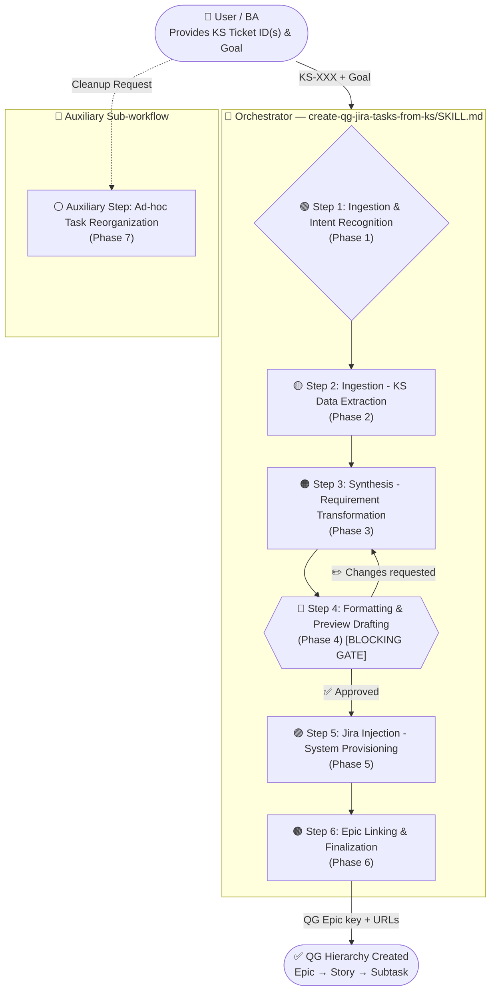
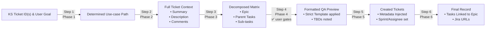
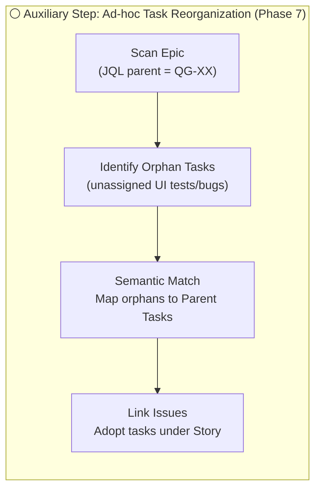

# QA Agentic Workflow — Flow Diagram

> **Source KS Ticket → QG Jira Test Hierarchy (Epic → Story → Sub-task)**

---

## High-Level Flow



---

## Detailed Phase Breakdown

```mermaid
flowchart LR
    subgraph INPUT["Input"]
        BA(["KS Ticket ID(s) & Goal\n(e.g. Create Epic, Link Epic)"])
    end

    subgraph STEP1["🟢 Step 1: Ingestion & Intent Recognition (Phase 1)"]
        direction TB
        S1A["Identify optimal processing path\nbased on 4 main Use-cases"]
    end

    subgraph STEP2["🟡 Step 2: Ingestion - KS Data Extraction (Phase 2)"]
        direction TB
        S2A["Call mcp_atlassian_jira_get_issue"]
        S2B["Fetch full context:\nSummary, Description, Comments"]
        S2C["Ensure no hidden constraints missed"]
        S2A --> S2B --> S2C
    end

    subgraph STEP3["🟠 Step 3: Synthesis - Requirement Transformation (Phase 3)"]
        direction TB
        S3A["LLM Evaluates raw KS data"]
        S3B["Distill testable cases & decompose:\nEpic → Parent Task → Sub-task"]
        S3C[["💾 Auto-save\nKS-XXX_requirements.md"]]
        S3A --> S3B --> S3C
    end

    subgraph STEP4["🔵 Step 4: Formatting & Preview Drafting (Phase 4)"]
        direction TB
        S4A["Enforce Strict QA Template:\nEpic Overview, Scope, Exit Criteria..."]
        S4B["Add [TBD] for missing info"]
        S4C[["💾 Auto-save\nKS-XXX_QG-Jira-Task-Structure-Preview.md"]]
        S4D{{"notify_user:\nDisplay Preview & Wait User Approval"}}
        S4A --> S4B --> S4C --> S4D
    end

    subgraph STEP5["🟣 Step 5: Jira Injection - System Provisioning (Phase 5)"]
        direction TB
        S5A["Inject Metadata:\nLocate Active Sprint, Assignee Ly Nguyen"]
        S5B["Create Epic (if requested)"]
        S5C["Create Parent Tasks (Story)"]
        S5D["Create Sub-tasks using\nParent IssueID"]
        S5A --> S5B --> S5C --> S5D
    end

    subgraph STEP6["🟤 Step 6: Epic Linking & Finalization (Phase 6)"]
        direction TB
        S6A["Secondary Loop:\nLink all Parent Tasks to Epic"]
        S6B["Output success log\nwith Jira URLs"]
        S6A --> S6B
    end

    subgraph OUTPUT["Output"]
        JIRA(["QG Epic + Stories + Subtasks\nin Jira + local records"])
    end

    INPUT --> STEP1 --> STEP2 --> STEP3 --> STEP4 --> STEP5 --> STEP6 --> OUTPUT
```



---

## Data Flow Between Phases



---

## 🧰 Auxiliary Step: Ad-hoc Task Reorganization (Phase 7)

*(Triggered only via specific cleanup requests as a standalone sub-workflow)*



---

## Auto-Saved Files (Historical Record)

```
QA skills/create-qg-jira-tasks-from-ks/task-analysis-records/
├── [Smallest-KS-ID]_requirements.md                        ← saved at end of Step 3 (Phase 3)
└── [Smallest-KS-ID]_QG-Jira-Task-Structure-Preview.md      ← preview saved at end of Step 4 (Phase 4)
```

> Files are **never overwritten**. Each run creates new files, building a historical audit trail.

---

## Skills Section

This section provides detailed descriptions of every step involved in the workflow — what each step does, when it is triggered, what it consumes, what it produces, and how it handles errors.

---

### 🎯 Orchestrator — `create-qg-jira-tasks-from-ks/SKILL.md`

**Role:** Master entry point that chains all steps into a single end-to-end run.

**Execution order (strict — do not reorder):**

| Step | Phase Mapping | Gate / Core Action |
|------|---------------|--------------------|
| 1 | `Ingestion & Intent Recognition (Phase 1)` | Determines Use-case (e.g., New Epic vs Link to Existing) |
| 2 | `Ingestion - KS Data Extraction (Phase 2)` | Fetches full KS context |
| 3 | `Synthesis - Requirement Transformation (Phase 3)` | Builds hierarchical matrix & saves `requirements.md` |
| 4 | `Formatting & Preview Drafting (Phase 4)` | **BLOCKING** — Enforces templates & waits for user |
| 5 | `Jira Injection - System Provisioning (Phase 5)` | Injects metadata & provisions Jira tasks |
| 6 | `Epic Linking & Finalization (Phase 6)`| Links parent tasks to Epic due to MCP constraints |
| Aux | `Ad-hoc Task Reorganization (Phase 7)` | Triggers sub-workflow for orphan tasks when requested |

---

### 🟢 Step 1: Ingestion & Intent Recognition (Phase 1)
**Purpose:** Identify the user's specific goal among the 4 main Use-cases.
- **Input:** KS ticket numbers (e.g., `KS-934`) and user request context.
- **Action:** Determines the processing path based on intentions (Create a new Epic, Link to an existing Epic, Update requirements, Ad-hoc reorganization).

### 🟡 Step 2: Ingestion - KS Data Extraction (Phase 2)
**Purpose:** Ensure comprehensive understanding of the KS ticket without missing hidden or threaded updates.
- **Tool used:** `mcp_atlassian_jira_get_issue`
- **Action:** Sequentially queries the API to fetch the full context of the KS tickets (including `Summary`, `Description`, and all conversational `Comments`).

### 🟠 Step 3: Synthesis - Requirement Transformation (Phase 3)
**Purpose:** Translate and break down raw data into a QA structure.
- **Action:** An LLM evaluates data and drafts a decomposed hierarchical matrix:
  - *Epic:* Overarching feature.
  - *Parent Task (Story):* Sub-features / UI clusters.
  - *Sub-task:* Specific test scenarios.
- **Output:** Auto-saves `task-analysis-records/[Smallest-KS-ID]_requirements.md`.

### 🔵 Step 4: Formatting & Preview Drafting (Phase 4)
**Purpose:** Enforce the "Strict QA Template" and block execution for user approval.
- **Action:**
  - *Epic Level:* `Epic Overview` ➔ `Scope` ➔ `Preconditions` ➔ `Exit Criteria`.
  - *Task Level:* `Test Objective` ➔ `Preconditions` ➔ `Test Steps` ➔ `Expected Result`.
  - Missing details get `[TBD]`.
- **Output:** Auto-saves `_QG-Jira-Task-Structure-Preview.md`.
- **Gate:** Pauses the agent using `notify_user`, waiting for the user to approve before proceeding.

### 🟣 Step 5: Jira Injection - System Provisioning (Phase 5)
**Purpose:** Create the issues systematically in Jira, with auto-injected constraints.
- **Tool used:** `mcp_atlassian_jira_create_issue`
- **Action:** Creates the Epic (if required), Parent Tasks, and Sub-tasks in sequence.
- **Constraints applied:** Sets `Assignee = Ly Nguyen`, `Reporter = Ly Nguyen`, locates the QG board's `Active Sprint` ID, and prefixes the Summary with the feature name.

### 🟤 Step 6: Epic Linking & Finalization (Phase 6)
**Purpose:** Resolve Atlassian MCP's Epic linking limitation and present final logs.
- **Tool used:** `mcp_atlassian_jira_link_to_epic`
- **Action:** Iterates through freshly generated Parent Tasks to link them systematically to the target Epic (`QG-...`).
- **Output:** Presents a success report containing direct Jira URLs for user review.

### 🧰 Auxiliary Step: Ad-hoc Task Reorganization (Phase 7)
**Purpose:** Clean up unstructured or disassociated UI test tickets.
- **Trigger:** Standalone sub-workflow for cleanup requests.
- **Action:** Scans an Epic via JQL, finds orphan Sub-tasks, contextually maps them to appropriate Story tasks using semantic matching, and re-links them to maintain the 3-tier hierarchy.
